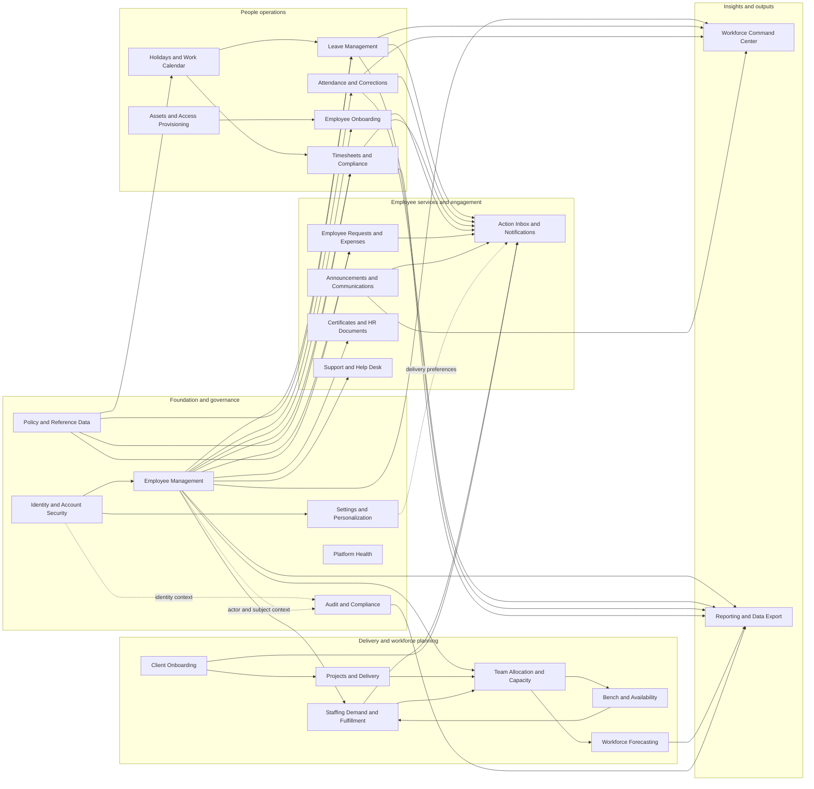

# Business Capability Map

> A business-function view of the complete FastAPI inventory. APIs are assigned to a primary capability by the business outcome they deliver, not by their router or source-file location.

## Scope and conventions

- **Source inventory:** `API_INVENTORY.md`
- **Runtime operations mapped:** **188 of 188**
- **Capabilities identified:** **25**
- An API has exactly one **primary capability** for coverage accounting, but may also appear as a **shared/integration API** where another capability consumes it.
- Supporting tables and services are aggregated from the transitive analysis in `API_INVENTORY.md` for both primary and shared APIs.
- Capabilities marked **Partial** or **Gap** are important business functions visible in the product model but not fully represented by dedicated backend APIs.

## Capability overview

| Capability | Business outcome | Status | Primary APIs | Shared APIs |
|---|---|---|---:|---:|
| Identity, Authentication & Account Security | Establish employee identity, complete first-time account setup, enforce password and MFA controls, recover accounts, and administer locked-account workflows. | Implemented | 21 | 0 |
| Employee Management & Organization | Maintain the authoritative employee directory and lifecycle record, including organizational placement, profile data, reporting relationships, status, exports, and profile media. | Implemented | 8 | 0 |
| Employee Onboarding | Move a new employee from registration and first-login setup through owned onboarding tasks to workforce readiness. | Partial — employee creation and onboarding-task records exist, but the Onboarding Center board is not backed by dedicated CRUD APIs | 0 | 5 |
| Workforce Command Center & Analytics | Give leadership an operational view of workforce size, activity, department distribution, attendance trends, pending work, birthdays, and anniversaries. | Implemented; dashboard endpoints currently have no explicit authentication dependency | 4 | 3 |
| Announcements & Employee Communications | Create, target, schedule, publish, pin, acknowledge, track, and retire internal communications. | Implemented | 10 | 0 |
| Action Inbox & Notifications | Aggregate actionable work and personal notifications, maintain unread state, route users to business records, and support completion of inbox work. | Implemented | 7 | 3 |
| Leave Management | Manage employee leave balances and requests from draft through approval, withdrawal, calendar visibility, and administrative adjustment. | Implemented | 13 | 0 |
| Attendance & Corrections | Record daily check-in/check-out activity, expose attendance history, and review or correct inaccurate attendance records. | Implemented | 7 | 0 |
| Timesheets & Allocation Compliance | Capture weekly project time, enforce calendar/allocation constraints, submit and recall timesheets, and support manager/HR approval and compliance review. | Implemented | 13 | 0 |
| Holidays & Work Calendar | Provide regional holiday schedules, floating-holiday eligibility, and working-day calculations used by leave and timesheet policy. | Implemented | 3 | 0 |
| Projects & Delivery Management | Create and maintain delivery projects, assign project managers, control project visibility, and manage project documents. | Implemented | 10 | 0 |
| Team Allocation & Capacity | Assign employees to projects and managers over defined periods, validate capacity, and expose current, upcoming, employee, and project allocation views. | Implemented | 11 | 0 |
| Bench & Availability | Identify unallocated or underallocated employees and expose availability for staffing and workforce planning. | Implemented as a read model over allocations and employees | 1 | 0 |
| Staffing Demand & Fulfillment | Capture resource demand, match and manage candidates, progress staffing requests, and fulfill selections by creating allocations. | Implemented | 15 | 0 |
| Workforce Forecasting | Forecast future capacity, allocation coverage, bench risk, and workforce availability over supported planning windows. | Implemented | 2 | 0 |
| Client Onboarding | Move clients from contract through go-live using owned checklists, tasks, team assignments, documents, milestones, progress, and activity history. | Implemented | 16 | 0 |
| Employee Service Requests & Expenses | Provide a governed workflow for employee requests, approvals, comments, evidence attachments, reassignment, cancellation, and expense-payment completion. | Implemented | 18 | 0 |
| Assets & Access Provisioning | Provision, assign, track, and recover employee hardware, software, application access, and credentials. | Gap — represented only as onboarding/client-onboarding tasks and documents; no dedicated asset/access API or asset table exists | 0 | 3 |
| Policy & Reference Data | Centralize reusable business rules and selectable reference data for requests, holidays, timesheets, staffing, certificates, attendance, and leave. | Partial/distributed — reference endpoints exist, but there is no unified policy-management API | 0 | 7 |
| Certificates & HR Documents | Generate, bulk-generate, verify, download, revoke, and audit employment certificates and formal HR letters. | Implemented; some certificate metadata/serial generation uses file-backed registries | 9 | 0 |
| User Settings & Personalization | Manage profile-facing settings, appearance, general preferences, notifications, privacy, security preferences, and settings activity. | Implemented | 12 | 0 |
| Support & Help Desk | Capture employee support issues and route them into an administrative support queue. | Implemented for ticket submission; no dedicated ticket-management endpoints were discovered | 1 | 0 |
| Audit, Security & Compliance | Create and review an immutable operational trail, protect sensitive access, record authorization failures, and support entity-level investigations and exports. | Implemented as a cross-cutting capability | 4 | 0 |
| Reporting & Data Export | Provide governed extracts for employee, time-off, audit, and workforce-planning data for operational and compliance use. | Implemented as distributed exports; no centralized reporting catalog | 1 | 4 |
| Platform Operations & Health | Expose basic runtime identity and service health for operators and deployment monitoring. | Implemented | 2 | 0 |

## Capability relationship diagram

### Relationship interpretation

- **Employee Management** is the master-data hub. Most operational capabilities depend on a valid employee, role, department, manager, and employment status.
- **Projects → Allocation → Bench/Forecasting** is the core delivery-capacity chain. Staffing can create allocations, while bench data feeds candidate and planning decisions.
- **Holidays and Policy** provide calendar and rule context to Leave and Timesheets.
- **Notifications** is the action-delivery layer for approvals, announcements, reminders, and workflow changes.
- **Audit** is cross-cutting. Sensitive reads, authorization failures, and state changes from many capabilities create evidence consumed by compliance and reporting.
- **Dashboard and Reporting** are consuming capabilities: they aggregate operational data rather than own the underlying transactions.

## Detailed capability inventory

### 1. Identity, Authentication & Account Security

- **Business goal:** Establish employee identity, complete first-time account setup, enforce password and MFA controls, recover accounts, and administer locked-account workflows.
- **User personas:** All employees, trainees, managers, HR Admin, Admin, Super Admin, security administrators
- **Implementation status:** Implemented
- **Dependencies on other capabilities:** Employee Management & Organization; Action Inbox & Notifications; Audit, Security & Compliance; User Settings & Personalization
- **Supporting database tables:** `account_unlock_requests`, `audit_logs`, `employees`, `login_challenge_sessions`, `notifications`, `password_reset_sessions`, `user_preferences`
- **Supporting services:** `app.services.audit_service.log_audit`, `app.services.auth_service.admin_reset_password`, `app.services.auth_service.approve_unlock`, `app.services.auth_service.check_email`, `app.services.auth_service.complete_login_mfa`, `app.services.auth_service.complete_reset`, `app.services.auth_service.confirm_totp_setup`, `app.services.auth_service.create_unlock_request_anonymous`, `app.services.auth_service.create_unlock_request_authenticated`, `app.services.auth_service.direct_unlock`, `app.services.auth_service.find_employee_by_email`, `app.services.auth_service.force_change_password`, `app.services.auth_service.initiate_reset`, `app.services.auth_service.login`, `app.services.auth_service.reject_unlock`, `app.services.auth_service.reset_password`, `app.services.auth_service.set_password_and_get_qr`, `app.services.auth_service.verify_login_password`, `app.services.auth_service.verify_reset_mfa`, `app.services.auth_service.verify_setup_code`, `app.services.settings_service.get_current_employee`

**Primary APIs (21)**

- `GET /api/v1/admin/security/locked-accounts` — Locked Accounts
- `POST /api/v1/admin/security/locked-accounts/{employee_id}/unlock` — Unlock Locked Account
- `GET /api/v1/admin/security/unlock-requests` — Unlock Requests
- `POST /api/v1/admin/security/unlock-requests/{request_id}/approve` — Approve Unlock Request
- `POST /api/v1/admin/security/unlock-requests/{request_id}/reject` — Reject Unlock Request
- `POST /api/v1/auth/admin-reset-password` — Api Admin Reset Password
- `POST /api/v1/auth/check-email` — Api Check Email
- `POST /api/v1/auth/confirm-totp` — Api Confirm Totp
- `POST /api/v1/auth/force-change-password` — Api Force Change Password
- `POST /api/v1/auth/forgot-password` — Api Forgot Password
- `POST /api/v1/auth/forgot-password/initiate` — Api Forgot Password Initiate
- `POST /api/v1/auth/forgot-password/reset` — Api Forgot Password Reset
- `POST /api/v1/auth/forgot-password/verify-mfa` — Api Forgot Password Verify Mfa
- `POST /api/v1/auth/login` — Api Login
- `POST /api/v1/auth/login/verify-mfa` — Api Complete Login Mfa
- `POST /api/v1/auth/login/verify-password` — Api Verify Login Password
- `GET /api/v1/auth/me/{email}` — Get My Profile
- `POST /api/v1/auth/request-unlock` — Api Request Unlock
- `POST /api/v1/auth/request-unlock-for-colleague` — Api Request Unlock For Colleague
- `POST /api/v1/auth/set-password` — Api Set Password
- `POST /api/v1/auth/verify-setup-code` — Api Verify Setup Code

### 2. Employee Management & Organization

- **Business goal:** Maintain the authoritative employee directory and lifecycle record, including organizational placement, profile data, reporting relationships, status, exports, and profile media.
- **User personas:** Super Admin, HR Admin, Admin, managers, employees managing their own profile
- **Implementation status:** Implemented
- **Dependencies on other capabilities:** Identity, Authentication & Account Security; Audit, Security & Compliance; Action Inbox & Notifications; Employee Onboarding
- **Supporting database tables:** `action_inbox_items`, `allocations`, `audit_logs`, `employee_audit_logs`, `employee_performance_snapshots`, `employees`, `leave_balances`, `leave_requests`, `notifications`, `sensitive_access_audit_logs`, `training_enrollments`
- **Supporting services:** `app.services.audit_service.changed_fields`, `app.services.audit_service.log_audit`, `app.services.audit_service.log_authorization_failure`, `app.services.employee_service.create_employee`, `app.services.security_service.export_employee_csv`, `app.services.security_service.log_sensitive_access`, `app.services.security_service.require_export_level`, `app.services.settings_service.get_current_employee`, `app.services.settings_service.require_admin_employee`

**Primary APIs (8)**

- `GET /api/v1/employees/` — List Employees
- `POST /api/v1/employees/` — Add Employee
- `GET /api/v1/employees/export` — Export Employees
- `GET /api/v1/employees/{employee_id}` — Get Employee
- `PUT /api/v1/employees/{employee_id}` — Update Employee
- `GET /api/v1/employees/{employee_id}/preview` — Get Employee Preview
- `POST /api/v1/employees/{employee_id}/remind-emergency-contact` — Remind Emergency Contact
- `POST /api/v1/employees/{employee_id}/upload-profile-picture` — Upload Profile Picture

### 3. Employee Onboarding

- **Business goal:** Move a new employee from registration and first-login setup through owned onboarding tasks to workforce readiness.
- **User personas:** HR, People Operations, hiring managers, IT, Payroll, new hires
- **Implementation status:** Partial — employee creation and onboarding-task records exist, but the Onboarding Center board is not backed by dedicated CRUD APIs
- **Dependencies on other capabilities:** Employee Management & Organization; Identity, Authentication & Account Security; Assets & Access Provisioning; Action Inbox & Notifications
- **Supporting database tables:** `attendance_corrections`, `audit_logs`, `employees`, `leave_requests`
- **Supporting services:** `app.services.audit_service.log_audit`, `app.services.auth_service.confirm_totp_setup`, `app.services.auth_service.find_employee_by_email`, `app.services.auth_service.set_password_and_get_qr`, `app.services.auth_service.verify_setup_code`, `app.services.employee_service.create_employee`, `app.services.settings_service.require_admin_employee`

**Primary APIs (0)**

- No dedicated primary API was discovered.

**Shared/integration APIs (5)**

- `POST /api/v1/auth/confirm-totp` — Api Confirm Totp
- `POST /api/v1/auth/set-password` — Api Set Password
- `POST /api/v1/auth/verify-setup-code` — Api Verify Setup Code
- `GET /api/v1/dashboard/pending-tasks` — Get Pending Tasks
- `POST /api/v1/employees/` — Add Employee

### 4. Workforce Command Center & Analytics

- **Business goal:** Give leadership an operational view of workforce size, activity, department distribution, attendance trends, pending work, birthdays, and anniversaries.
- **User personas:** Super Admin, HR Admin, Admin, executive/operations leadership
- **Implementation status:** Implemented; dashboard endpoints currently have no explicit authentication dependency
- **Dependencies on other capabilities:** Employee Management & Organization; Leave Management; Attendance & Corrections; Employee Onboarding; Announcements & Employee Communications
- **Supporting database tables:** `announcements`, `attendance`, `attendance_corrections`, `employees`, `leave_requests`
- **Supporting services:** No dedicated service method resolved

**Primary APIs (4)**

- `GET /api/v1/dashboard/attendance-trend` — Get Attendance Trend
- `GET /api/v1/dashboard/department-chart` — Get Department Chart
- `GET /api/v1/dashboard/kpis` — Get Kpis
- `GET /api/v1/dashboard/pending-tasks` — Get Pending Tasks

**Shared/integration APIs (3)**

- `GET /api/v1/dashboard/announcements` — Get Dashboard Announcements
- `GET /api/v1/dashboard/leave-calendar` — Get Leave Calendar
- `GET /api/v1/dashboard/on-leave-today` — Get On Leave Today

### 5. Announcements & Employee Communications

- **Business goal:** Create, target, schedule, publish, pin, acknowledge, track, and retire internal communications.
- **User personas:** Super Admin, HR Admin, Admin, communication owners, all employees as recipients
- **Implementation status:** Implemented
- **Dependencies on other capabilities:** Employee Management & Organization; Action Inbox & Notifications; Audit, Security & Compliance
- **Supporting database tables:** `action_inbox_items`, `announcement_acknowledgments`, `announcement_audiences`, `announcement_reads`, `announcements`, `employees`, `notifications`
- **Supporting services:** No dedicated service method resolved

**Primary APIs (10)**

- `GET /api/v1/announcements` — List Announcements
- `POST /api/v1/announcements` — Create Announcement
- `GET /api/v1/announcements/my` — My Announcements
- `GET /api/v1/announcements/unread-count` — Unread Count
- `DELETE /api/v1/announcements/{announcement_id}` — Delete Announcement
- `PUT /api/v1/announcements/{announcement_id}` — Update Announcement
- `POST /api/v1/announcements/{announcement_id}/acknowledge` — Acknowledge Announcement
- `POST /api/v1/announcements/{announcement_id}/read` — Mark Read
- `GET /api/v1/announcements/{announcement_id}/stats` — Get Announcement Stats
- `GET /api/v1/dashboard/announcements` — Get Dashboard Announcements

### 6. Action Inbox & Notifications

- **Business goal:** Aggregate actionable work and personal notifications, maintain unread state, route users to business records, and support completion of inbox work.
- **User personas:** Employees, managers, HR Admin, Admin, Super Admin
- **Implementation status:** Implemented
- **Dependencies on other capabilities:** Employee Management & Organization; Announcements & Employee Communications; Leave Management; Attendance & Corrections; Timesheets & Allocation Compliance; Employee Service Requests & Expenses
- **Supporting database tables:** `action_inbox_items`, `allocations`, `announcement_acknowledgments`, `announcement_audiences`, `announcements`, `attendance_corrections`, `audit_logs`, `company_holidays`, `employees`, `leave_balances`, `leave_requests`, `leave_types`, `notifications`, `timesheet_entries`
- **Supporting services:** `app.services.audit_service.log_audit`, `app.services.audit_service.log_authorization_failure`, `app.services.compliance_service.calculate_compliance`, `app.services.settings_service.get_current_employee`, `app.services.work_calendar_service.company_holiday_dates`, `app.services.work_calendar_service.is_employee_working_day`, `app.services.work_calendar_service.payable_leave_dates`

**Primary APIs (7)**

- `GET /api/v1/inbox` — Get Inbox
- `GET /api/v1/inbox/count` — Get Inbox Count
- `POST /api/v1/inbox/{item_id}/complete` — Complete Inbox Item
- `GET /api/v1/notifications` — Get Notifications
- `PUT /api/v1/notifications/mark-all-read` — Mark All Notifications Read
- `GET /api/v1/notifications/unread-count` — Get Unread Count
- `PUT /api/v1/notifications/{notification_id}/read` — Mark Notification Read

**Shared/integration APIs (3)**

- `POST /api/v1/announcements/{announcement_id}/acknowledge` — Acknowledge Announcement
- `POST /api/v1/leaves/approvals/{request_id}/decision` — Decide Leave Request
- `POST /api/v1/timesheets/approvals/{employee_id}/{week_start}/decision` — Decide Timesheet

### 7. Leave Management

- **Business goal:** Manage employee leave balances and requests from draft through approval, withdrawal, calendar visibility, and administrative adjustment.
- **User personas:** Employees, managers, HR Admin, Admin, Super Admin
- **Implementation status:** Implemented
- **Dependencies on other capabilities:** Employee Management & Organization; Holidays & Work Calendar; Action Inbox & Notifications; Audit, Security & Compliance; Reporting & Data Export
- **Supporting database tables:** `activity_log`, `attendance`, `attendance_corrections`, `audit_logs`, `company_holidays`, `employees`, `leave_balances`, `leave_requests`, `leave_types`, `notifications`, `timesheet_entries`
- **Supporting services:** `app.services.audit_service.log_audit`, `app.services.audit_service.log_authorization_failure`, `app.services.settings_service.get_current_employee`, `app.services.settings_service.is_manager_or_admin_role`, `app.services.work_calendar_service.payable_leave_day_count`, `app.services.work_calendar_service.region_from_location`

**Primary APIs (13)**

- `GET /api/v1/admin/time-off/dashboard` — Admin Time Off Dashboard
- `PUT /api/v1/admin/time-off/leave-balances/{balance_id}` — Adjust Balance
- `POST /api/v1/admin/time-off/leave-requests/{request_id}/decision` — Decide Leave
- `GET /api/v1/dashboard/leave-calendar` — Get Leave Calendar
- `GET /api/v1/dashboard/on-leave-today` — Get On Leave Today
- `POST /api/v1/inbox/leave-requests/{request_id}/{decision}` — Decide Leave Request
- `GET /api/v1/leaves/approvals` — Leave Approvals
- `POST /api/v1/leaves/approvals/{request_id}/decision` — Decide Leave Request
- `POST /api/v1/leaves/me/requests` — Create My Leave Request
- `DELETE /api/v1/leaves/me/requests/{request_id}` — Delete My Leave Request
- `PUT /api/v1/leaves/me/requests/{request_id}` — Update My Leave Request
- `POST /api/v1/leaves/me/requests/{request_id}/withdraw` — Withdraw My Leave Request
- `GET /api/v1/leaves/me/summary` — My Leave Summary

### 8. Attendance & Corrections

- **Business goal:** Record daily check-in/check-out activity, expose attendance history, and review or correct inaccurate attendance records.
- **User personas:** Employees, managers, HR Admin, Admin, Super Admin
- **Implementation status:** Implemented
- **Dependencies on other capabilities:** Employee Management & Organization; Holidays & Work Calendar; Action Inbox & Notifications; Audit, Security & Compliance; Reporting & Data Export
- **Supporting database tables:** `activity_log`, `attendance`, `attendance_corrections`, `audit_logs`, `employees`, `leave_balances`, `leave_requests`, `leave_types`, `notifications`, `timesheet_entries`
- **Supporting services:** `app.services.audit_service.log_audit`, `app.services.settings_service.get_current_employee`, `app.services.settings_service.is_manager_or_admin_role`

**Primary APIs (7)**

- `PUT /api/v1/admin/time-off/attendance/{attendance_id}` — Update Attendance
- `POST /api/v1/admin/time-off/corrections/{correction_id}/decision` — Decide Correction
- `POST /api/v1/attendance/me/check-in` — Check In
- `POST /api/v1/attendance/me/check-out` — Check Out
- `GET /api/v1/attendance/me/history` — My Attendance History
- `GET /api/v1/attendance/me/today` — My Attendance Today
- `POST /api/v1/inbox/attendance-corrections/{correction_id}/{decision}` — Decide Attendance Correction

### 9. Timesheets & Allocation Compliance

- **Business goal:** Capture weekly project time, enforce calendar/allocation constraints, submit and recall timesheets, and support manager/HR approval and compliance review.
- **User personas:** Employees, project contributors, managers, HR Admin, Admin, Super Admin
- **Implementation status:** Implemented
- **Dependencies on other capabilities:** Employee Management & Organization; Projects & Delivery Management; Team Allocation & Capacity; Holidays & Work Calendar; Leave Management; Action Inbox & Notifications
- **Supporting database tables:** `activity_log`, `allocations`, `attendance`, `attendance_corrections`, `audit_logs`, `company_holidays`, `employees`, `leave_balances`, `leave_requests`, `leave_types`, `notifications`, `projects`, `timesheet_entries`
- **Supporting services:** `app.services.audit_service.log_audit`, `app.services.audit_service.log_authorization_failure`, `app.services.compliance_service.calculate_compliance`, `app.services.settings_service.get_current_employee`, `app.services.work_calendar_service.company_holiday_dates`, `app.services.work_calendar_service.is_employee_working_day`, `app.services.work_calendar_service.payable_leave_dates`

**Primary APIs (13)**

- `POST /api/v1/admin/time-off/timesheets/{employee_id}/{week_start}/decision` — Decide Timesheet
- `GET /api/v1/timesheets/approvals` — Timesheet Approvals
- `POST /api/v1/timesheets/approvals/{employee_id}/{week_start}/decision` — Decide Timesheet
- `GET /api/v1/timesheets/me/history` — My Timesheet History
- `GET /api/v1/timesheets/me/options` — My Timesheet Options
- `GET /api/v1/timesheets/me/summary` — My Timesheet Summary
- `DELETE /api/v1/timesheets/me/week` — Delete My Timesheet Week
- `GET /api/v1/timesheets/me/week` — My Timesheet Week
- `POST /api/v1/timesheets/me/week` — Save My Timesheet Week
- `POST /api/v1/timesheets/me/week/copy` — Copy My Timesheet Week
- `POST /api/v1/timesheets/me/week/recall` — Recall My Timesheet Week
- `POST /api/v1/timesheets/me/week/submit` — Submit My Timesheet Week
- `GET /api/v1/timesheets/{timesheet_id}/allocation-compliance` — Timesheet Allocation Compliance

### 10. Holidays & Work Calendar

- **Business goal:** Provide regional holiday schedules, floating-holiday eligibility, and working-day calculations used by leave and timesheet policy.
- **User personas:** All employees, HR, managers, Payroll/operations
- **Implementation status:** Implemented
- **Dependencies on other capabilities:** Employee Management & Organization; Policy & Reference Data
- **Supporting database tables:** `company_holidays`, `employees`, `leave_requests`
- **Supporting services:** `app.services.settings_service.get_current_employee`

**Primary APIs (3)**

- `GET /api/v1/holidays` — Holidays
- `GET /api/v1/holidays/available-floating` — Available Floating Holidays
- `GET /api/v1/holidays/working-days` — Working Days

### 11. Projects & Delivery Management

- **Business goal:** Create and maintain delivery projects, assign project managers, control project visibility, and manage project documents.
- **User personas:** Project managers, HR Admin, Admin, Super Admin, allocated employees
- **Implementation status:** Implemented
- **Dependencies on other capabilities:** Employee Management & Organization; Team Allocation & Capacity; Audit, Security & Compliance
- **Supporting database tables:** `allocations`, `audit_logs`, `employees`, `project_documents`, `projects`
- **Supporting services:** `app.services.audit_service.log_authorization_failure`, `app.services.project_service.assign_project_manager`, `app.services.project_service.create_project`, `app.services.project_service.delete_project_document`, `app.services.project_service.download_project_document`, `app.services.project_service.get_project`, `app.services.project_service.list_project_documents`, `app.services.project_service.list_projects`, `app.services.project_service.serialize_project_document`, `app.services.project_service.update_project`, `app.services.project_service.upload_project_document`, `app.services.settings_service.get_current_employee`

**Primary APIs (10)**

- `GET /api/v1/projects/` — Projects Index
- `POST /api/v1/projects/` — Create Project Endpoint
- `GET /api/v1/projects/assignable-employees` — Assignable Employees
- `GET /api/v1/projects/{project_id}` — Project Detail
- `PATCH /api/v1/projects/{project_id}` — Update Project Endpoint
- `GET /api/v1/projects/{project_id}/documents` — Project Documents
- `POST /api/v1/projects/{project_id}/documents` — Upload Document
- `DELETE /api/v1/projects/{project_id}/documents/{document_id}` — Delete Document
- `GET /api/v1/projects/{project_id}/documents/{document_id}/download` — Download Document
- `PATCH /api/v1/projects/{project_id}/manager` — Update Project Manager

### 12. Team Allocation & Capacity

- **Business goal:** Assign employees to projects and managers over defined periods, validate capacity, and expose current, upcoming, employee, and project allocation views.
- **User personas:** Resource managers, project managers, HR Admin, Admin, Super Admin, employees viewing their assignments
- **Implementation status:** Implemented
- **Dependencies on other capabilities:** Employee Management & Organization; Projects & Delivery Management; Staffing Demand & Fulfillment; Bench & Availability; Workforce Forecasting
- **Supporting database tables:** `allocations`, `audit_logs`, `employees`, `notifications`, `projects`
- **Supporting services:** `app.services.allocation_service.cancel_allocation`, `app.services.allocation_service.create_allocation`, `app.services.allocation_service.get_active_allocations`, `app.services.allocation_service.get_allocation_summary`, `app.services.allocation_service.get_allocations_by_employee`, `app.services.allocation_service.get_upcoming_allocations`, `app.services.allocation_service.serialize_allocation`, `app.services.allocation_service.update_allocation`, `app.services.audit_service.log_authorization_failure`, `app.services.project_service.get_project`, `app.services.settings_service.get_current_employee`, `app.services.staffing_allocation_service.capacity_check_payload`

**Primary APIs (11)**

- `POST /api/v1/allocations/` — Create Allocation Endpoint
- `GET /api/v1/allocations/employee/{employee_id}` — Employee Allocations
- `GET /api/v1/allocations/employee/{employee_id}/active` — Employee Active Allocations
- `GET /api/v1/allocations/employee/{employee_id}/capacity-check` — Employee Capacity Check
- `GET /api/v1/allocations/employee/{employee_id}/summary` — Employee Allocation Summary
- `GET /api/v1/allocations/employee/{employee_id}/upcoming` — Employee Upcoming Allocations
- `GET /api/v1/allocations/project/{project_id}` — Project Allocations
- `DELETE /api/v1/allocations/{allocation_id}` — Cancel Allocation Endpoint
- `PATCH /api/v1/allocations/{allocation_id}` — Update Allocation Endpoint
- `GET /api/v1/projects/my-allocations` — My Active Allocations
- `GET /api/v1/projects/{project_id}/allocations` — Project Allocations

### 13. Bench & Availability

- **Business goal:** Identify unallocated or underallocated employees and expose availability for staffing and workforce planning.
- **User personas:** Resource managers, hiring managers, HR Admin, Admin, Super Admin
- **Implementation status:** Implemented as a read model over allocations and employees
- **Dependencies on other capabilities:** Employee Management & Organization; Team Allocation & Capacity; Staffing Demand & Fulfillment; Workforce Forecasting
- **Supporting database tables:** `allocations`, `audit_logs`, `employees`
- **Supporting services:** `app.services.allocation_service.get_active_allocations`, `app.services.allocation_service.get_allocation_summary`, `app.services.audit_service.log_authorization_failure`, `app.services.settings_service.get_current_employee`

**Primary APIs (1)**

- `GET /api/v1/allocations/bench` — Bench Availability

### 14. Staffing Demand & Fulfillment

- **Business goal:** Capture resource demand, match and manage candidates, progress staffing requests, and fulfill selections by creating allocations.
- **User personas:** Hiring managers, resource managers, HR Admin, Admin, Super Admin
- **Implementation status:** Implemented
- **Dependencies on other capabilities:** Employee Management & Organization; Projects & Delivery Management; Team Allocation & Capacity; Bench & Availability; Audit, Security & Compliance
- **Supporting database tables:** `allocations`, `audit_logs`, `departments`, `designations`, `employees`, `notifications`, `projects`, `staffing_request_candidates`, `staffing_requests`
- **Supporting services:** `app.services.allocation_service.serialize_allocation`, `app.services.audit_service.log_audit`, `app.services.audit_service.log_authorization_failure`, `app.services.settings_service.get_current_employee`, `app.services.staffing_allocation_service.create_allocation_from_staffing_request`, `app.services.staffing_service.cancel_request`, `app.services.staffing_service.change_status`, `app.services.staffing_service.create_staffing_request`, `app.services.staffing_service.fulfilled_allocation_ids`, `app.services.staffing_service.refresh_system_candidates`, `app.services.staffing_service.reject_candidate`, `app.services.staffing_service.select_candidate`, `app.services.staffing_service.serialize_candidate`, `app.services.staffing_service.serialize_request`, `app.services.staffing_service.serialize_summary`, `app.services.staffing_service.shortlist_candidate`, `app.services.staffing_service.update_staffing_request`

**Primary APIs (15)**

- `GET /api/v1/staffing-requests/` — List Staffing Requests
- `POST /api/v1/staffing-requests/` — Create Staffing Request Endpoint
- `GET /api/v1/staffing-requests/options` — Staffing Request Options
- `DELETE /api/v1/staffing-requests/{request_id}` — Cancel Staffing Request Endpoint
- `GET /api/v1/staffing-requests/{request_id}` — Get Staffing Request
- `PATCH /api/v1/staffing-requests/{request_id}` — Update Staffing Request Endpoint
- `GET /api/v1/staffing-requests/{request_id}/activity` — Staffing Request Activity
- `GET /api/v1/staffing-requests/{request_id}/allocations` — Get Staffing Request Allocations
- `GET /api/v1/staffing-requests/{request_id}/candidates` — Get Staffing Candidates
- `POST /api/v1/staffing-requests/{request_id}/candidates/refresh` — Refresh Staffing Candidates
- `POST /api/v1/staffing-requests/{request_id}/candidates/{employee_id}/reject` — Reject Staffing Candidate
- `POST /api/v1/staffing-requests/{request_id}/candidates/{employee_id}/select` — Select Staffing Candidate
- `POST /api/v1/staffing-requests/{request_id}/candidates/{employee_id}/shortlist` — Shortlist Staffing Candidate
- `POST /api/v1/staffing-requests/{request_id}/create-allocation` — Create Allocation From Request Endpoint
- `PATCH /api/v1/staffing-requests/{request_id}/status` — Update Staffing Request Status

### 15. Workforce Forecasting

- **Business goal:** Forecast future capacity, allocation coverage, bench risk, and workforce availability over supported planning windows.
- **User personas:** Managers, resource planners, HR Admin, Admin, Super Admin, leadership
- **Implementation status:** Implemented
- **Dependencies on other capabilities:** Employee Management & Organization; Team Allocation & Capacity; Bench & Availability; Reporting & Data Export
- **Supporting database tables:** `allocations`, `audit_logs`, `employees`
- **Supporting services:** `app.services.audit_service.log_audit`, `app.services.audit_service.log_authorization_failure`, `app.services.forecasting_service.get_workforce_forecast`, `app.services.settings_service.get_current_employee`

**Primary APIs (2)**

- `GET /api/v1/forecasting` — Workforce Forecast
- `GET /api/v1/forecasting/export` — Export Workforce Forecast

### 16. Client Onboarding

- **Business goal:** Move clients from contract through go-live using owned checklists, tasks, team assignments, documents, milestones, progress, and activity history.
- **User personas:** Client success, delivery managers, HR/Admin roles acting as platform administrators, project owners
- **Implementation status:** Implemented
- **Dependencies on other capabilities:** Employee Management & Organization; Projects & Delivery Management; Audit, Security & Compliance
- **Supporting database tables:** `audit_logs`, `client_activity_logs`, `client_checklist_items`, `client_documents`, `client_milestones`, `client_onboarding`, `client_tasks`, `client_team_members`, `clients`, `employees`
- **Supporting services:** `app.services.audit_service.log_audit`, `app.services.settings_service.get_current_employee`

**Primary APIs (16)**

- `GET /api/v1/admin/client-onboarding` — List Clients
- `POST /api/v1/admin/client-onboarding` — Create Client
- `DELETE /api/v1/admin/client-onboarding/{client_id}` — Delete Client
- `GET /api/v1/admin/client-onboarding/{client_id}` — Get Client
- `PUT /api/v1/admin/client-onboarding/{client_id}` — Update Client
- `PUT /api/v1/admin/client-onboarding/{client_id}/checklist/{item_id}` — Update Checklist
- `POST /api/v1/admin/client-onboarding/{client_id}/documents` — Create Document
- `DELETE /api/v1/admin/client-onboarding/{client_id}/documents/{document_id}` — Delete Document
- `POST /api/v1/admin/client-onboarding/{client_id}/milestones` — Create Milestone
- `DELETE /api/v1/admin/client-onboarding/{client_id}/milestones/{milestone_id}` — Delete Milestone
- `PUT /api/v1/admin/client-onboarding/{client_id}/milestones/{milestone_id}` — Update Milestone
- `POST /api/v1/admin/client-onboarding/{client_id}/tasks` — Create Task
- `DELETE /api/v1/admin/client-onboarding/{client_id}/tasks/{task_id}` — Delete Task
- `PUT /api/v1/admin/client-onboarding/{client_id}/tasks/{task_id}` — Update Task
- `POST /api/v1/admin/client-onboarding/{client_id}/team` — Create Team Member
- `DELETE /api/v1/admin/client-onboarding/{client_id}/team/{member_id}` — Delete Team Member

### 17. Employee Service Requests & Expenses

- **Business goal:** Provide a governed workflow for employee requests, approvals, comments, evidence attachments, reassignment, cancellation, and expense-payment completion.
- **User personas:** Employees, managers/reviewers, HR Admin, Payroll, Super Admin
- **Implementation status:** Implemented
- **Dependencies on other capabilities:** Employee Management & Organization; Policy & Reference Data; Action Inbox & Notifications; Audit, Security & Compliance; Certificates & HR Documents
- **Supporting database tables:** `action_inbox_items`, `audit_logs`, `employee_requests`, `employees`, `leave_requests`, `notifications`, `request_attachments`, `request_comments`, `request_status_history`, `request_ticket_counters`
- **Supporting services:** `app.services.attachment_service.delete_attachment`, `app.services.attachment_service.download_attachment`, `app.services.attachment_service.list_attachments`, `app.services.attachment_service.serialize_attachment`, `app.services.attachment_service.upload_attachment`, `app.services.requests_service.add_comment`, `app.services.requests_service.approve_request`, `app.services.requests_service.cancel_request`, `app.services.requests_service.create_request`, `app.services.requests_service.ensure_read_access`, `app.services.requests_service.get_approval_queue`, `app.services.requests_service.get_my_requests`, `app.services.requests_service.get_request`, `app.services.requests_service.get_request_policies`, `app.services.requests_service.get_types`, `app.services.requests_service.mark_expense_paid`, `app.services.requests_service.reassign_request`, `app.services.requests_service.reject_request`, `app.services.requests_service.serialize_comment`, `app.services.requests_service.serialize_request`, `app.services.requests_service.submit_request`, `app.services.requests_service.update_request`, `app.services.settings_service.get_current_employee`

**Primary APIs (18)**

- `POST /api/v1/requests` — Create Employee Request
- `GET /api/v1/requests/my` — My Requests
- `GET /api/v1/requests/policies` — Request Policies
- `GET /api/v1/requests/queue` — Approval Queue
- `GET /api/v1/requests/types` — Request Types
- `GET /api/v1/requests/{request_id}` — Request Detail
- `PATCH /api/v1/requests/{request_id}` — Update Employee Request
- `POST /api/v1/requests/{request_id}/approve` — Approve Employee Request
- `GET /api/v1/requests/{request_id}/attachments` — List Request Attachments
- `POST /api/v1/requests/{request_id}/attachments` — Upload Request Attachment
- `DELETE /api/v1/requests/{request_id}/attachments/{attachment_id}` — Delete Request Attachment
- `GET /api/v1/requests/{request_id}/attachments/{attachment_id}/download` — Download Request Attachment
- `POST /api/v1/requests/{request_id}/cancel` — Cancel Employee Request
- `POST /api/v1/requests/{request_id}/comments` — Add Request Comment
- `POST /api/v1/requests/{request_id}/mark-paid` — Mark Request Paid
- `POST /api/v1/requests/{request_id}/reassign` — Reassign Employee Request
- `POST /api/v1/requests/{request_id}/reject` — Reject Employee Request
- `POST /api/v1/requests/{request_id}/submit` — Submit Employee Request

### 18. Assets & Access Provisioning

- **Business goal:** Provision, assign, track, and recover employee hardware, software, application access, and credentials.
- **User personas:** IT, Security, People Operations, hiring managers, employees
- **Implementation status:** Gap — represented only as onboarding/client-onboarding tasks and documents; no dedicated asset/access API or asset table exists
- **Dependencies on other capabilities:** Employee Management & Organization; Employee Onboarding; Client Onboarding; Audit, Security & Compliance
- **Supporting database tables:** `audit_logs`, `client_activity_logs`, `client_checklist_items`, `client_documents`, `client_milestones`, `client_onboarding`, `client_tasks`, `client_team_members`, `clients`, `employees`
- **Supporting services:** `app.services.audit_service.log_audit`, `app.services.settings_service.get_current_employee`

**Primary APIs (0)**

- No dedicated primary API was discovered.

**Shared/integration APIs (3)**

- `PUT /api/v1/admin/client-onboarding/{client_id}/checklist/{item_id}` — Update Checklist
- `POST /api/v1/admin/client-onboarding/{client_id}/documents` — Create Document
- `POST /api/v1/admin/client-onboarding/{client_id}/tasks` — Create Task

### 19. Policy & Reference Data

- **Business goal:** Centralize reusable business rules and selectable reference data for requests, holidays, timesheets, staffing, certificates, attendance, and leave.
- **User personas:** HR policy owners, Admin, Super Admin, managers, all consuming users
- **Implementation status:** Partial/distributed — reference endpoints exist, but there is no unified policy-management API
- **Dependencies on other capabilities:** Employee Management & Organization; Audit, Security & Compliance
- **Supporting database tables:** `allocations`, `audit_logs`, `company_holidays`, `departments`, `designations`, `employees`, `projects`
- **Supporting services:** `app.services.audit_service.log_authorization_failure`, `app.services.certificate_service.list_counters`, `app.services.requests_service.get_request_policies`, `app.services.requests_service.get_types`, `app.services.settings_service.get_current_employee`

**Primary APIs (0)**

- No dedicated primary API was discovered.

**Shared/integration APIs (7)**

- `GET /api/v1/certificates/meta` — Certificate Meta
- `GET /api/v1/holidays` — Holidays
- `GET /api/v1/holidays/working-days` — Working Days
- `GET /api/v1/requests/policies` — Request Policies
- `GET /api/v1/requests/types` — Request Types
- `GET /api/v1/staffing-requests/options` — Staffing Request Options
- `GET /api/v1/timesheets/me/options` — My Timesheet Options

### 20. Certificates & HR Documents

- **Business goal:** Generate, bulk-generate, verify, download, revoke, and audit employment certificates and formal HR letters.
- **User personas:** HR Admin, Admin, Super Admin, employees/third parties verifying certificates
- **Implementation status:** Implemented; some certificate metadata/serial generation uses file-backed registries
- **Dependencies on other capabilities:** Employee Management & Organization; Policy & Reference Data; Audit, Security & Compliance
- **Supporting database tables:** `audit_logs`, `certificate_audit_logs`, `certificates`, `employees`, `sensitive_access_audit_logs`
- **Supporting services:** `app.services.audit_service.log_audit`, `app.services.certificate_service.build_filename`, `app.services.certificate_service.certificate_id`, `app.services.certificate_service.certificate_verify_url`, `app.services.certificate_service.consume_next_serial`, `app.services.certificate_service.generate_certificate_pdf`, `app.services.certificate_service.get_certificate_verification`, `app.services.certificate_service.list_counters`, `app.services.certificate_service.list_legacy_issued_certificates`, `app.services.certificate_service.peek_next_serial`, `app.services.certificate_service.record_issued_certificate`, `app.services.certificate_service.validate_certificate_type`, `app.services.hr_document_service.build_internship_completion_filename`, `app.services.hr_document_service.generate_internship_completion_docx`, `app.services.hr_document_service.generate_internship_completion_pdf`, `app.services.security_service.log_sensitive_access`, `app.services.settings_service.get_current_employee`, `app.services.settings_service.require_admin_employee`

**Primary APIs (9)**

- `GET /api/v1/certificates` — List Certificates
- `POST /api/v1/certificates/bulk-generate` — Bulk Generate Certificates
- `POST /api/v1/certificates/generate` — Generate Certificate
- `GET /api/v1/certificates/meta` — Certificate Meta
- `GET /api/v1/certificates/next-serial` — Next Serial
- `GET /api/v1/certificates/verify/{cert_id}` — Verify Certificate
- `GET /api/v1/certificates/{cert_id}/download` — Download Certificate
- `POST /api/v1/certificates/{cert_id}/revoke` — Revoke Certificate
- `POST /api/v1/hr-documents/internship-completion` — Generate Internship Completion Letter

### 21. User Settings & Personalization

- **Business goal:** Manage profile-facing settings, appearance, general preferences, notifications, privacy, security preferences, and settings activity.
- **User personas:** All authenticated employees
- **Implementation status:** Implemented
- **Dependencies on other capabilities:** Identity, Authentication & Account Security; Employee Management & Organization; Action Inbox & Notifications; Audit, Security & Compliance
- **Supporting database tables:** `audit_logs`, `employees`, `user_preferences`, `user_settings`
- **Supporting services:** `app.services.preferences_service.activity_history`, `app.services.preferences_service.get_or_create_preferences`, `app.services.preferences_service.serialize_preferences`, `app.services.preferences_service.update_appearance`, `app.services.preferences_service.update_general`, `app.services.preferences_service.update_notifications`, `app.services.settings_service.get_current_employee`, `app.services.settings_service.get_or_create_user_settings`, `app.services.settings_service.serialize_settings`, `app.services.settings_service.update_appearance_settings`, `app.services.settings_service.update_general_settings`, `app.services.settings_service.update_notification_settings`, `app.services.settings_service.update_privacy_settings`, `app.services.settings_service.update_security_settings`

**Primary APIs (12)**

- `GET /api/v1/settings/activity` — Get My Settings Activity
- `GET /api/v1/settings/me` — Get My Settings
- `PATCH /api/v1/settings/me/appearance` — Patch Appearance Settings
- `PATCH /api/v1/settings/me/general` — Patch General Settings
- `PATCH /api/v1/settings/me/notifications` — Patch Notification Settings
- `PATCH /api/v1/settings/me/privacy` — Patch Privacy Settings
- `PATCH /api/v1/settings/me/security` — Patch Security Settings
- `GET /api/v1/settings/preferences` — Get My Preferences
- `PATCH /api/v1/settings/preferences/appearance` — Patch Preference Appearance
- `PATCH /api/v1/settings/preferences/general` — Patch Preference General
- `PATCH /api/v1/settings/preferences/notifications` — Patch Preference Notifications
- `GET /api/v1/settings/profile` — Get Settings Profile

### 22. Support & Help Desk

- **Business goal:** Capture employee support issues and route them into an administrative support queue.
- **User personas:** All authenticated employees, support administrators
- **Implementation status:** Implemented for ticket submission; no dedicated ticket-management endpoints were discovered
- **Dependencies on other capabilities:** Identity, Authentication & Account Security; Employee Management & Organization; Action Inbox & Notifications
- **Supporting database tables:** `employees`, `support_tickets`
- **Supporting services:** `app.services.settings_service.create_support_ticket`, `app.services.settings_service.get_current_employee`

**Primary APIs (1)**

- `POST /api/v1/support-tickets` — Submit Support Ticket

### 23. Audit, Security & Compliance

- **Business goal:** Create and review an immutable operational trail, protect sensitive access, record authorization failures, and support entity-level investigations and exports.
- **User personas:** Super Admin, HR Admin, security/compliance reviewers, auditors
- **Implementation status:** Implemented as a cross-cutting capability
- **Dependencies on other capabilities:** Identity, Authentication & Account Security; Employee Management & Organization; all write-oriented capabilities emit or consume audit evidence
- **Supporting database tables:** `audit_logs`, `employees`
- **Supporting services:** `app.services.audit_service.log_audit`, `app.services.audit_service.log_authorization_failure`, `app.services.settings_service.get_current_employee`

**Primary APIs (4)**

- `GET /api/v1/audit-logs` — List Audit Logs
- `GET /api/v1/audit-logs/entity/{entity_type}/{entity_id}` — List Entity Audit Logs
- `GET /api/v1/audit-logs/export` — Export Audit Logs
- `GET /api/v1/audit-logs/{log_id}` — Get Audit Log

### 24. Reporting & Data Export

- **Business goal:** Provide governed extracts for employee, time-off, audit, and workforce-planning data for operational and compliance use.
- **User personas:** Super Admin, HR Admin, Admin, managers/resource planners where scoped, auditors
- **Implementation status:** Implemented as distributed exports; no centralized reporting catalog
- **Dependencies on other capabilities:** Employee Management & Organization; Leave Management; Attendance & Corrections; Timesheets & Allocation Compliance; Workforce Forecasting; Audit, Security & Compliance
- **Supporting database tables:** `allocations`, `attendance`, `audit_logs`, `employees`, `leave_requests`, `leave_types`, `sensitive_access_audit_logs`, `timesheet_entries`
- **Supporting services:** `app.services.audit_service.log_audit`, `app.services.audit_service.log_authorization_failure`, `app.services.forecasting_service.get_workforce_forecast`, `app.services.security_service.export_employee_csv`, `app.services.security_service.log_sensitive_access`, `app.services.security_service.require_export_level`, `app.services.settings_service.get_current_employee`, `app.services.settings_service.require_admin_employee`

**Primary APIs (1)**

- `GET /api/v1/admin/time-off/reports/{report_type}/csv` — Export Report

**Shared/integration APIs (4)**

- `GET /api/v1/admin/time-off/reports/{report_type}/csv` — Export Report
- `GET /api/v1/audit-logs/export` — Export Audit Logs
- `GET /api/v1/employees/export` — Export Employees
- `GET /api/v1/forecasting/export` — Export Workforce Forecast

### 25. Platform Operations & Health

- **Business goal:** Expose basic runtime identity and service health for operators and deployment monitoring.
- **User personas:** Platform operators, developers, monitoring systems
- **Implementation status:** Implemented
- **Dependencies on other capabilities:** Database platform and application configuration
- **Supporting database tables:** No dedicated table resolved
- **Supporting services:** No dedicated service method resolved

**Primary APIs (2)**

- `GET /` — Root
- `GET /health` — Health

## Capability gaps and architectural observations

1. **Employee Onboarding is not yet a complete backend capability.** Employee creation can seed onboarding-related data and the authentication flow supports first-time setup, but the visual Onboarding Center uses hardcoded candidates rather than dedicated onboarding-plan APIs.
2. **Assets & Access Provisioning has no system of record.** There is no asset/access router, service, or table for devices, licenses, credentials, assignment, recovery, or access review.
3. **Policy management is distributed.** Request policies, holiday rules, timesheet options, attendance policies, and staffing/certificate metadata are exposed by separate domains; there is no unified effective-dated policy capability.
4. **Reporting is federated.** CSV/export endpoints exist in several domains, but there is no report catalog, asynchronous report job, retained artifact, or unified authorization policy.
5. **Notification delivery is in-app focused.** Notifications and inbox records are modeled, but a generalized outbound delivery capability for email/SMS/push and delivery receipts is not evident from the inventory.
6. **Identity enforcement is header-based.** Many protected capabilities resolve caller-supplied identity headers to employees rather than using a cryptographically verified bearer-token dependency, making Identity a critical platform-hardening dependency.
7. **Dashboard endpoints are aggregations, not sources of truth.** KPI and chart APIs should remain read models backed by Employee, Leave, Attendance, Announcement, and Onboarding data.

## Coverage validation

- API operations in source inventory: **188**
- API operations with exactly one primary capability: **188**
- Unique primary API assignments: **188**
- Unassigned API operations: **0**
- Duplicate primary assignments: **0**
- Shared/integration appearances are intentional and do not affect primary coverage accounting.
