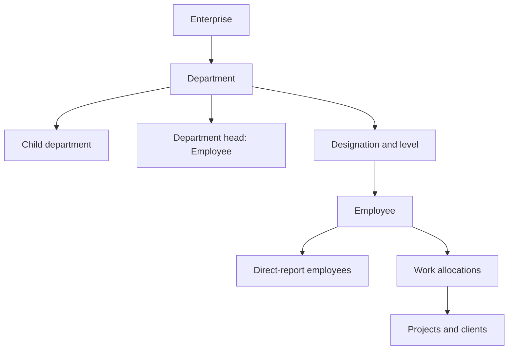
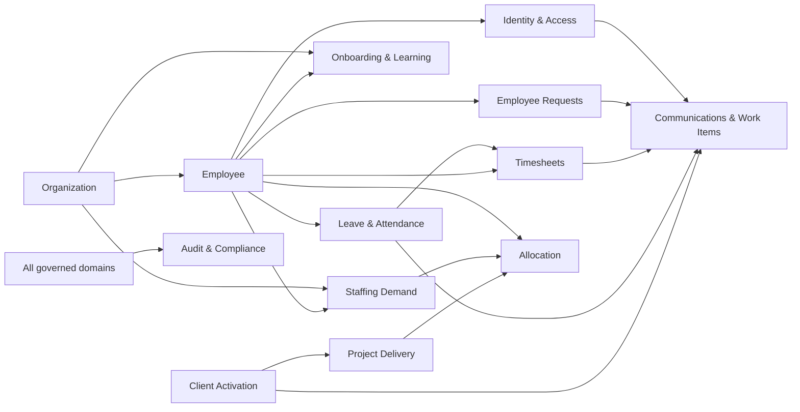
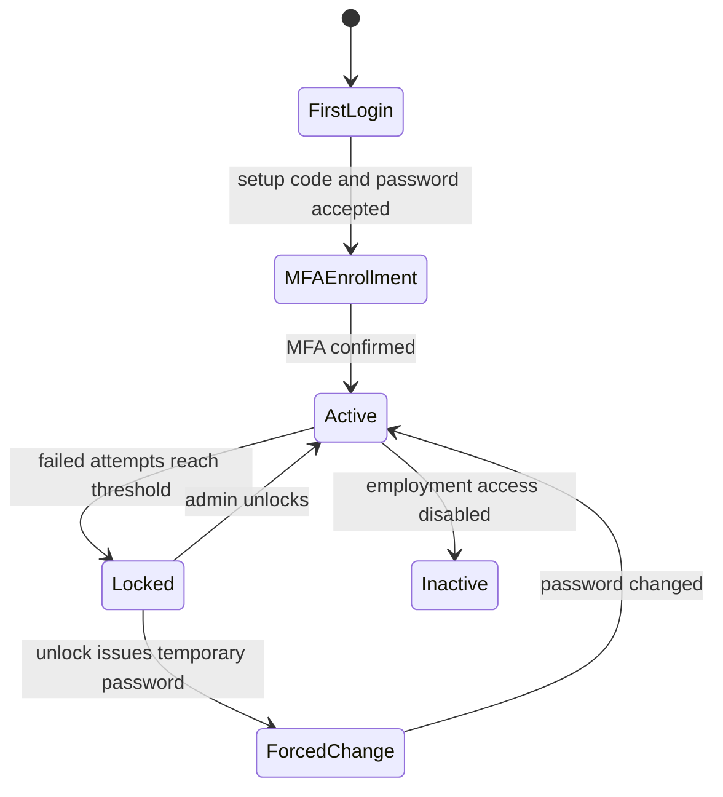
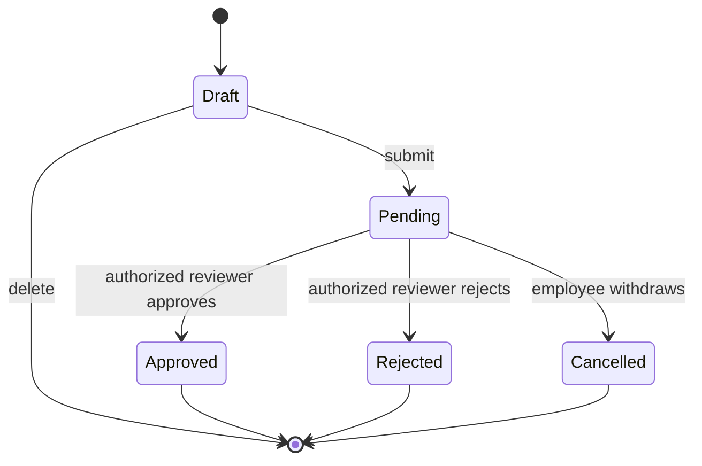
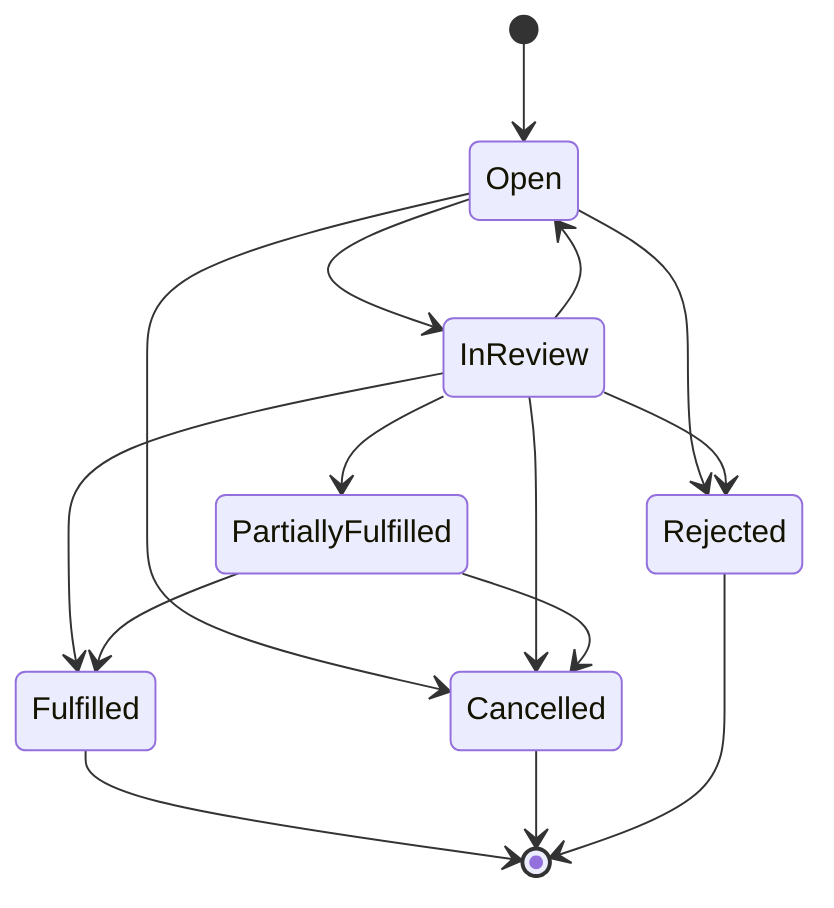

# Enterprise Domain Model

## 1. Purpose and scope

This document describes Reknew Orbit as an employee-operations business system. It models the language, responsibilities, invariants, lifecycles, and collaborations of the enterprise—not its technical delivery mechanisms.

The system spans the employee lifecycle, organizational structure, work delivery, time and absence, staffing, onboarding, client activation, learning, internal communication, identity security, and administration. Some concepts are fully governed transactional domains; others are supporting records or read models.

## 2. Enterprise context

### 2.1 Actors and authority

| Actor | Business responsibility | Typical authority |
|---|---|---|
| Super Admin | Enterprise-wide governance and emergency administration | Full workforce, security, configuration, audit, and approval authority |
| Admin / Global Access | Cross-functional operations | Broad administration equivalent to delegated super-user access |
| HR Admin | Employee lifecycle and people operations | Employee records, leave oversight, requests, onboarding, learning, unlock reviews |
| Manager | Delivery and direct-report accountability | Reviews direct-report requests and timesheets; manages work and staffing |
| Employee | Performs work and manages personal obligations | Own profile, attendance, leave, timesheets, requests, training, messages, preferences |
| Trainee | Limited employee undergoing development | Assigned training and restricted workforce participation |
| Project Manager | Accountable for project delivery | Project membership, allocations, documents, delivery oversight |
| Hiring Manager | Requests and selects capacity | Staffing demand, candidate review, fulfillment |
| Client Onboarding Owner | Drives a client to operational readiness | Onboarding stage, checklist, tasks, milestones, team and documents |
| Request Reviewer | Current decision owner | Approves or rejects a submitted business request |
| Finance actor | Completes reimbursement settlement | Marks an approved expense as paid; represented by privileged HR/admin roles |
| System | Applies deterministic rules and produces derived work | Notifications, inbox actions, candidate suggestions, counters, progress and audit |

### 2.2 Departments and organizational hierarchy

A department is a durable organizational unit. Departments can nest through a parent department and may designate an employee as department head. Designations belong to departments and carry levels from 1 (entry) through 7 (C-level). Employees belong to a department, hold a designation, and may report to another employee. This creates two overlapping hierarchies: the structural department tree and the people-management reporting tree.

**Hierarchy rules**

- Department names and codes are unique; inactive departments remain historical reference points.
- A designation is scoped to a department and has an ordered seniority level.
- An employee may have one manager, while a manager may have many direct reports.
- A department head is an employee but is not automatically identical to every employee's reporting manager.
- Employee records contain both normalized department/designation/manager references and legacy text fields. These must be synchronized until the legacy fields are retired.
- Approval routing uses the reporting relationship; organizational reporting quality is therefore a business-critical data dependency.

## 3. Bounded contexts and aggregate map

An **aggregate** is a consistency boundary: its root owns changes to its child entities and enforces the rules that must hold together.

| Bounded context | Aggregate roots | Supporting entities / value objects |
|---|---|---|
| Workforce & Organization | Employee, Department, Designation | Employee audit, performance snapshot, emergency contact/address values |
| Identity & Access | Employee Account, Account Unlock Request | Login challenge, password reset session, sensitive-access audit |
| Leave & Attendance | Leave Request, Attendance Day, Attendance Correction | Leave type, leave balance, holiday |
| Work Recording | Timesheet Week (conceptual), Timesheet Entry | Work calendar, overtime decision |
| Project Delivery | Project, Allocation | Project document |
| Staffing | Staffing Request | Staffing candidate |
| Employee Service Requests | Employee Request | Ticket counter, status history, comments, attachments |
| Employee Onboarding & Learning | Onboarding Task, Training | Training enrollment, certificate, certificate audit |
| Client Activation | Client | Client onboarding, checklist, task, team member, document, milestone, activity |
| Communications | Announcement, Channel, Notification, Action Inbox Item | Audience, acknowledgment, read receipt, message, reaction |
| Administration & Support | User Settings, User Preferences, Support Ticket | Audit log, activity log |

## 4. Workforce and organization

### 4.1 Employee aggregate

**Purpose.** The authoritative identity of a person engaged by the enterprise and the anchor for reporting, access, assignments, time, leave, requests, learning, and communications.

**Core attributes.** Employee identifier; legal/preferred name; work and personal contact; date of birth and gender; department; designation; manager; location; workforce type; workforce status; role; employment status; joining and exit dates; onboarding type; profile image; emergency contact; address; notes; active flag; access level; security posture and timestamps.

**Relationships.** Belongs to a department and designation; reports to an employee; may head a department; manages employees; owns balances, requests, attendance, timesheets, settings and preferences; participates in projects, channels, training, onboarding and clients; acts as reviewer, creator, assignee or auditor elsewhere.

**Lifecycle.** `onboarding → active → inactive/offboarding`; exit details conclude employment. The independent active flag controls operational eligibility. First-login setup progresses through setup-code verification, password creation, MFA enrollment, and normal sign-in.

**Ownership and modification.** HR/admin owns the employment record. Employees control limited personal profile and preferences. Security fields are controlled by identity workflows. Managers influence reporting and work records but do not own core HR data.

**Business rules.** Work email is unique. Only active employees with active employment may submit workforce requests. A manager assignment is mandatory for manager-routed requests. Privileged roles are explicit. Sensitive personal fields may be encrypted and their access audited. Inactivation must preserve history rather than erase dependent records.

**Example.** HR creates an onboarding employee, assigns Engineering, Software Engineer, and a manager; the employee completes first-login security setup; on joining day HR activates employment, enabling leave, time, and request participation.

### 4.2 Organization entities

| Entity | Purpose and attributes | Relationships | States / ownership / modifiers | Rules and example |
|---|---|---|---|---|
| Department | Groups people and accountability; name, code, parent, head, sort order | Parent/children, head employee, designations, employees, staffing requests | Active/inactive; HR/admin owns and modifies | Unique name/code. Example: Engineering contains Platform and Data child departments. |
| Designation | Defines job identity and seniority; name, level, department | Department and employees | Active/inactive; HR/admin owns and modifies | Level is 1–7. Example: Senior Engineer at level 4 belongs to Engineering. |
| Employee Audit Log | Immutable evidence of employee-field changes | Employee and acting employee | Append-only; system writes, auditors read | Stores old/new values and reason. Example: manager reassignment is traceable. |
| Employee Performance Snapshot | Latest summarized performance signal; rating, review date, KPI score | One employee | HR/performance process owns; privileged users modify | A snapshot is not a full review history. Example: latest rating informs staffing context. |

## 5. Identity, access, and security

### 5.1 Employee Account aggregate

The employee account is the security facet of Employee. It holds password and MFA material, failed-attempt counters, locks, first-login and forced-change flags, last activity, and access role. The employee owns credentials; administrators govern access and exceptional recovery.

Password strength is validated. Login and reset challenges are short-lived and single-use. Failed login attempts can lock an account and notify administrators. An administrator cannot approve their own unlock. Approved unlocks clear lock counters, issue a temporary password, and force a password change. Reset flows avoid revealing whether an email exists.

### 5.2 Security entities

| Entity | Purpose and attributes | Relationships | States / ownership / modifiers | Rules and example |
|---|---|---|---|---|
| Login Challenge Session | Bridges password verification to MFA; token hash, employee, expiry, used time | Employee account | Active → used/expired; system only | Single use. Example: correct TOTP consumes the challenge and completes login. |
| Password Reset Session | Staged recovery proof; reset token hash, MFA verified, expiry, used time | Employee account | Created → MFA verified → used, or expired | System controls; employee supplies proofs. Example: verified reset allows a new strong password. |
| Account Unlock Request | Governed appeal for a locked account; target, requester, reason, reviewer notes/times | Employee account and reviewing admin | Pending → approved/rejected | HR/admin owns decision; requester cannot self-approve; duplicate pending requests are suppressed. |
| Sensitive Access Audit Log | Records access to sensitive data; actor, action, target, field/classification, reason | Actor and target employee | Append-only | System writes. Example: viewing protected PII records who accessed what and why. |

## 6. Leave, attendance, and work calendar

### 6.1 Leave Type and Leave Balance aggregates

**Leave Type** defines policy: code, name, default annual entitlement, paid/unpaid, carry-forward permission and cap, allowed date direction, past limit, applicability and display order. HR owns policy configuration.

**Leave Balance** is an employee/type/year ledger summary: entitlement, used days and carry-forward. It is created when needed. Available balance equals entitlement plus carry-forward minus used and pending demand. Approval, not submission, increases used days.

Rules include working-day calculation, regional eligibility, date limits, maximum 90-day forward application in the general policy, no overlapping pending/approved leave, and sufficient effective balance. Floating/optional holiday leave must reference an eligible holiday on the exact date and cannot be reused.

### 6.2 Leave Request aggregate

**Purpose and attributes.** Captures an employee's absence intent: leave type, start/end, calculated days, half-day choice, holiday reference, reason, status and review evidence.

**Relationships.** Employee, leave type, annual balance, company holiday, manager/reviewer, notifications and inbox work.

**Lifecycle and approval.**

**Ownership and modification.** Employee owns the request and may edit/delete only a draft or withdraw only a pending request. The reporting manager or privileged reviewer owns the decision; nobody may review their own leave. HR owns policy and balances.

**Example.** An employee submits two working days of annual leave. Pending demand reduces effective availability. Their manager approves; used balance increases by two and the dates become unavailable for timesheet entry.

### 6.3 Attendance entities

| Entity | Purpose and attributes | Relationships | States / ownership / modifiers | Rules and example |
|---|---|---|---|---|
| Attendance Day | Daily presence record; date, check-in/out, total hours, status, source, remarks | Employee and calendar | Present, absent, half-day, late, on-leave, WFH, holiday | Employee records time; system/HR may derive or correct. One business day should have one authoritative record. Check-out derives hours. |
| Attendance Correction | Requests amendment to recorded time; original/requested times, reason, reviewer evidence | Attendance day, employee, reviewer | Pending → approved/rejected | Employee requests; manager/HR decides. Approval must update the authoritative attendance fact. Example: missed checkout corrected to 17:30. |
| Company Holiday | Shared non-working date; name, date, type, regions, active flag | Work calendar, leave request | Active/inactive | HR/admin owns. Regional applicability matters; optional/floating holidays require explicit employee selection. |

## 7. Timesheets and overtime

### 7.1 Timesheet Week aggregate (conceptual)

The business treats an employee/week as one approval unit even though weekly state is stored on its entries.

**Purpose and attributes.** Records project work for a week: work dates, projects, start/end, regular and overtime hours, notes, submission evidence, reviewer and decision.

**Relationships.** Employee, reporting manager, project, leave dates, holiday calendar, notifications and audit.

**Lifecycle.** `draft/rejected → submitted → approved or rejected`; a submitted week may be recalled to draft before decision. Submitted or approved entries cannot be edited or deleted. Rejected entries can be corrected and resubmitted.

**Ownership and approval.** Employee owns drafting and submission. Reporting manager owns the decision. Overtime has a nested `none/pending/approved/rejected` decision synchronized with weekly approval.

**Business rules.** Entries cannot be created on pending or approved leave dates. Time ranges determine hours; a week's status is derived across its entries. A target week cannot be overwritten when submitted or approved. Copying a prior week revalidates leave conflicts. Approval may record variance evidence.

**Example.** An employee enters 38 regular and 4 overtime hours across two projects, submits the week, and the manager approves both the week and overtime. A different submitted week is recalled before review and corrected.

### 7.2 Timesheet Entry entity

Each entry contains employee, work date/week, project, entry code, times, regular/overtime hours, overtime status, notes and replicated weekly workflow metadata. It is modified only through the containing week. The same employee/date/project combination must not create contradictory work facts.

## 8. Project delivery and resource allocation

### 8.1 Project aggregate

**Purpose.** Represents a delivery initiative. Attributes include unique name/code, client name, description, planned dates, project manager, creator and status.

**Relationships.** Owns documents; receives employee allocations, timesheet entries and staffing demand; is commercially associated to a client by name.

**Lifecycle.** `planning → active → on_hold → completed/cancelled` (the stored status vocabulary; transition enforcement is limited).

**Ownership.** Project manager owns delivery; administrators create/govern projects; assigned employees contribute time.

**Rules.** Name and code are unique. End cannot logically precede start. New staffing allocations require an active destination project. Historical project records should remain after completion.

**Example.** A signed client engagement creates an active implementation project, receives three allocations, collects its statement of work, and later completes.

### 8.2 Project Document

Stores contract, SOW, NDA, invoice, report or other project evidence with file identity, storage location, size, MIME type, checksum, uploader and soft-deletion evidence. The project owns it; authorized delivery/admin users upload or retire it. A checksum supports integrity and duplicate detection.

### 8.3 Allocation aggregate

**Purpose and attributes.** A dated commitment of employee capacity to a project under a manager: percentage, delivery role, billing type, status, dates, notes and audit actors.

**Relationships.** Employee, project, allocation manager, staffing request candidate and timesheet context.

**Lifecycle.** `upcoming → active → completed`; active/upcoming may be cancelled. Moving project, changing manager or percentage are named business changes.

**Ownership and modification.** Resource/staffing administrators and authorized managers own changes; employee is the allocated resource, not the allocation owner.

**Business rules.** Percentage is 1–100. End is on/after start. Employee, manager and project must exist. A project-less legacy record requires project name. The same employee cannot have overlapping assignments to the same project. Total overlapping active/upcoming capacity cannot exceed 100%. A move requires an active project. Every material change is audited and notifies the employee.

**Example.** A staffing selection creates a 60% billable allocation to Project A. The employee may receive at most 40% overlapping capacity elsewhere; moving the allocation emits a project-change event.

## 9. Staffing and bench management

### 9.1 Staffing Request aggregate

**Purpose and attributes.** Expresses demand for capacity: project, requester, hiring manager, department, needed role/designation/skills, percentage, headcount, dates, priority, business reason, fulfillment and rejection evidence.

**Relationships.** Project, department, employees as candidates, hiring manager and resulting allocations.

**Lifecycle.**

**Ownership and modification.** Requester/hiring manager owns the demand; staffing/HR/admin actors manage candidates and status. Terminal demand cannot be changed. Rejection requires a reason.

**Business rules.** Project name and role are required; percentage 1–100; headcount at least one; start required; end not before start; priority is low/medium/high/urgent. Hiring manager must exist and be a manager or privileged administrator. Candidates must be active, non-super-admin employees with compatible capacity; department, designation and availability influence rank. Fulfillment creates allocations and recalculates fulfilled headcount.

**Example.** A hiring manager requests two Data Engineers at 50%. The system suggests available employees, staffing shortlists and selects two, then fulfillment creates allocations and closes the demand.

### 9.2 Staffing Request Candidate

A candidate is an employee considered for one staffing request, with capacity snapshots, next availability, match status, provenance and notes. States are `suggested → shortlisted → selected → allocated`, with rejection as an alternate outcome. A rejected candidate cannot be selected; an allocated candidate cannot be changed or selected twice; employee and allocation uniqueness is enforced within the request.

Bench and availability are derived from active/upcoming allocation capacity rather than modeled as a separate persisted person state.

## 10. Employee service requests

### 10.1 Employee Request aggregate

**Purpose.** A common case-management envelope for Work From Home, Short Permission, Overtime, Expense Reimbursement and Application Issue requests.

**Attributes.** Unique typed ticket number; employee; current owner/submission target; dates/times/amount/category/detail fields; status; submission, review and payment evidence.

**Relationships.** Employee, manager/HR reviewer, status history, comments, attachments, notification and action inbox.

**Lifecycle.** `draft → pending → approved/rejected`; draft or pending may be cancelled; an approved expense may become `paid`. Reassignment changes the current decision owner without changing the underlying employee owner.

**Ownership and approval.** Employee owns content while draft and may submit/cancel. Manager reviews ordinary workforce requests. Expense and application issues route to HR/admin according to policy. Only privileged HR/admin actors reassign; only finance-capable HR/admin actors settle expenses. Internal comments are reviewer-only.

**Business rules.** Only active employees participate. WFH cannot be past, cannot exceed configured duration, and cannot overlap pending/approved WFH. Short permission cannot be past, requires a valid time range, is duration-limited, and is unique per date. Overtime must be completed work, submitted within 30 days, and duration-limited. Expense cannot be future, is limited to 90 days (or 14 pre-joining days), requires amount and potentially a receipt. Application issue requires category and details. Leave overlap produces a confirmation warning. Attachments are size/type controlled. Every transition creates history and audit evidence.

**Example.** An employee submits a receipt-backed expense. HR approves it; finance marks it paid. The ticket, history, comments, attachment and payment evidence remain together.

### 10.2 Request child entities

| Entity | Purpose | Ownership, states and rules | Example |
|---|---|---|---|
| Request Ticket Counter | Produces monotonic type-specific ticket sequences | System-owned, atomic per prefix/year | `EXP-2026-00124` |
| Request Status History | Immutable transition ledger with actor, from/to, notes and time | Request-owned; system appends only | Pending to approved by manager |
| Request Comment | Conversation attached to a request; includes internal flag | Author creates; reviewers alone see/create internal notes | HR asks for a clearer receipt |
| Request Attachment | Evidence file with type, storage, checksum and soft delete | Employee/reviewer adds as authorized; request owns retention | Expense receipt PDF |

## 11. Employee onboarding, learning, and credentials

### 11.1 Onboarding Task

Represents one new-hire obligation with employee, title, description, assignee, due date, completion evidence and `pending → in_progress → completed` lifecycle. HR owns the onboarding plan; assignees perform tasks; completion records who and when. Example: People Ops assigns bank/payroll collection and completes it before joining.

The current domain stores individual tasks but has no persisted new-hire onboarding-plan aggregate or formal stage board. Consequently, cross-task progress is derived rather than governed by one transactional root.

### 11.2 Training aggregate

**Training** is a reusable course definition: title, description, type (`mandatory`, `optional`, `skill_based`, `compliance`), department scope, mandatory flag, duration, due date, material and active flag. HR/L&D owns it.

**Training Enrollment** links an employee to training and holds `pending → in_progress → completed` or `failed`, enrollment/start/completion dates, score and certificate link. HR/L&D assigns; employees perform; authorized learning owners record outcomes. Mandatory training should be completed by its due date.

**Example.** Security Awareness is mandatory for all Engineering employees. An employee starts, scores 92, completes, and receives a certificate.

### 11.3 Certificate aggregate

A certificate records credential code, learner identity, course, issue/expiry, score, certificate/verification URLs, issuer and validity. Learning/admin actors issue or update it; its audit log records changes. A credential can be valid, expired or revoked/invalid as represented by its validity and dates. Example: completion of compliance training issues a verifiable certificate expiring next year.

**Certificate Audit Log** is append-only evidence of certificate action, actor and metadata.

## 12. Client activation

### 12.1 Client aggregate

**Purpose and attributes.** Captures a commercial customer and its path to readiness: company/contact, contract dates/value, owner, status, notes, target and actual go-live.

**Relationships.** Owns one onboarding record plus checklist, tasks, team, documents, milestones and activity history. It is commercially related to projects, although projects currently retain client name rather than a governed client reference.

**Lifecycle.** Client status vocabulary is `prospect, contract_signed, onboarding, active, paused, at_risk, completed`. Onboarding stages are `Contract Signed → Requirements Gathering → Environment Setup → Team Allocation → Training → Go Live → Hypercare → Completed`.

**Ownership and modification.** Client owner drives the relationship; super admin and HR/admin roles govern the aggregate; assignees complete delegated work.

**Business rules.** Contract end cannot precede start; target go-live cannot precede contract start. Default checklist and milestones establish a standard control plan. Checklist completion recalculates progress; full completion moves onboarding stage to Completed. Stage/status changes and material child changes create client activity.

**Example.** After contract signature, the system creates NDA, kickoff, requirements, team, access, environment, training and go-live controls. Owners complete them, the client goes live, finishes hypercare, and reaches Completed.

### 12.2 Client child entities

| Entity | Purpose and key attributes | Lifecycle / owner / rules | Example |
|---|---|---|---|
| Client Onboarding | Current stage, progress, target/actual go-live and owner | Client-owned; onboarding owner updates; progress is derived | Environment Setup at 44% |
| Client Checklist Item | Standard readiness control, owner, due date, completion evidence | Open → completed; assignee/admin modifies | NDA Signed |
| Client Task | Operational work, priority, assignee and due date | Not started → in progress/blocked → completed | Configure tenant |
| Client Team Member | Employee participation and client role | Added → removed; onboarding owner/admin controls | Project lead assigned |
| Client Document | Named document and link/type | Added → removed; governed by client | Signed contract |
| Client Milestone | Target/actual date and status | Not started → in progress/blocked → completed/approved | Go Live approved |
| Client Activity Log | Chronology of client actions and details | Append-only, system/actor generated | Stage changed to Training |

## 13. Communications and work orchestration

### 13.1 Announcement aggregate

An announcement is governed enterprise communication with title, content, type, priority, audience type, schedule, status, pinning, active flag, acknowledgment requirement and publisher. HR/admin owns publication. Audience targets scope delivery; reads measure visibility; acknowledgments provide explicit confirmation.

Lifecycle is `draft → scheduled/published → archived/inactive` according to status and publication window. Publication must respect start/end ordering, audience targeting and privileged creator authority. Example: HR publishes a high-priority policy update to Engineering and requires acknowledgment.

| Child entity | Purpose | Owner and rule |
|---|---|---|
| Announcement Audience | Explicit department/employee/role target | Announcement-owned; no orphan targeting |
| Announcement Read | Per-employee read evidence | System records once per employee/announcement |
| Announcement Acknowledgment | Explicit employee acceptance evidence | Employee creates; unique per employee/announcement |

### 13.2 Collaboration aggregate

**Channel** is public, private or direct-message conversation space, with creator and members. **Channel Member** grants admin/member participation. **Message** contains author, content, optional file, parent thread, pin/edit/delete evidence. **Message Reaction** records one employee reaction to a message.

Channel creator/admin owns membership and governance; members create messages and reactions. Soft deletion preserves conversation integrity. A private or direct channel must restrict participation to members. Example: a project channel contains a threaded delivery discussion and file, with emoji reactions.

### 13.3 Notification, Action Inbox Item, and Activity Log

| Entity | Purpose | Lifecycle / ownership / rules | Example |
|---|---|---|---|
| Notification | Tells one employee about a business event; type, related entity, message, link | Unread → read; recipient owns read state, system creates | Timesheet approved |
| Action Inbox Item | Assigns actionable work with type, priority and related entity | Pending → completed/dismissed as supported; assignee acts, system creates/closes | Review leave request |
| Activity Log | Generic operational feed entry | Append-only supporting record | Employee created or allocation changed |

Notifications communicate; inbox items demand action. They are projections of source aggregates and must not become the authority for approval status.

## 14. Administration, preferences, support, and audit

### 14.1 User Settings and User Preferences

Both are employee-owned one-to-one personalization records.

- **User Settings** includes timezone, date format, landing page, theme/sidebar/density, MFA presentation, notification switches and profile visibility.
- **User Preferences** includes theme mode/accent/compact sidebar, locale, landing page and email/in-app category switches.

Employees modify their own record; administrators may enforce security-sensitive settings. Allowed themes, accents, date formats and languages are constrained. These two entities overlap materially and should eventually be consolidated or assigned clear precedence.

### 14.2 Support Ticket

A support case contains requester identity/contact, category, subject, description and status. Its lifecycle is `Open → In Progress → Resolved → Closed`, with reopening as a policy decision not explicitly governed. The requester owns the reported problem; support/admin owns triage and resolution. Example: an employee reports an application access defect and support closes it after verification.

### 14.3 Audit Log

The central audit record captures actor, action, entity identity, old/new values, changed fields, reason, metadata, source, IP and user agent. It is append-only and system-owned. Auditors and privileged administrators read it; business users cannot modify history. Domain-specific audit logs complement rather than replace it.

## 15. Enterprise business events

Events are past-tense business facts. Some are explicitly recorded or notified; others are the canonical events the model implies.

| Domain | Business events |
|---|---|
| Workforce | EmployeeCreated, EmployeeActivated, ReportingManagerChanged, EmployeeInactivated, EmploymentEnded, ProfileUpdated |
| Identity | FirstLoginCompleted, MFAEnrolled, LoginFailed, AccountLocked, UnlockRequested, UnlockApproved, UnlockRejected, PasswordReset, PasswordChangeForced |
| Leave | LeaveDrafted, LeaveSubmitted, LeaveWithdrawn, LeaveApproved, LeaveRejected, LeaveBalanceConsumed |
| Attendance | EmployeeCheckedIn, EmployeeCheckedOut, AttendanceCorrectionRequested, AttendanceCorrected, AttendanceCorrectionRejected |
| Timesheet | TimesheetDrafted, TimesheetSubmitted, TimesheetRecalled, TimesheetApproved, TimesheetRejected, OvertimeApproved, OvertimeRejected |
| Project/allocation | ProjectActivated, DocumentUploaded, AllocationCreated, AllocationPercentageChanged, AllocationManagerChanged, AllocationProjectChanged, AllocationEnded, AllocationRemoved |
| Staffing | StaffingRequestOpened, StaffingReviewStarted, CandidateSuggested, CandidateShortlisted, CandidateSelected, CandidateAllocated, StaffingPartiallyFulfilled, StaffingFulfilled, StaffingRejected, StaffingCancelled |
| Requests | EmployeeRequestDrafted, EmployeeRequestSubmitted, RequestReassigned, RequestApproved, RequestRejected, RequestCancelled, ExpensePaid, CommentAdded, AttachmentAdded |
| Learning | OnboardingTaskAssigned, OnboardingTaskCompleted, TrainingAssigned, TrainingStarted, TrainingCompleted, TrainingFailed, CertificateIssued, CertificateExpired |
| Client | ClientCreated, ContractSigned, OnboardingStageChanged, ChecklistCompleted, ClientTaskBlocked, MilestoneApproved, ClientWentLive, ClientAtRisk, ClientOnboardingCompleted |
| Communications | AnnouncementPublished, AnnouncementRead, AnnouncementAcknowledged, MessagePosted, NotificationRead, ActionCompleted |

## 16. End-to-end business processes

### 16.1 Hire to productive employee

1. HR creates the employee and organizational assignment.
2. First-login credentials and MFA establish identity.
3. HR assigns onboarding tasks and mandatory training.
4. Managers and support owners complete readiness work.
5. Employment becomes active and enables operational participation.
6. Staffing assigns project capacity; the employee records attendance and time.
7. Learning completion may issue certificates.

### 16.2 Demand to staffed delivery

1. A client engagement or project creates capacity demand.
2. A hiring manager opens a staffing request with skills, dates, percentage and headcount.
3. Availability is calculated from allocations; candidates are ranked.
4. Staffing shortlists and selects candidates.
5. Selection is fulfilled into validated allocations.
6. Employees record project time; managers approve weeks.
7. Allocation completion returns capacity to the bench pool.

### 16.3 Absence to payroll-quality record

1. Employee chooses an applicable leave type and dates.
2. Calendar, overlap and effective balance rules validate the request.
3. Manager/authorized reviewer decides.
4. Approval consumes balance and locks dates against time entry.
5. Attendance reflects leave; corrections follow a separate approval trail.

### 16.4 Client contract to steady state

1. Client progresses from prospect to contract signed.
2. Standard onboarding checklist and milestones are created.
3. An owner assigns team and tasks and collects documents.
4. Requirements, environment, allocation and training are completed.
5. Go-live and hypercare milestones are recorded.
6. Client becomes active/completed; project delivery retains ongoing operational work.

### 16.5 Locked account to restored access

1. Repeated failed attempts lock the employee account and alert administrators.
2. Employee or an authorized actor requests unlock review.
3. An independent HR/admin reviewer approves or rejects.
4. Approval clears locks, issues a temporary password and forces change.
5. Audit and notifications preserve evidence and inform the employee.

## 17. Approval model

| Approval object | Requester | Decision owner | Preconditions | Decision effects |
|---|---|---|---|---|
| Leave request | Employee | Reporting manager or privileged reviewer | Pending, applicable dates, balance, no overlap; no self-review | Approve consumes balance; reject closes request |
| Attendance correction | Employee | Manager/HR | Existing attendance and pending correction | Approval updates attendance; rejection preserves original |
| Timesheet week/overtime | Employee | Reporting manager | Submitted week; no post-submit editing | All entries and overtime decision updated together |
| Workforce request | Employee | Manager or HR by request policy | Active employment, valid request-specific data | Status history, notifications and inbox updated |
| Expense payment | Employee originated | Finance-capable HR/admin | Expense already approved | Paid evidence recorded |
| Account unlock | Locked employee/requester | Independent HR/admin | Pending and target still valid; no self-approval | Unlock or rejection with audit and notification |
| Client milestone | Client onboarding team | Authorized client owner/admin | Milestone evidence | Milestone becomes approved; activity recorded |

## 18. Ownership principles

- **Record ownership** and **decision ownership** differ: employees own their requests, while reviewers own pending decisions.
- Aggregate roots own child lifecycle: a client owns onboarding artifacts; a request owns history/comments/attachments; an announcement owns audience and receipts.
- The source aggregate is authoritative. Notifications, action items, dashboards, counters and summaries are projections.
- HR owns workforce truth and policy; managers own direct-report execution; project/staffing owners govern delivery capacity; employees own personal actions and preferences.
- Audit evidence is system-owned and immutable.
- Soft deletion is preferred for evidence-bearing documents/messages; employment and delivery history should not be physically erased when referenced.

## 19. Important domain gaps and risks

1. **Employee onboarding has no persisted plan aggregate.** Tasks exist, but candidate stage, owner, progress and checklist cohesion are not transactionally governed.
2. **Timesheet week is implicit.** Weekly status is repeated on entries, allowing inconsistency unless every change is applied atomically. A TimesheetWeek root would make submission and approval safer.
3. **Client-to-project identity is weak.** Project stores client name rather than a client reference, risking spelling drift and broken lifecycle traceability.
4. **Organizational data is duplicated.** Normalized employee relationships coexist with legacy text manager/department/designation fields.
5. **Settings overlap.** User Settings and User Preferences can disagree on theme, timezone, landing page and notifications.
6. **Bench is derived, not owned.** This is valid if allocation data is timely; stale or future-dated allocations directly distort availability.
7. **Assets are a named business area without a persisted asset aggregate.** Device assignment is only a flag on Employee, so custody, serial number, issue/return, condition and approvals are not modeled.
8. **Some references are descriptive rather than relational.** Holiday, learner/client and legacy project references can lose referential integrity.
9. **Lifecycle enforcement varies.** Staffing and requests have explicit transition controls, while project, client, announcement, support and certificate states rely more heavily on caller discipline.
10. **Role vocabulary has compatibility aliases.** `super_admin`, `admin`, `hr_admin`, and `global_access` overlap; a canonical authority model would reduce policy ambiguity.

## 20. Entity completeness index

This index lists every persisted business entity represented in the model.

| Context | Entities |
|---|---|
| Workforce | Employee; Employee Audit Log; Employee Performance Snapshot; Department; Designation |
| Identity | Login Challenge Session; Password Reset Session; Account Unlock Request; Sensitive Access Audit Log |
| Leave & attendance | Leave Type; Leave Balance; Leave Request; Attendance Day; Attendance Correction; Company Holiday |
| Time & delivery | Timesheet Entry; Project; Project Document; Allocation |
| Staffing | Staffing Request; Staffing Request Candidate |
| Employee requests | Employee Request; Request Ticket Counter; Request Status History; Request Comment; Request Attachment |
| Learning | Onboarding Task; Training; Training Enrollment; Certificate; Certificate Audit Log |
| Client activation | Client; Client Onboarding; Client Checklist Item; Client Task; Client Team Member; Client Document; Client Milestone; Client Activity Log |
| Communications | Announcement; Announcement Audience; Announcement Acknowledgment; Announcement Read; Channel; Channel Member; Message; Message Reaction; Notification; Action Inbox Item; Activity Log |
| Administration | User Settings; User Preferences; Support Ticket; Audit Log |

The conceptual **Timesheet Week** and **Employee Account** are aggregates formed from persisted records but are not separate tables. Work calendar and bench availability are domain services/derived concepts rather than persisted entities.
