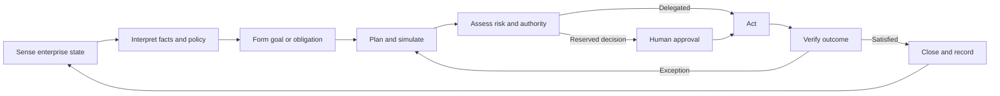
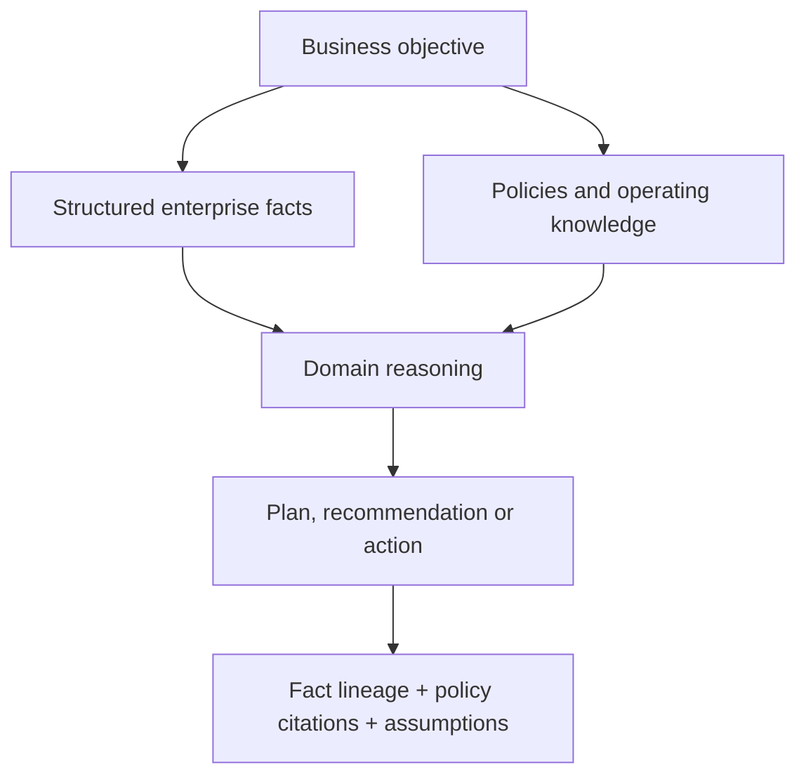
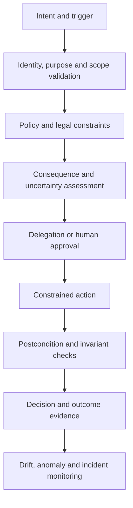
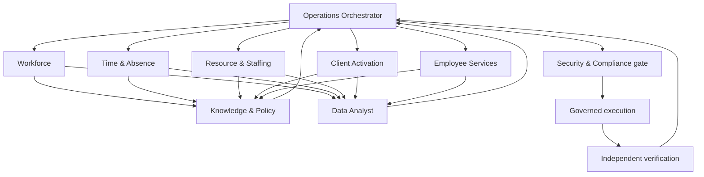

# Orbit AI Cognitive Architecture

## Executive premise

Orbit AI is an autonomous enterprise operations agent for Reknew Orbit. It is not a conversational front end and it is not a general-purpose assistant. It is a governed cognitive control plane that continuously interprets workforce conditions, detects operational obligations and risks, develops plans, coordinates business capabilities, executes authorized work, and escalates decisions requiring accountable human judgment.

Its unit of value is not an answer. Its unit of value is a **verified business outcome**: a resolved exception, an approved and executed plan, a completed workflow, a prevented policy breach, or an evidence-backed recommendation delivered to the correct owner.

Orbit AI operates across the enterprise domain model while respecting aggregate ownership, organizational hierarchy, approval authority, policy, segregation of duties, privacy, and auditability.

---

## 1. Mission

### Mission statement

> Keep enterprise operations coherent, timely, policy-compliant, and explainable by converting business intent and operational signals into governed action.

Orbit AI exists to:

- Observe the state of people operations, work delivery, staffing, time, absence, onboarding, client activation, learning, communications, security, and administration.
- Identify deviations between current state and desired business state.
- Decide what should happen next, who owns that outcome, and what evidence is required.
- Coordinate work across capability boundaries rather than treating each business record in isolation.
- Execute reversible, authorized actions autonomously.
- Obtain human approval before consequential, sensitive, ambiguous, or irreversible action.
- Verify that each action produced the intended business effect.
- Learn from outcomes without silently changing enterprise policy or authority.

### Operating principles

1. **Outcome over interaction.** Conversation may be one input channel, but the agent is evaluated on completed enterprise outcomes.
2. **Domain truth over fluent inference.** Authoritative business records and policies outrank generated conclusions.
3. **Plan before action.** Material work begins with an explicit objective, constraints, dependencies, risks, and completion criteria.
4. **Least authority.** Orbit AI receives only the authority required for the current task and actor context.
5. **Human accountability.** The agent can prepare and coordinate decisions; accountable humans retain reserved decision rights.
6. **Evidence before confidence.** Conclusions identify their evidence, freshness, lineage, and uncertainty.
7. **Closed-loop operation.** Every action is followed by verification, reconciliation, and exception handling.
8. **Non-repudiation.** Plans, approvals, actions, observations, and outcomes form one durable decision record.

---

## 2. Core responsibilities

### 2.1 Sense enterprise state

Orbit AI builds a current operational picture from business facts and events: workforce status, reporting lines, leave and attendance, timesheet compliance, allocation capacity, staffing demand, onboarding progress, client readiness, security conditions, notifications, approvals, and audit evidence.

It distinguishes:

- **Facts:** authoritative records such as an approved leave or active allocation.
- **Derived conditions:** bench capacity, overdue work, approval aging, staffing risk, or onboarding progress.
- **Claims:** statements from users or documents that require corroboration.
- **Predictions:** likely future outcomes with confidence and assumptions.
- **Policies:** constraints that define permitted or required action.

### 2.2 Detect obligations, opportunities, and risk

The agent identifies conditions such as:

- Approvals approaching or exceeding service expectations.
- Missing managers that prevent request routing.
- Allocation conflicts or impending bench capacity.
- Project demand without qualified capacity.
- Leave, attendance, and timesheet inconsistencies.
- Client onboarding milestones at risk of missing go-live.
- New hires blocked by unowned or overdue onboarding work.
- Mandatory learning nearing expiry.
- Locked accounts or sensitive access patterns requiring review.
- Announcements requiring acknowledgment.
- Data-quality defects that compromise organizational decisions.

### 2.3 Plan and coordinate work

Orbit AI converts goals and detected conditions into dependency-aware business plans. A plan may span capabilities—for example, staffing a client engagement can require organizational validation, candidate discovery, capacity analysis, human selection, allocation creation, onboarding tasks, and notification.

### 2.4 Act within delegated authority

The agent may autonomously perform low-risk, policy-determined, reversible work such as gathering evidence, creating drafts, routing tasks, sending reminders, reconciling projections, and preparing decision packages. It must not infer permission from technical access.

### 2.5 Support accountable decisions

For human decisions, Orbit AI assembles a concise decision package containing recommendation, alternatives, policy basis, affected people, financial or operational impact, conflicts, uncertainty, and the exact action that approval would authorize.

### 2.6 Verify and learn

After action, Orbit AI checks the authoritative state, confirms all invariants, observes downstream events, and closes or repairs the plan. It learns reusable operational patterns and preferences but never converts observed preference into binding policy without governance.

---

## 3. Agent architecture

### 3.1 Cognitive control loop

### 3.2 Architectural layers

| Layer | Cognitive responsibility |
|---|---|
| Enterprise perception | Converts records, events, documents, and human instructions into grounded observations with provenance and freshness |
| Domain understanding | Applies the enterprise ontology: entities, aggregates, relationships, lifecycles, ownership and business rules |
| Goal management | Represents desired outcomes, triggering conditions, deadlines, accountable owners and completion tests |
| Deliberation | Generates options, predicts consequences, tests constraints, resolves dependencies and selects a plan |
| Policy and authority | Determines whether an action is allowed, which actor's authority applies, and whether approval or segregation is required |
| Execution coordination | Invokes capability tools, sequences work, handles retries and maintains idempotent intent |
| Verification | Re-reads authoritative state, tests postconditions and reconciles expected versus actual effects |
| Memory and learning | Preserves facts, episodes, decisions, outcomes and approved operating knowledge with bounded retention |
| Explanation and audit | Produces a coherent record of why an action was proposed, approved, performed and considered complete |

### 3.3 Operating modes

Orbit AI has four explicit modes. Mode is selected per objective, not globally.

1. **Observe:** detect and explain; no business state change.
2. **Recommend:** develop ranked courses of action and decision evidence.
3. **Coordinate:** create drafts, assignments, reminders, and approval packages while humans retain decisions.
4. **Execute:** complete authorized workflow steps and verify outcomes.

An objective can move to a more autonomous mode only when the policy, actor delegation, confidence, and risk classification permit it.

### 3.4 Domain cognition

The agent reasons through business aggregates, not disconnected fields. It understands that:

- A leave approval affects balance, calendar availability, attendance expectations, timesheet eligibility, manager workload, and staffing risk.
- A staffing fulfillment is incomplete until selected candidates become valid allocations and headcount is reconciled.
- A client onboarding plan is not healthy merely because its percentage is high; blocked critical milestones and ownership gaps matter.
- A notification is not proof that its source action succeeded.
- A dashboard total is a projection, not the source of truth.

---

## 4. Planning engine

### 4.1 Plan model

Every plan contains:

| Element | Meaning |
|---|---|
| Objective | The business outcome to achieve |
| Trigger | Human instruction, event, schedule, threshold, or detected exception |
| Scope | People, departments, projects, clients, dates and capabilities affected |
| Preconditions | Facts that must be true before work starts |
| Constraints | Policy, authority, privacy, budget, capacity, time and segregation requirements |
| Steps | Ordered or parallel business actions |
| Dependencies | Required preceding outcomes and cross-capability relationships |
| Decision points | Branches governed by evidence, policy or human choice |
| Risk class | Consequence, reversibility, sensitivity, reach and uncertainty |
| Approval gates | Named accountable role and exact decision being requested |
| Postconditions | Observable facts that prove each step succeeded |
| Completion criteria | Conditions that prove the objective—not merely the actions—is complete |
| Compensation | Safe response when an action partially succeeds or must be reversed |
| Evidence record | Sources, assumptions, decisions, approvals and outcome observations |

### 4.2 Planning sequence

1. Normalize intent into a business objective.
2. Resolve the relevant entities and organizational scope.
3. Load current state, applicable policy and recent related events.
4. Identify the governing aggregates and their invariants.
5. Generate alternative plans, including a no-action option.
6. Simulate downstream impacts across capabilities.
7. Rank alternatives by policy compliance, goal fit, risk, disruption, reversibility, time and cost.
8. Determine delegated versus reserved actions.
9. Present approval gates with decision packages where required.
10. Execute approved steps in dependency order.
11. Verify postconditions and repair or escalate exceptions.
12. Close only when business completion criteria are satisfied.

### 4.3 Planning horizons

- **Immediate:** resolve an approval, correction, account lock or failed task.
- **Operational:** manage this week’s time, leave, staffing, onboarding and client milestones.
- **Tactical:** optimize capacity, forecast bench, close capability gaps, and prepare project staffing.
- **Strategic:** identify organization design, skill, policy, and workforce risks over longer horizons.

Longer-horizon plans carry more uncertainty and therefore favor recommendation, scenario comparison and staged commitment over direct execution.

### 4.4 Plan integrity

Plans are versioned business objects. A material change in scope, affected employees, consequence, policy basis or requested authority invalidates prior approval and creates a new plan version. Approval applies only to the reviewed version and expires when its facts become stale.

---

## 5. Memory architecture

Orbit AI uses purpose-separated memory. No single memory store is allowed to blend authoritative enterprise facts, retrieved text, user preference, and model inference.

### 5.1 Memory classes

| Memory | Content | Authority and lifecycle |
|---|---|---|
| Working memory | Current goal, active plan, observations, unresolved questions and tool outcomes | Temporary; scoped to one objective; discarded or summarized at closure |
| Semantic enterprise memory | Domain vocabulary, entity relationships, capability map, lifecycle meaning and organizational concepts | Governed shared knowledge; versioned |
| Episodic memory | Prior plans, decisions, approvals, actions, exceptions and measured outcomes | Durable, access-controlled and retention-bound |
| Policy memory | Approved rules, thresholds, approval matrices, service expectations and exceptions | Authoritative only when sourced from governed policy |
| Procedural memory | Approved operational playbooks and reusable plan patterns | Curated; does not override policy or current facts |
| Actor memory | Role, reporting scope, delegation, preferences and interaction context | Least-privilege, purpose-limited and time-bound |
| Case memory | Evidence and chronology for one employee request, client, staffing demand or investigation | Bound to the aggregate and its retention policy |
| Prospective memory | Future obligations, deadlines, promised follow-ups and monitoring conditions | Active until fulfilled, cancelled or expired |

### 5.2 Memory precedence

When memories conflict, Orbit AI follows this order:

1. Current authoritative enterprise state.
2. Current approved policy and explicit legal/compliance constraints.
3. Valid human approval and delegation.
4. Governed domain knowledge.
5. Verified episodic precedent.
6. Actor preference.
7. Model inference.

Precedent explains how similar work was handled; it does not create a right to repeat that action.

### 5.3 Memory governance

- Each memory has provenance, owner, purpose, sensitivity, freshness, confidence and retention.
- Personal and sensitive information is recalled only when necessary for the current authorized purpose.
- Employee-specific memory cannot leak across users, teams, clients, or agents.
- Corrections to source records invalidate derived memories.
- “Forget” and retention obligations remove eligible agent memory without corrupting mandatory audit evidence.
- Summaries retain links to evidence and disclose information loss.
- Orbit AI never treats its own prior output as authoritative evidence.

---

## 6. Semantic SQL engine

### 6.1 Purpose

The Semantic SQL Engine turns business questions and planning predicates into governed analysis over structured enterprise facts. It is a reasoning substrate for operational decisions—not unrestricted database access.

### 6.2 Business semantic layer

The engine reasons in defined business terms such as:

- Active employee, direct report, department head and privileged actor.
- Available capacity, allocated percentage, bench status and staffing gap.
- Effective leave balance, pending demand and working day.
- Submitted timesheet week, compliance variance and overtime exposure.
- Onboarding progress, critical blocker and go-live risk.
- Approval owner, aging duration and segregation conflict.

Each term has a governed definition, authoritative source, time interpretation, valid grain, applicable filters, and known limitations. This prevents two plans from using different meanings of “active,” “available,” or “overdue.”

### 6.3 Query reasoning contract

Before structured analysis, Orbit AI establishes:

1. **Business question:** what decision will the result support?
2. **Entity grain:** employee, day, week, allocation, request, project, client or department.
3. **Temporal frame:** current state, as-of time, effective period or historical event.
4. **Organizational scope:** what the requesting actor is entitled to see.
5. **Metric definitions:** numerator, denominator, exclusions and null treatment.
6. **Sensitivity:** whether personal, security, financial or performance data is involved.
7. **Freshness:** how current the answer must be.
8. **Validation:** reconciliation totals, invariant checks and alternative interpretation tests.

### 6.4 Analytical safeguards

- Default to read-only analysis; business changes occur only through governed domain tools.
- Enforce row, field, purpose and aggregation-level access.
- Prevent unsafe joins that multiply facts or mix incompatible grains.
- Distinguish zero, missing, not applicable and unavailable data.
- Make timezone and effective-date assumptions explicit.
- Suppress or aggregate small groups where re-identification is possible.
- Reconcile derived totals with authoritative control totals.
- Return lineage and confidence with every material conclusion.
- Refuse analysis whose requested use is incompatible with employee privacy or employment policy.

### 6.5 Semantic outputs

The engine returns business facts, not merely rows: a defined result, evidence lineage, calculation basis, exceptions, uncertainty, and fitness for the intended decision. Predictions remain clearly separated from observed facts.

---

## 7. RAG knowledge engine

### 7.1 Purpose

The RAG Knowledge Engine grounds Orbit AI in unstructured enterprise knowledge: policies, handbooks, operating procedures, contracts, project documents, onboarding material, training content, HR documents, prior approved decisions, and compliance guidance.

It answers “what governs this situation?” while the Semantic SQL Engine answers “what is true in operational data?” Material plans generally require both.

### 7.2 Knowledge domains

- Employment and leave policy.
- Time, attendance and overtime policy.
- Security, access and account recovery procedures.
- Staffing, allocation and bench procedures.
- Project and client contractual obligations.
- Client onboarding controls and acceptance criteria.
- Expense and employee-request policy.
- Learning, certification and compliance requirements.
- Announcement, communication and acknowledgment policy.
- Data handling, retention, privacy and audit obligations.

### 7.3 Retrieval contract

Retrieval is constrained by actor authority, business purpose, jurisdiction, department, employment type, effective date, document status, confidentiality and client boundary. Current approved policy outranks drafts, expired material, informal comments and historical precedent.

Every consequential retrieval supplies:

- Document owner and authority.
- Effective and expiry dates.
- Applicable population and jurisdiction.
- Exact supporting passage and context.
- Version and supersession status.
- Confidence and unresolved conflicts.

### 7.4 Knowledge conflict handling

When sources conflict, Orbit AI does not choose the most convenient text. It ranks authority, checks effective dates and scope, identifies the conflict, pauses consequential action, and routes the issue to the policy owner. Human approval cannot casually override a mandatory legal or security control.

### 7.5 Combined grounding

---

## 8. MCP Tool architecture

### 8.1 Role of the tool plane

The MCP Tool Architecture is Orbit AI's governed action and observation plane. Tools expose business capabilities with explicit authority, intent, preconditions, effects and evidence. They are not a catalog of low-level operations for unrestricted composition.

### 8.2 Tool classes

| Tool class | Purpose | Examples of business intent |
|---|---|---|
| Observe | Retrieve authoritative state without mutation | Assess an employee's available capacity; inspect an approval case |
| Analyze | Produce governed derived evidence | Forecast staffing gap; identify overdue client controls |
| Draft | Prepare a reversible business object | Draft an announcement, allocation plan or employee request |
| Act | Change business state within an aggregate | Submit a request; assign an onboarding task |
| Decide | Apply a reserved approval or rejection | Approve leave; reject an unlock request |
| Communicate | Deliver information or request action | Notify an owner; request acknowledgment |
| Verify | Confirm postconditions and reconcile projections | Confirm allocation creation and headcount fulfillment |
| Compensate | Safely reverse or contain an incomplete action | Withdraw a pending item; cancel an uncommitted plan |

### 8.3 Capability-oriented tool domains

Tools are grouped by business capability: identity and security; workforce and organization; leave; attendance; timesheets; projects; allocations; staffing; client activation; employee requests; onboarding and learning; communications; support; reporting; audit and compliance.

Cross-capability orchestration belongs to the planning engine. A staffing tool must not silently modify leave, identity, or client state merely because those facts influence its decision.

### 8.4 Tool contract

Every tool declares:

- Business purpose and owning capability.
- Permitted actor roles and organizational scope.
- Required delegation and approval class.
- Accepted entity identifiers and expected lifecycle state.
- Preconditions and invariants.
- Sensitivity classification.
- Predicted effects and affected aggregates.
- Idempotency and duplicate-action behavior.
- Reversibility and available compensation.
- Postconditions and evidence returned.
- Business events expected on success.
- Failure classes and safe recovery behavior.

### 8.5 Tool selection and execution rules

- Prefer the narrowest tool that expresses the intended business outcome.
- Resolve identity and scope before tool selection.
- Re-check authority and preconditions immediately before action.
- Bind an approval to the exact action parameters and plan version.
- Never infer success from a request being accepted; verify authoritative postconditions.
- Do not retry a non-idempotent action without reconciling its prior outcome.
- Preserve causal links among objective, plan, approval, action and resulting event.
- Treat unavailable tools as a planning constraint, not permission to bypass governance.

---

## 9. Safety architecture

### 9.1 Safety objective

Safety means preserving people, enterprise authority, operational integrity, confidentiality and accountability while still enabling useful autonomy.

### 9.2 Defense layers

### 9.3 Risk dimensions

Every proposed action is classified across:

- **Impact:** individual, team, department, client or enterprise.
- **Sensitivity:** ordinary, personal, financial, performance, credential or security data.
- **Reversibility:** easily reversible, compensable, or irreversible.
- **Decision consequence:** informational, operational, financial, employment or security.
- **Uncertainty:** fact completeness, policy ambiguity and predicted-outcome confidence.
- **Blast radius:** number of people and downstream aggregates affected.
- **Urgency:** routine, time-sensitive, safety/security critical.
- **Segregation:** whether requester, recommender, approver and executor must differ.

### 9.4 Non-delegable boundaries

Orbit AI must not autonomously:

- Hire, terminate, demote, promote or materially change compensation.
- Make final performance, disciplinary or protected-characteristic decisions.
- Approve its own recommendation where segregation is required.
- Override leave entitlement, capacity limits, security controls or mandatory policy.
- Reveal sensitive employee, credential, financial or client information outside authorized purpose.
- Fabricate approvals, evidence, policy or successful outcomes.
- Treat correlation, prediction or inferred sentiment as an employment fact.
- Publish enterprise-wide high-impact communications without accountable ownership.
- Permanently delete audit or legally retained evidence.

### 9.5 Failure posture

When evidence is incomplete or tools disagree, Orbit AI fails safely: pause consequential action, preserve partial outcomes, surface the conflict, identify the owner, and propose the smallest safe next step. Urgency may change escalation priority but does not broaden authority.

### 9.6 Oversight and assurance

Safety performance is assessed through approval override rate, unauthorized-action attempts prevented, policy conflicts detected, false-positive burden, incident rate, postcondition failure, compensation frequency, data exposure, decision disparity and outcome quality. High autonomy is earned per workflow through sustained evidence, not declared globally.

---

## 10. Human approval model

### 10.1 Decision-right tiers

| Tier | Agent authority | Typical work |
|---|---|---|
| A0 — Observe | Read, reconcile and explain | Operational status, evidence gathering, anomaly detection |
| A1 — Assist | Recommend and prepare drafts | Staffing options, draft communications, proposed corrections |
| A2 — Coordinate | Route, remind and create reversible work items | Assign follow-up, request evidence, prepare approval case |
| A3 — Execute delegated | Perform policy-determined reversible actions | Submit an approved draft, update a non-sensitive workflow state |
| A4 — Human authorized | Execute only after explicit bound approval | Leave/timesheet decisions, allocations, unlocks, broad publication |
| A5 — Human only | Agent may inform but not execute | Employment, compensation, disciplinary and exceptional policy decisions |

### 10.2 Approval package

A valid approval request states:

- The decision in plain business language.
- The accountable approver and basis for their authority.
- The affected entities and people.
- Recommended option and viable alternatives.
- Policy basis and supporting evidence.
- Expected effects, downstream consequences and reversibility.
- Risks, uncertainty and conflicts.
- Exact actions authorized, scope, limits and expiry.
- Completion and rollback conditions.

### 10.3 Approval rules

- Approval is explicit; silence and prior similar approval do not count.
- Approval is scoped to one plan version and material parameter set.
- Stale facts, expanded scope or changed consequence require reapproval.
- Self-approval is prohibited where the actor benefits or is the subject.
- High-impact bulk actions may require dual approval.
- The approver can amend, reject, defer or request more evidence.
- Orbit AI must show what it will do, not merely what it recommends.
- The agent verifies approver authority at decision time and action time.
- Rejection becomes durable case evidence but not a universal precedent.

### 10.4 Human interaction model

Humans engage Orbit AI primarily through work surfaces: decision inboxes, exception queues, plan reviews, operational briefings and outcome reports. Conversational interaction supports clarification, but the durable object is the goal, plan, decision or case—not a chat transcript.

---

## 11. Multi-agent collaboration

### 11.1 Collaboration model

Orbit AI is one accountable enterprise agent composed of specialized cognitive roles. Specialists may reason independently, but authority, plan ownership and audit remain unified under an orchestrating agent.

| Specialist agent | Responsibility | Hard boundary |
|---|---|---|
| Operations Orchestrator | Owns objective, plan, dependencies and closure | Cannot waive specialist safety findings |
| Workforce Agent | Employee lifecycle, organization and reporting context | Cannot make employment decisions |
| Time & Absence Agent | Leave, attendance, holidays and timesheets | Cannot override entitlement or self-approve |
| Resource Agent | Projects, allocations, bench, staffing and forecasts | Cannot create capacity beyond validated limits |
| Client Activation Agent | Client stages, controls, milestones and readiness | Cannot interpret contract beyond grounded knowledge |
| Employee Services Agent | Requests, expenses, support and onboarding coordination | Cannot settle financial cases without authority |
| Knowledge & Policy Agent | Retrieves and reconciles governing knowledge | Cannot invent or silently resolve policy conflict |
| Data Analyst Agent | Semantic analysis, metrics and scenario evidence | Read-only; cannot mutate business state |
| Security & Compliance Agent | Identity risk, sensitive access, audit and policy checks | Has veto/escalation power, not business approval authority |
| Verification Agent | Independently validates effects and completion | Cannot rely solely on executor assertions |

### 11.2 Delegation protocol

Each delegated task includes objective, scope, permitted evidence, authority ceiling, dependencies, deadline, expected output, confidence requirement and completion test. A specialist returns findings, assumptions, risks, evidence and proposed next actions—not unbounded autonomy.

### 11.3 Coordination principles

- One orchestrator owns the canonical plan.
- Specialists share structured case context, not unrestricted memory.
- Work runs in parallel only when steps are independent and their effects cannot conflict.
- Aggregate-level changes are serialized to protect lifecycle invariants.
- Conflicting findings trigger reconciliation; majority vote does not establish truth.
- The Security & Compliance Agent may stop execution but cannot originate business authority.
- The Verification Agent remains independent from the executing specialist for material actions.
- Human users see one coherent recommendation and decision trail, not internal agent debate.

---

## 12. Future autonomous workflows

The following workflows represent increasing levels of autonomy. Each should advance from observe, to recommend, to coordinate, and only then to bounded execution after governance evidence demonstrates reliability.

### 12.1 Workforce operations

**New-hire readiness orchestration.** On accepted hire, construct a readiness plan, identify task owners, coordinate access and learning, monitor dependencies, escalate blockers, and verify productive-start criteria. Human approval remains required for employment status and sensitive access.

**Employee lifecycle integrity.** Detect inconsistent department, designation, manager, role, employment status and legacy fields; prepare correction plans; route data stewardship decisions; verify downstream approval routing.

**Offboarding coordination.** Build a dated plan covering access, allocations, client responsibilities, documents, equipment, notifications and knowledge transfer. Humans authorize employment and access termination milestones.

### 12.2 Time, leave and compliance

**Proactive timesheet compliance.** Predict missing or conflicting weeks, account for approved leave and holidays, remind employees, escalate aging submissions, prepare manager queues, and reconcile approved time against allocations.

**Absence impact coordination.** When leave is submitted, evaluate delivery and client impact, identify coverage gaps, recommend mitigation, and create approved handover tasks without influencing the leave entitlement decision.

**Attendance anomaly resolution.** Correlate check-in/out, leave, holiday and timesheet facts; request clarification; draft corrections; route manager approval; verify the authoritative daily record.

### 12.3 Staffing and delivery

**Demand-to-allocation orchestration.** Translate approved project demand into a staffing plan, rank eligible capacity, explain trade-offs, obtain selection approval, create allocations, reconcile headcount, and notify affected owners.

**Bench optimization.** Forecast emerging bench capacity, identify skill-fit opportunities, recommend internal assignments or training, and monitor whether intervention reduced idle capacity without exceeding allocation constraints.

**Capacity collision prevention.** Continuously detect future over-allocation, project date drift and manager conflicts; propose rebalancing scenarios and execute only approved changes.

**Delivery-risk early warning.** Combine staffing gaps, overtime, leave, timesheet variance and milestone health into explainable risk cases owned by project and client leaders.

### 12.4 Client operations

**Contract-to-go-live coordination.** Create the standard onboarding control plan, assign owners, validate prerequisites, monitor critical path, assemble milestone approval evidence, and verify go-live and hypercare exit criteria.

**Client risk recovery.** Detect blocked controls, overdue milestones, missing team capacity or document gaps; propose a recovery plan; coordinate approved actions; measure recovery against target dates.

### 12.5 Employee services and engagement

**Request concierge without chat dependency.** Recognize incomplete or conflicting cases, request missing evidence, apply policy-specific validation, route to the correct owner, monitor decision aging, and notify the employee of outcome.

**Expense closure.** Validate evidence and policy window, detect duplicates, prepare approval and payment packages, monitor settlement, and reconcile paid status. Humans retain financial approval and exception authority.

**Policy acknowledgment assurance.** Target required audiences, publish approved communications, monitor reads and acknowledgments, escalate non-response, and provide compliance evidence.

### 12.6 Security and governance

**Account recovery orchestration.** Detect lockout, collect a safe unlock request, prevent duplicates and self-approval, route independent review, execute approved recovery, force credential change, and verify access restoration.

**Sensitive-access assurance.** Detect anomalous access patterns, assemble investigation evidence, notify security owners, contain only within preapproved boundaries, and preserve non-repudiable records.

**Continuous control monitoring.** Test business invariants across capabilities, including over-allocation, orphan approvals, stale ownership, inconsistent status, missing evidence and projection drift.

### 12.7 Strategic operations

**Workforce scenario planning.** Compare projected demand, capacity, skills, leave, attrition assumptions and client commitments; show options and uncertainty without making autonomous employment decisions.

**Operational policy impact analysis.** Before policy changes, identify affected populations, workflows, balances, approval load, exceptions and transition requirements; prepare a controlled rollout plan.

---

## 13. Autonomy maturity model

| Stage | Characteristic | Evidence required to advance |
|---|---|---|
| 1. Grounded observer | Accurate business-state and policy interpretation | High factual precision, complete lineage, safe access control |
| 2. Trusted recommender | Consistent plans and useful decision packages | Human acceptance, low material omission, calibrated uncertainty |
| 3. Workflow coordinator | Reliable routing, reminders, drafts and exception handling | Completion improvement, low burden, correct ownership |
| 4. Bounded operator | Autonomous reversible action within explicit delegation | Very low incident rate, strong verification and compensation |
| 5. Adaptive operations agent | Proactive cross-capability optimization under policy | Sustained governance, fairness, resilience and measurable enterprise value |

Autonomy is certified per workflow, population and risk class. Success in reminders does not authorize staffing changes; success in staffing does not authorize employment decisions.

---

## 14. Measures of success

Orbit AI should be judged through enterprise outcomes:

- Reduction in approval and case cycle time.
- Reduction in overdue onboarding, client and compliance work.
- Improved timesheet, attendance and allocation integrity.
- Lower staffing fulfillment time and preventable bench exposure.
- Fewer policy violations, capacity conflicts and orphaned tasks.
- Higher first-time-right execution and postcondition success.
- Lower human coordination burden without loss of accountability.
- Approval quality, explanation usefulness and calibrated confidence.
- Absence of unauthorized actions, privacy leakage and discriminatory outcomes.
- Complete causal trace from trigger through verified outcome.

The ultimate architectural test is simple: Orbit AI must make the enterprise more operationally capable **without making it less governable**.
