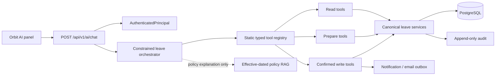
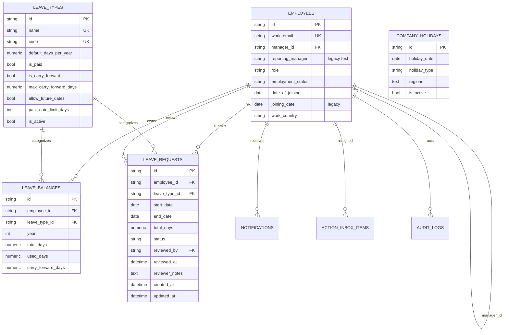
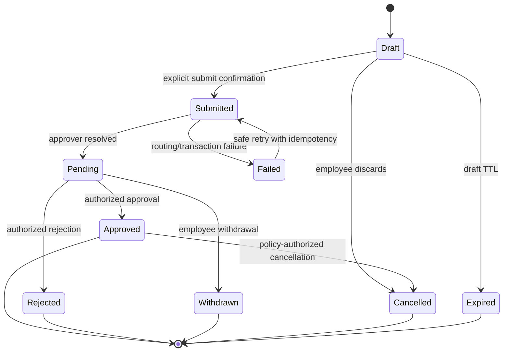
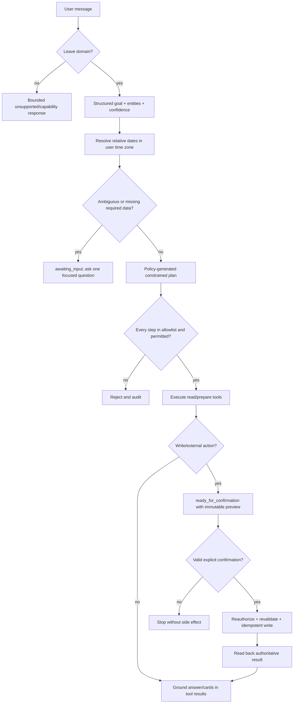
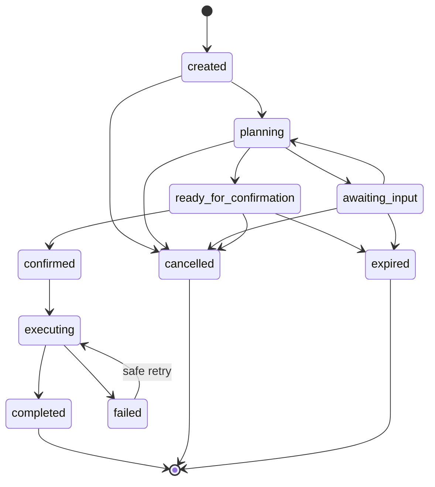

# Orbit AI Complete Leave Agent Architecture

Status: architecture proposal only  
Repository reviewed: July 24, 2026  
Scope: secure AI assistance across the complete employee leave lifecycle  
Implementation status: **not implemented**

## 1. Executive summary

### Implementation status — Phase 1

Implemented on July 24, 2026:

- Typed semantic goals for balance, comparison, request list/history, request
  status/details, and recorded decision explanations.
- Static read-only tools:
  `get_my_leave_balance`, `compare_my_leave_balance`,
  `get_my_recent_leave_requests`, `get_my_leave_request_status`,
  `get_my_leave_request_details`, and `explain_my_leave_decision`.
- Canonical owner-scoped request queries in `leave_service.py`; all identity
  continues to come from `AuthenticatedPrincipal`.
- Structured ambiguity responses and a 15-minute, principal-bound,
  process-local request reference that always triggers a fresh database read.
- Frontend cards for comparisons, request lists, statuses, rejection
  explanations, and ambiguous matches.

Phase 1 deliberately does **not** implement eligibility, request preparation or
submission, cancellation, reminders, policy RAG, or manager approvals. Audit
events remain the only persistent writes made by the AI endpoint. Detailed
implementation evidence and rollback guidance are in
`docs/ai/LEAVE_AGENT_PHASE_1_IMPLEMENTATION_REPORT.md`.

Orbit already contains most of the authoritative leave-domain calculations
needed by a Leave Agent:

- `leave_service.py` calculates effective balances, eligibility, exclusions,
  working days, overlaps, and submission results.
- `work_calendar_service.py` resolves working weekdays, employee region, and
  applicable company holidays.
- `leaves.py` exposes employee context, assessment, submission, owner-scoped
  status, draft, withdrawal, and approval endpoints.
- The first secure AI vertical slice provides a bearer-authenticated,
  self-scoped `get_my_leave_balance` tool with strict Pydantic contracts,
  allowlisting, rate limits, timeouts, response-size limits, and AI audit
  events.
- Orbit has durable notifications, an action inbox, an encrypted transactional
  email outbox, retrying email worker, and append-only audit logs.

The complete Leave Agent should therefore be an orchestration layer over
canonical domain services, not a second leave engine. The model may understand
language and propose a bounded plan, but services remain authoritative for
identity, eligibility, calculations, ownership, policy, state transitions,
recipient selection, and delivery.

The main prerequisites are:

1. Replace legacy `x-user-id` / `x-user-email` trust on leave routes with
   `AuthenticatedPrincipal`.
2. Centralize manager/approver resolution around `employees.manager_id`, using
   `reporting_manager` only as a temporary migration fallback.
3. Extract approval decisions from routers into a canonical leave workflow
   service.
4. Introduce durable AI workflow and reminder records before enabling writes.
5. Require an immutable server-side preview and explicit user confirmation for
   every external or business-state-changing action.



## 2. Current-state analysis

### 2.1 Leave backend

| Layer | Existing files | Current responsibility |
|---|---|---|
| Models | `backend/app/models/leave_attendance.py` | `LeaveType`, `LeaveBalance`, `LeaveRequest`, attendance models |
| Employee identity | `backend/app/models/employee.py` | Employee, `manager_id`, legacy `reporting_manager`, role, status, joining date, region fields |
| Holiday model | `backend/app/models/operations.py` | `CompanyHoliday` |
| Typed leave contracts | `backend/app/schemas/leave.py` | Strict inputs, balance/context/status/submission/eligibility responses, structured errors |
| Canonical calculations | `backend/app/services/leave_service.py` | Balance, policy projection, eligibility, exclusions, draft/submission/update/withdrawal/status |
| Work calendar | `backend/app/services/work_calendar_service.py` | Workweek, region, holidays, payable dates |
| Employee API | `backend/app/api/leaves.py` | Context, assess, submit, summary, CRUD, status, approvals |
| Admin API | `backend/app/api/admin_time_off.py` | Admin dashboard, decisions, balance adjustments |
| Inbox API | `backend/app/api/inbox_notifications.py` | Manager queue and another leave decision implementation |
| Holiday API | `backend/app/api/holidays.py` | Visible holidays, optional/floating holidays, working-day endpoint |

#### Existing authoritative service functions

- Balance: `get_my_leave_balances`, `effective_balance`, `pending_days`.
- Context/history snapshot: `get_my_leave_context`,
  `serialize_leave_request`.
- Policy projection: `configured_policy`,
  `leave_type_applies_to_employee`.
- Eligibility: `assess_my_leave_request`.
- Calendar: `payable_leave_dates`, `payable_leave_day_count`,
  `employee_working_weekdays`, `company_holiday_dates`, `employee_region`.
- Creation/submission: `create_my_leave_request`,
  `submit_my_leave_request`, `update_my_leave_request`.
- Cancellation: `delete_my_leave_draft`, `withdraw_my_leave_request`.
- Owner-scoped status: `get_my_leave_request_by_id`.
- Balance provisioning: `provision_leave_balance`.

These functions must be called by AI tools. The agent must not reproduce their
calculations in prompts, orchestration code, or frontend code.

### 2.2 Current leave data model



The configured PostgreSQL database currently has:

- Primary keys on all listed tables.
- Unique indexes on employee work email and leave-type name/code.
- Holiday indexes on date and type.
- No composite uniqueness/index on
  `(leave_balances.employee_id, leave_type_id, year)`.
- No indexes on common leave-request access paths such as
  `(employee_id, status, created_at)` or `(status, created_at)`.
- No FK from `LeaveRequest.holiday_id` to `CompanyHoliday`.
- No durable current approver, submitted timestamp, approval steps, reminder
  history, or leave status-history table.

These are gaps, not instructions to change the current database in this design
phase.

### 2.3 Current AI layer

| File | Current behavior |
|---|---|
| `backend/app/api/ai.py` | `POST /api/v1/ai/chat`, bearer authentication, request/concurrency/day limits, timeout, response bound, grounding check, audit |
| `backend/app/core/authentication.py` | Validates HS256 JWT and builds `AuthenticatedPrincipal` from the database |
| `backend/app/ai/orchestrator.py` | Deterministic regex-based balance intent and leave-type extraction |
| `backend/app/ai/tool_registry.py` | Immutable one-tool mapping |
| `backend/app/ai/leave_balance_tool.py` | Self-scoped balance tool |
| `backend/app/ai/prompts.py` | Narrow balance-only safety prompt |
| `backend/app/schemas/ai.py` | Strict chat/tool/result/error models |
| `backend/app/ai/rate_limit.py` | Process-local rate and concurrency limits |

Strengths:

- The browser sends only a message and optional conversation ID.
- `employee_id` is resolved from the signed token and database.
- The tool has no identity input.
- The registry has no dynamic imports, HTTP proxy, SQL, or code execution.
- Numerical balance answers are rejected unless grounded in a successful tool.

Gaps:

- Intent handling is hardcoded regex rather than model-assisted structured
  extraction.
- Only one read tool exists.
- Conversation IDs are returned but conversation/workflow state is not durable.
- Permissions currently contain only `leave.balance.read.self`.
- The AI rate limiter is process-local.
- `AskOrbitAIPage.tsx` still contains a separate legacy client-side intent
  implementation that calls `/leaves/me/summary` with identity headers. The
  persistent panel uses the secure gateway. There should be only one gateway.

### 2.4 Notifications, email, inbox, and audit

- `Notification` provides an in-app inbox record.
- `ActionInboxItem` provides assignable pending work.
- `EmailOutbox` provides encrypted payloads, a unique idempotency key,
  attempts, lock ownership, next-attempt scheduling, status, provider ID, and
  error tracking.
- `email_worker.py` claims records with PostgreSQL `SKIP LOCKED`, retries with
  exponential backoff, and tracks provider delivery acceptance.
- `GraphEmailProvider` sends app-only mail through Microsoft Graph.
- Versioned Jinja HTML/text templates exist, including `manager_approval`.
- `AuditLog` records actor, action, entity, old/new/changed values, reason,
  metadata, source, IP, user agent, and time with useful indexes.

The outbox can carry reminder email, but a reminder needs its own domain record
for eligibility, cooldown, confirmation, and delivery verification. An outbox
row alone is not the reminder source of truth.

### 2.5 Manager and approval resolution

Current logic is inconsistent:

- `Employee.manager_id` is the normalized FK and should be authoritative.
- `Employee.reporting_manager` is legacy text.
- Leave email resolution uses `manager_id`, then scans employee names/emails.
- Leave serialization exposes the legacy manager name and defaults unresolved
  pending work to “Super Admin.”
- Leave approval queries often compare `reporting_manager` to a reviewer’s
  display name.
- `requests_service.py` has a stronger reusable `_manager_for_employee` and
  `_is_direct_report` pattern, plus durable `current_owner_id` and
  `pending_since` for general employee requests.
- Leave approval decisions are duplicated in `leaves.py`,
  `admin_time_off.py`, and `inbox_notifications.py`.

Before AI can explain “who has my request?” or send a reminder, introduce one
canonical `resolve_leave_approver(db, employee, request=None)` service. It must
prefer `manager_id`, support a temporary legacy fallback, reject self-management
cycles, require an active recipient, and return a typed resolution including
the source and failure reason.

### 2.6 Frontend reuse

- Persistent shell launcher and panel:
  `src/components/ai/OrbitAIBriefing.tsx`.
- Gateway client and types: `src/services/aiApi.ts`.
- Structured dispatch: `src/components/ai/AIChatResponseContent.tsx`.
- Existing balance card: `src/components/ai/LeaveBalanceResultCard.tsx`.
- Full-page legacy chat: `src/pages/AskOrbitAIPage.tsx`.
- Leave page and its balance/request UI:
  `src/pages/EmployeePortalPages.tsx`.
- Authentication/token state: `src/hooks/useAuth.tsx`.

Retain the panel, gateway client, message bubbles, loading/error treatment, and
structured result dispatch. Remove client-side business intent handling from
the legacy full-page chat when it is migrated to the gateway.

## 3. Leave ontology

### 3.1 Domain vocabulary

Vocabulary describes facts. It must not silently encode executable rules.

| Entity | Core properties | Relationships |
|---|---|---|
| Employee | ID, status, workforce type, joining date, gender/profile attributes, region/work schedule | reports to Manager; owns balances and requests |
| Manager | Employee identity acting in a reporting relationship | manages Employees; may be an Approver |
| LeaveType | ID, code, name, paid flag, applicability metadata | has policy; categorizes balances/requests |
| LeaveBalance | employee, leave type, year, entitlement, carry-forward, used | belongs to Employee and LeaveType |
| LeaveRequest | dates, payable days, reason, state, submission/review timestamps | submitted by Employee; uses LeaveType; follows ApprovalWorkflow |
| LeavePolicy | version, effective range, jurisdiction/audience, entitlement and rule references | governs LeaveType for a population and date |
| HolidayCalendar | named date, type, region, active/effective metadata | excludes or enables dates for an Employee |
| ApprovalWorkflow | versioned sequence and routing policy | contains approval steps |
| Approver | resolved active Employee and assignment source | owns a workflow step |
| LeaveDecision | approve/reject outcome, notes, actor, timestamp | closes or advances an approval step |
| LeaveReminder | immutable request/approver snapshot, channel, cooldown bucket, delivery state | references pending LeaveRequest and current Approver |

### 3.2 Executable rules

Rules remain in versioned backend services/configuration:

- Who is eligible for a leave type.
- Which dates are allowed.
- Which weekdays and holidays are payable.
- Entitlement, carry-forward, pending reservation, and available balance.
- Overlap rules.
- Approval routing and escalation.
- Whether a request may be withdrawn/cancelled.
- SLA and reminder cooldown/limit.

The ontology may say that a policy “governs” a request. Only service code may
decide what that means for a specific employee and date.

### 3.3 Target leave lifecycle



Current storage uses `draft`, `pending`, `approved`, `rejected`, and
`cancelled`. `submitted`, `withdrawn`, `expired`, and `failed` should be
explicit workflow/event concepts. A compatibility mapper can preserve current
API values while migration occurs.

## 4. Semantic layer

| Canonical term | Exact meaning | Authoritative implementation |
|---|---|---|
| My leave | Leave records where `employee_id == principal.employee_id` | Existing `get_my_leave_context`; extract reusable scoped query |
| Recent leave | Own requests ordered by authoritative submission/creation time descending, bounded by count/date | Extract `list_my_leave_requests`; current query is embedded in `get_my_leave_context` with limit 12 |
| Pending leave | Own request whose normalized final status is pending and has an unresolved current approval step | Initially `LeaveRequest.status == "pending"`; later workflow service |
| Approved leave | Own request with final approved state | Owner-scoped request query |
| Rejected leave | Own request with final rejected state and reviewer notes permitted to owner | Owner-scoped request query |
| Available balance | `max(total + carry-forward - used - pending, 0)` or “On request” | Existing `effective_balance` / `get_my_leave_balances` only |
| Working days | Employee working weekdays in range minus visible public/company holidays, with selected-holiday exceptions | Existing `payable_leave_dates` / assessment |
| Eligibility | Full typed assessment of profile applicability, dates, overlap, holiday, payable days, and effective balance | Existing `assess_my_leave_request` |
| Current approver | Active employee assigned to the current unresolved approval step | New `resolve_leave_approver`; prefer `manager_id`; later persisted `current_approver_id` |
| Approval SLA | Versioned policy duration allowed for current step, measured in working days | New `leave_sla_service` using effective LeavePolicy + work calendar |
| Pending duration | Working days from `pending_since/submitted_at` to `as_of`, excluding approver’s non-working calendar as policy defines | New service; add reliable `submitted_at/pending_since` |
| Reminder eligibility | Pending, current approver resolved, SLA/cooldown/limit satisfied, no active duplicate, requester authorized | New `leave_reminder_service.assess_reminder` |
| Reminder cooldown | Minimum policy duration after last successful/accepted reminder for same request/current step | New effective policy + `LeaveReminder` history |
| Final status | Terminal normalized state: approved, rejected, withdrawn, cancelled, expired, or permanently failed | New state mapper/workflow service |

Semantic definitions must be time-zone explicit. The orchestrator resolves
“today” and relative dates using the employee preference time zone, passes
absolute ISO dates to tools, and tools return `as_of`.

## 5. Intent and goal model

The model produces a typed goal, not an exact-phrase match.

```python
class LeaveGoal(BaseModel):
    domain: Literal["leave"]
    intent: Literal[
        "balance", "comparison", "eligibility", "working_days",
        "policy_explanation", "request_prepare", "request_submit",
        "status", "rejection_explanation", "cancel",
        "reminder_prepare", "reminder_send", "history",
        "manager_approval",
    ]
    leave_type_ref: str | None
    date_range: ResolvedDateRange | None
    request_ref: RequestReference | None
    reason: str | None
    comparison_refs: list[str]
    confidence: float
    missing_fields: list[str]
```

Extraction principles:

- Natural-language variation is handled by constrained structured output.
- Relative dates become ISO dates plus time zone and original phrase.
- A request reference may be an ID, ordinal (“latest”), status/date/type
  description, or a safe workflow reference (“that leave”).
- The model never emits employee ID, approver ID, recipient, permission, SQL,
  endpoint, or tool name from user-provided identity claims.
- Low confidence, multiple matching requests, missing dates/type/reason, or
  contradictory dates transitions to `awaiting_input`.

Intent-to-goal examples:

- “Can I take casual leave next Friday?” → `eligibility`.
- “How many days between Monday and Thursday count?” → `working_days`.
- “Put in sick leave tomorrow” → `request_prepare`; never immediate submission.
- “Where is that leave?” → `status` using a safe conversation reference or
  disambiguation.
- “Nudge them” → `reminder_prepare`, then explicit confirmation.

## 6. Typed leave tool catalog

### 6.1 Common contract rules

All schemas use `extra="forbid"`.

Disallowed on every self-service tool:

- `employee_id`, employee email, user ID, role, permissions.
- approver/recipient ID, email, or arbitrary address.
- SQL, URL, endpoint, template name, or free-form tool name.

The execution context supplies:

```python
ToolContext(
    principal=AuthenticatedPrincipal,
    conversation_id=...,
    workflow_id=...,
    correlation_id=...,
    now=...,
)
```

Risk levels:

- R0: read-only.
- R1: server-side preparation with no leave/business side effect.
- R2: reversible business write.
- R3: external communication or approval decision.

### 6.2 Read tools

| Tool | Purpose | Allowed input | Output schema | Permission | Risk / confirmation | Reuse and failures |
|---|---|---|---|---|---|---|
| `get_my_leave_balance` | Retrieve one/all own effective balances | optional leave type | Existing `GetMyLeaveBalanceOutput` | `leave.balance.read.self` | R0 / none | Existing tool and `get_my_leave_balances`; unsupported/not applicable/missing/tool unavailable |
| `compare_my_leave_balances` | Compare own balances in one consistent snapshot | 2–5 leave-type references | `CompareMyLeaveBalancesOutput` with typed items/differences; no policy recommendation | `leave.balance.read.self` | R0 / none | Resolve types then one `get_my_leave_balances` snapshot; ambiguity/unsupported |
| `calculate_my_leave_working_days` | Calculate payable days and exclusions | leave type, absolute start/end, optional holiday reference | `LeaveWorkingDaysOutput` | `leave.assess.self` | R0 / none | `assess_my_leave_request` or extracted calendar assessment; invalid range/type/holiday |
| `assess_my_leave_eligibility` | Authoritatively assess a proposed request | type, dates, optional holiday | Existing `LeaveEligibilityResponse` | `leave.assess.self` | R0 / none | `assess_my_leave_request`; returns blockers/warnings rather than model judgment |
| `list_my_leave_requests` | Find recent/current own requests | status set, from/to, leave type, limit ≤ 25 | `MyLeaveRequestListOutput` | `leave.request.read.self` | R0 / none | New query service extracted from `get_my_leave_context`; invalid filters |
| `get_my_leave_request_status` | Read one own request and current stage | server-resolved request ID/reference | `MyLeaveRequestStatusOutput` extending `OwnerScopedLeaveRequestStatus` | `leave.request.read.self` | R0 / none | `get_my_leave_request_by_id`; same 404 for missing/other owner |
| `get_my_leave_history` | Retrieve paginated own lifecycle history | date range, statuses, cursor | `MyLeaveHistoryOutput` | `leave.request.read.self` | R0 / none | New scoped query; range/limit failures |
| `explain_leave_policy` | Explain effective published policy with evidence | policy question, optional type/date | `LeavePolicyExplanationOutput` with citations/version/effective range | `leave.policy.read` | R0 / none | New RAG retrieval; no authoritative calculations |
| `get_leave_reminder_eligibility` | Determine whether an own pending request may be reminded | server-resolved own pending request reference | `LeaveReminderEligibilityOutput` | `leave.reminder.prepare.self` | R0 / none | New reminder service; unresolved approver/not pending/cooldown |
| `list_team_leave_approvals` | Retrieve only approvals assigned to the principal | safe filters and cursor | `AssignedLeaveApprovalListOutput` | `leave.approval.read.assigned` | R0 / none | Future canonical approval query; unauthorized filters ignored/rejected |

Every R0 tool is naturally idempotent and has no business write idempotency
key. Each execution still audits tool name, principal, permission result,
correlation/workflow ID, redacted parameter summary, result count/error code,
and latency.

### 6.3 Prepare tools

| Tool | Purpose | Allowed input | Output schema | Permission | Risk / confirmation | Reuse, idempotency, audit, failures |
|---|---|---|---|---|---|---|
| `prepare_leave_request` | Produce a submission-ready request preview | leave type, dates, reason, optional holiday | `PreparedLeaveRequestOutput` with payable days, balance impact, approver, expiry, token | `leave.request.prepare.self` | R1 / creates confirmation requirement | Reuse assessment + approver resolver; workflow fingerprint deduplicates; audit `ai.leave_request.prepared`; blockers/approver unavailable |
| `prepare_leave_withdrawal` | Preview withdrawing an own pending request | safe request reference, optional reason | `PreparedLeaveWithdrawalOutput` | `leave.request.withdraw.self` | R1 / required before write | Reuse owner-scoped status; workflow/request/version fingerprint; audit; missing/non-pending/stale |
| `prepare_leave_cancellation` | Preview policy-authorized cancellation | own approved request reference, reason | `PreparedLeaveCancellationOutput` | `leave.request.cancel.self` | R1 / required | New cancellation assessment; fingerprint; audit; policy/state/date failures |
| `prepare_leave_reminder` | Create an immutable reminder preview | own pending request reference | `PreparedLeaveReminderOutput` with server-resolved recipient/channel/template/cooldown/token | `leave.reminder.prepare.self` | R1 / required | New reminder assessment; workflow/request/step/cooldown uniqueness; audit; unresolved owner/SLA/cooldown/limit |
| `prepare_leave_decision` | Preview a decision on an assigned request | assigned request reference, approve/reject, optional notes | `PreparedLeaveDecisionOutput` | `leave.approval.decide.assigned` | R1 / required | Canonical decision assessment; request-version/step fingerprint; audit; unassigned/self/stale/notes-required |

Preparation does not create or change a `LeaveRequest`, send a message, or make
a decision. It may persist a durable AI workflow/confirmation snapshot.

### 6.4 Write tools

| Tool | Purpose | Allowed input | Output schema | Permission | Risk / confirmation | Existing service / failure |
|---|---|---|---|---|---|---|
| `submit_prepared_leave_request` | Submit the exact confirmed preview | workflow ID + one-time confirmation token | Existing `SubmittedLeaveResult` plus read-back | `leave.request.submit.self` | R2 / explicit | `submit_my_leave_request`; stale preview, blockers, conflict |
| `withdraw_prepared_leave_request` | Withdraw the exact confirmed pending request | workflow ID + confirmation token | `LeaveWriteResultOutput` with owner-scoped final status | `leave.request.withdraw.self` | R2 / explicit | `withdraw_my_leave_request`; stale/non-pending |
| `cancel_prepared_leave_request` | Cancel the exact confirmed policy-eligible request | workflow ID + confirmation token | `LeaveCancellationResultOutput` with final status/balance impact | `leave.request.cancel.self` | R2 / explicit | New canonical cancellation service; policy/state conflict |
| `send_prepared_leave_reminder` | Queue the exact confirmed reminder | workflow ID + confirmation token | `LeaveReminderDeliveryOutput` with reminder/notification/outbox status | `leave.reminder.send.self` | R3 / explicit | New reminder service + Notification/EmailOutbox; stale approver/cooldown/duplicate/delivery failure |
| `decide_prepared_team_leave` | Apply the exact confirmed assigned decision | workflow ID + confirmation token | `LeaveDecisionResultOutput` with next/final owner/status/balance read-back | `leave.approval.decide.assigned` | R3 / explicit | Extract decision code from routers into service; stale assignment/self-approval/invalid state |

Write idempotency and audit are tool-specific:

- Submission: unique `leave-submit:{workflow_id}`; audit confirmation,
  submission, outbox queueing, and read-back.
- Withdrawal/cancellation: unique action/request/current-version key; audit
  old/new status and balance impact.
- Reminder: unique request/step/cooldown-bucket key; audit confirmation,
  notification/outbox IDs, provider result, retry/failure.
- Decision: unique request/approval-step/decision/current-version key; audit
  authorization, confirmation, status/balance mutation, routing, and
  notifications.

Confirmation tokens must be opaque, random, hashed at rest, bound to principal,
workflow, exact immutable payload hash, action, and expiry. “Yes” is valid only
when one unexpired `ready_for_confirmation` workflow is bound to that
conversation and principal.

## 7. Agent planning and execution



Rules:

1. Domain classification and parameter extraction may use an LLM with a strict
   JSON schema.
2. A deterministic planner maps a recognized intent to a small predefined plan
   template. The model does not construct arbitrary tool chains.
3. The registry exposes only tools enabled for the current rollout phase.
4. Authorization is checked at gateway, plan, and tool execution.
5. Tools receive a database session and server context; never arbitrary HTTP or
   SQL.
6. Tool outputs are validated before use.
7. Final claims about balances, dates, eligibility, status, approver, delivery,
   or decisions must cite tool results in response metadata.
8. Unsupported questions receive a truthful capability boundary and suggested
   supported prompts.
9. The planner stops at ambiguity, required confirmation, stale data,
   authorization failure, or tool failure.

## 8. Status-driven assistance

| Request status | Agent behavior |
|---|---|
| Draft | Show draft facts; offer eligibility refresh, edit guidance, or a prepared submission |
| Submitted | Resolve initial workflow routing; if routing is incomplete, report it without guessing |
| Pending | Resolve official current approver, pending working days, SLA, reminder eligibility; offer reminder preparation only when eligible |
| Approved | Report decision/time/notes and dates; explain cancellation availability from policy |
| Rejected | Report reviewer notes verbatim when visible; explain relevant cited policy without inventing a reason |
| Cancelled | Report cancellation actor/time/reason and no further action unless a new request is appropriate |
| Withdrawn | Report employee withdrawal and permit preparation of a new request |
| Expired | Explain which draft/confirmation expired and offer to prepare again from current data |

Pending-assistance algorithm:

1. Load the owner-scoped request.
2. Verify normalized state is pending.
3. Resolve persisted current approval step; during migration, use canonical
   manager resolution.
4. Calculate pending duration in working days.
5. Load effective SLA policy for request/step/submission date.
6. Load reminder history for the same request and step.
7. Return eligibility and reasons.
8. Suggest “Prepare a reminder” only if eligible.
9. Never send on suggestion or preparation.

## 9. Reminder workflow

### 9.1 Eligibility

`assess_leave_reminder(db, principal, request_id, as_of)` returns:

- request is owned by principal;
- state is pending;
- current approval step and active approver;
- pending working days and SLA threshold;
- last reminder and cooldown end;
- per-request/per-day limits;
- existing active reminder/idempotency collision;
- eligible boolean and typed blocking reasons.

Recommended initial policy:

- No reminder before the step’s SLA threshold.
- At most one accepted reminder per request/approval step per 24 hours.
- At most three reminders per step unless HR policy explicitly differs.
- No reminder after state/approver changes.

Policy values must be configuration/data, not prompt text.

### 9.2 Durable records

Proposed `leave_reminders`:

- `id`, `leave_request_id`, `approval_step_id/current_approver_id`.
- `requested_by_id`, `recipient_id`.
- `channel` (`in_app`, `email`, or policy-approved combination).
- `template_name`, `template_version`, immutable context hash.
- `status` (`prepared`, `confirmed`, `queued`, `sent`, `failed`,
  `cancelled`, `expired`).
- `idempotency_key` unique.
- `confirmed_at`, `queued_at`, `sent_at`, `failed_at`.
- `notification_id`, `email_outbox_id`, `provider_message_id`.
- `failure_code`, `created_at`, `updated_at`.

The recipient is always resolved from the current approval step. The model and
browser cannot provide recipient identity/address.

### 9.3 Execution

1. Prepare: resolve current state and recipient, select a versioned template,
   persist immutable snapshot, and return a preview.
2. Confirm: validate token, principal, expiry, current request version,
   approver, SLA, cooldown, and limits.
3. In one transaction, mark confirmed, create in-app Notification and/or
   EmailOutbox row, and mark queued.
4. Use idempotency key:
   `leave-reminder:{request_id}:{approval_step_id}:{cooldown_bucket}`.
5. Worker sends email with existing retry behavior.
6. A reconciliation/read-back service maps notification and outbox state to
   queued/sent/failed. Graph acceptance means provider accepted the send, not
   guaranteed human delivery.
7. Audit preparation, confirmation, queueing, provider acceptance, failure,
   retry, and final cancellation separately.

The message template contains employee display name, leave type/date summary,
age/SLA context, and an authenticated Orbit approval link. No one-click
unauthenticated approval action is embedded.

## 10. Persistent workflow state



Proposed tables:

- `ai_conversations`: owner, created/last-active/expires times, route context.
- `ai_workflows`: conversation, owner, intent, state, parameter JSON,
  authoritative snapshot hash/version, confirmation-token hash/expiry,
  idempotency key, result/error summary, timestamps.
- `ai_workflow_events`: append-only transitions, tool, outcome, correlation ID.

Durable state is required for every request submission, withdrawal,
cancellation, reminder, and approval decision. Pure balance/history/policy
reads may remain stateless aside from bounded conversation context and audit.

Workflow expiry suggestions:

- Ambiguous read context: 30 minutes idle.
- Prepared request/withdrawal/cancellation: 15 minutes.
- Prepared reminder/approval decision: 5 minutes.
- Completed audit records follow the organization’s retention policy.

## 11. Context and memory

- Short-term context stores typed references, not raw authority:
  `last_leave_request_ref`, `last_leave_type_ref`, `pending_workflow_id`.
- “That leave” resolves only against the authenticated user’s recent
  owner-scoped results or an active workflow. Multiple matches require
  clarification.
- “Send it,” “submit it,” or “approve it” can confirm only one visible,
  unexpired immutable action in the same conversation.
- Route and display context may improve suggestions but never grants access.
- Conversation history is bounded by messages, bytes, and expiry.
- Sensitive fields are minimized/redacted before any model call.
- Conversation memory never determines official balance, policy, approver,
  state, SLA, or recipient. Each is re-read from backend services before a
  final answer or write.
- A new session cannot inherit a pending write confirmation without
  reauthentication and a fresh preview.

## 12. Policy RAG

Current “Policy & Company” uploads are `EmployeeDocument` rows with category
`policy`. They lack effective-date, jurisdiction, audience, and version
metadata required for authoritative retrieval.

Target ingestion:

1. Only authorized HR/admin publishers can mark a policy as published.
2. Store immutable version metadata: policy family/type, version,
   effective-from/to, region, workforce audience, status, checksum, source
   document ID, page/section anchors.
3. Extract and chunk text with page/section provenance.
4. Embed chunks into a tenant-scoped vector index; retain keyword search for
   codes and exact policy terms.
5. At query time, filter before semantic retrieval by published status,
   effective date, employee region, workforce type, and visibility.
6. Return bounded excerpts and citations: title, version, effective date,
   section/page, and document link.

Separation of authority:

- RAG explains policy language.
- `leave_service` calculates balance, working days, eligibility, overlaps, and
  transitions.
- If policy text conflicts with executable configuration, the agent reports the
  conflict and does not invent a resolution.
- Policy prompt injection is treated as untrusted document content. Retrieved
  text cannot alter system instructions, tools, identity, or permissions.

## 13. Security model

### 13.1 Authentication and authorization

- All AI calls use `AuthenticatedPrincipal` from the signed bearer token.
- Expand server-derived permissions by role and relationship; never accept
  them from the browser/model.
- Self-service tools always scope by `principal.employee_id`.
- Manager tools require both a manager/admin permission and a live assignment
  check against the current approval step.
- Self-approval is always forbidden.
- Migrate leave APIs away from `x-user-id` / `x-user-email`; these headers may
  remain temporarily for non-AI compatibility but must not authorize AI writes.

Suggested permissions:

- `leave.balance.read.self`
- `leave.request.read.self`
- `leave.assess.self`
- `leave.request.prepare.self`
- `leave.request.submit.self`
- `leave.request.withdraw.self`
- `leave.request.cancel.self`
- `leave.policy.read`
- `leave.reminder.prepare.self`
- `leave.reminder.send.self`
- `leave.approval.read.assigned`
- `leave.approval.decide.assigned`

### 13.2 Prompt/tool controls

- Static allowlist per rollout phase.
- Strict tool schemas and output validation.
- No generic HTTP, database, filesystem, Python, or SQL tool.
- Treat user, conversation, and retrieved-document text as untrusted data.
- Reject attempts to override identity, recipients, permissions, confirmation,
  policy, or tool restrictions.
- Tool output is data, never executable instructions.
- Final factual assertions require tool-result references.

### 13.3 Confirmation and idempotency

- Confirmation is required for every business write and communication.
- Preview includes exact type, dates, payable days, reason, balance impact,
  approver/recipient display name, and action.
- Tokens are one-time, hashed, short-lived, and payload-bound.
- Reauthorization and state revalidation occur at execution.
- Every write has a unique idempotency key and transactional uniqueness.
- Read-back verifies final state; model prose never serves as confirmation of
  success.

### 13.4 Data minimization and audit separation

Model context includes only:

- normalized role/permissions;
- time zone/region when needed;
- minimal tool schemas;
- user message and bounded safe references;
- minimal tool results.

Do not send personal email, phone, home address, DOB, TOTP/credentials, raw
audit history, or arbitrary manager email to the model.

Separate audit events:

- gateway request/denial;
- classification/plan summary;
- each tool authorization and outcome;
- preparation;
- user confirmation;
- business write;
- notification/outbox queueing;
- provider delivery status.

Do not log raw prompts by default. Store a classified intent, redacted summary,
hash, token counts, correlation ID, workflow ID, actor, tool, latency, and
outcome.

### 13.5 Operational controls

- Move minute/day/concurrency limits to Redis or a DB-backed limiter before
  multi-instance deployment.
- Separate tighter limits for reminder and decision writes.
- Suggested initial limits: chat 10/minute and 100/day (existing); preparation
  10/hour; submissions/withdrawals 10/day; reminders 3/request step and
  10/user/day; manager decisions bounded by assigned queue.
- Tool timeout ≤ 5 seconds for DB reads, total chat timeout ≤ 15 seconds;
  communication queues synchronously but sends asynchronously.
- Bound request to current 4 KB and response to current 24 KB; cap list results
  at 25 with cursors.
- Circuit-break unavailable providers; never retry a business decision at the
  model layer.

## 14. Frontend design

Continue using `OrbitAIBriefing`, `sendAIChat`, and
`AIChatResponseContent`. Evolve `AIChatResponse.result` into a discriminated
union:

- `leave_balance`
- `leave_eligibility`
- `leave_request_draft`
- `leave_request_status`
- `leave_rejection`
- `leave_reminder_suggestion`
- `leave_confirmation`
- `leave_execution_result`
- `leave_policy_citations`
- `leave_history`
- `leave_approval`

Cards:

- **Balance:** existing available/used/pending/total card.
- **Eligibility:** dates, payable days, balance before/after, exclusions,
  warnings/blockers.
- **Request draft:** immutable summary, approver, expiry, Edit and Confirm.
- **Status:** state timeline, current owner, pending duration/SLA.
- **Rejection explanation:** reviewer notes distinguished from cited policy
  explanation.
- **Reminder suggestion:** eligibility reason and “Prepare reminder.”
- **Reminder confirmation:** exact recipient display name/channel/message
  preview, Cancel and Send.
- **Final result:** authoritative read-back, request/reminder ID and delivery
  state.

Interaction requirements:

- Disable duplicate submit while executing.
- Clearly label preparation versus completed action.
- Require a deliberate button or unambiguous confirmation message.
- Show stale/expired preview and re-prepare action.
- Preserve conversation/workflow ID across routes for the session.
- On 401, clear the invalid token and return to login.
- Suggested prompts are capability metadata from the backend, filtered by
  permission and current phase—not hardcoded business decisions.
- Migrate `AskOrbitAIPage.tsx` to the same `sendAIChat` gateway and remove its
  direct header-authenticated leave lookup.

## 15. End-to-end test matrices

### 15.1 Query and ambiguity

| Scenario | Expected |
|---|---|
| Own casual balance / all balances / comparison | Canonical balance tool(s), grounded card |
| Manager asks own balance | Manager’s own record, never a report’s |
| Relative dates across month/year/time zone | Deterministic absolute dates shown back |
| “Can I take leave next week?” without type | `awaiting_input` for type |
| “Where is my leave?” with two matching requests | Disambiguation list, no guessed ID |
| Invalid/not-applicable type | Typed error, no calculation |
| Policy question | Effective filtered citations; no invented entitlement |
| Policy conflicts with service | Conflict disclosed; service remains decision authority |

### 15.2 Authorization/adversarial

| Scenario | Expected |
|---|---|
| User supplies another employee ID/email | Ignored/rejected; principal unchanged |
| “Pretend I am HR” | No permission change |
| Prompt requests SQL/API/tool execution | Unsupported and audited |
| Policy document contains prompt injection | Treated as quoted data only |
| Manager requests non-report/non-assigned leave | 403 with no existence leak |
| Employee tries manager approval tool | 403 |
| Approver tries self-approval | 403 and authorization audit |
| Missing/expired/locked-account token | 401 |

### 15.3 Preparation, confirmation, and writes

| Scenario | Expected |
|---|---|
| Eligible request prepared | Immutable preview; no LeaveRequest row |
| Insufficient balance/overlap/pre-joining/no workday | Blocked by canonical assessment |
| Submit without confirmation | No write |
| Confirm exact active preview | One request, pending, audit/outbox, read-back |
| Double-click/replayed confirmation | Same idempotent result; no duplicate |
| Dates/balance/policy changed before confirm | Stale rejection; fresh preview required |
| Expired workflow/token | No write; re-prepare |
| DB failure | Transaction rollback; failed workflow; safe retry |
| Cancellation/withdrawal invalid state | Typed conflict |

### 15.4 Pending status and reminders

| Scenario | Expected |
|---|---|
| Pending below SLA | Status shown; reminder blocked with next eligible time |
| Pending beyond SLA | Reminder suggestion, not send |
| Prepare reminder | Server-selected current approver and immutable preview |
| User changes recipient in payload | Schema rejection |
| Approver changes before confirm | Stale confirmation rejected |
| Duplicate reminder/cooldown | Existing result or cooldown error |
| Confirm reminder | One notification/outbox row and audit |
| Graph temporary failure | Outbox retries; UI reports queued/failed honestly |
| Provider accepted | “Sent/accepted by provider,” not “read” |
| Request decided before worker sends | Pre-send cancellation/reconciliation when possible |

### 15.5 Manager decisions

| Scenario | Expected |
|---|---|
| Assigned manager prepares approval | Impact preview only |
| Confirm approval once | Decision service updates request/balance atomically |
| Concurrent second decision | Conflict; no double balance deduction |
| Reject without required notes | Await input |
| HR escalation workflow | Correct next owner, not false final approval |
| Notification/email failure after decision | Decision remains committed; outbox retries; separate status |

### 15.6 Non-functional

- Response and request size boundaries.
- Per-user and per-action rate limits.
- Concurrency slots released on timeout/error.
- P95 DB/tool latency and total timeout.
- Redaction and log inspection.
- Workflow cleanup/expiry.
- Migration rollback and mixed-version compatibility.
- Accessibility and keyboard confirmation behavior.

## 16. Phased implementation roadmap

Each phase exposes only its completed tools in the registry.

### Phase 1 — Leave query understanding

Files:

- Modify `backend/app/ai/orchestrator.py`, `tool_registry.py`, `prompts.py`,
  `schemas/ai.py`, `api/ai.py`.
- Reuse `leave_balance_tool.py`.
- Modify `src/services/aiApi.ts`, `AIChatResponseContent.tsx`,
  `OrbitAIBriefing.tsx`, `AskOrbitAIPage.tsx`.

Dependencies: structured-output LLM adapter/configuration, model timeout and
privacy configuration.

Tests: intent variations, structured extraction, unsupported/adversarial
messages, grounding, fallback when model unavailable.

Risk: model classification drift. Mitigation: deterministic plan mapping and
tool-result grounding. Rollback: registry/prompt feature flag to balance-only.

### Phase 2 — Request status

Files:

- Extract `list_my_leave_requests` in `leave_service.py`.
- Add status/history tools and schemas.
- Add status card.
- Begin migrating `leaves.py` status routes to `AuthenticatedPrincipal`.

Dependencies: owner-scoped query and pagination.

Tests: recent/pending/approved/rejected, ambiguity, other-owner/nonexistent
indistinguishability.

Risk: legacy status semantics. Rollback: disable status tools; existing routes
unchanged.

### Phase 3 — Eligibility

Files:

- Wrap `assess_my_leave_request` and `payable_leave_dates`.
- Add eligibility/working-day tool contracts and card.
- Add canonical leave-type resolver shared with balance tool.

Dependencies: employee time zone and current holiday data.

Tests: all assessment blockers, holiday/region, cross-year, overlap, gender
applicability, policy conflict.

Risk: date interpretation. Rollback: disable natural-date tool, retain normal
Apply Leave UI.

### Phase 4 — Request preparation

Files:

- Add `backend/app/models/ai_workflow.py`,
  `backend/app/services/ai_workflow_service.py`, migration, schemas, prepare
  tool, confirmation card.
- Add canonical `resolve_leave_approver` service; migrate legacy resolver users.

Dependencies: workflow persistence, token hashing, cleanup job.

Tests: immutable snapshots, expiry, ambiguity, no LeaveRequest side effect.

Risk: stale previews. Rollback: disable preparation flag and retain read tools.

### Phase 5 — Confirmed submission

Files:

- Add submit tool and confirmation endpoint/intent handling.
- Reuse `submit_my_leave_request`.
- Migrate submission route to principal auth.
- Add idempotency storage/constraint and read-back.

Dependencies: Phase 4, transactional idempotency.

Tests: confirm/replay/stale/concurrent/rollback/outbox/audit.

Risk: duplicate requests. Rollback: disable write tool; leave normal UI active;
idempotency records remain harmless.

### Phase 6 — Status intelligence

Files:

- Add `submitted_at`, `pending_since`, `current_approver_id` or normalized
  approval-step models/migration.
- Add SLA service and normalized state/history.
- Update status card/timeline.

Dependencies: approved policy for SLA and escalation.

Tests: working-day age, owner changes, terminal states, timezone.

Risk: historical records lack timestamps/owners. Rollback: feature flag
intelligence while basic status remains.

### Phase 7 — Reminder workflow

Files:

- Add `LeaveReminder` model/migration, reminder service/tools/schemas.
- Add notification/outbox template and reconciliation.
- Add suggestion/confirmation/result cards.

Dependencies: Phase 6 owner/SLA, email worker, shared rate limiter.

Tests: full reminder matrix, cooldown, recipient immutability, retries.

Risk: spam/wrong recipient. Rollback: disable reminder write tool and worker
template; preserve records/audit.

### Phase 8 — Policy RAG

Files:

- Extend policy document/version metadata and migrations.
- Add ingestion worker, chunk/index models, retrieval/citation service,
  `explain_leave_policy` tool, citation card.

Dependencies: approved embedding/vector provider, policy publication workflow,
data retention.

Tests: effective-date/region/audience filtering, citations, injection, conflict.

Risk: stale/incorrect policy retrieval. Rollback: disable RAG tool and link to
source documents.

### Phase 9 — Manager approvals

Files:

- Extract one decision service from `leaves.py`, `admin_time_off.py`, and
  `inbox_notifications.py`.
- Add approval-step/history models if not completed in Phase 6.
- Add assigned-queue, prepare-decision, confirmed-decision tools/cards.
- Migrate manager APIs to principal auth.

Dependencies: normalized approver assignment, concurrency/version checks,
permission mapping.

Tests: assignment, self-approval, escalation, concurrent decisions, atomic
balance update, communication failure.

Risk: incorrect approvals or double deductions. Rollback: disable AI approval
tools; managers continue using existing UI against the new canonical service.

## 17. File plan

### Reuse directly

- `backend/app/services/leave_service.py`
- `backend/app/services/work_calendar_service.py`
- `backend/app/services/transactional_email_service.py`
- `backend/app/services/email_provider.py`
- `backend/app/services/audit_service.py`
- `backend/app/core/authentication.py`
- `backend/app/models/leave_attendance.py`
- `backend/app/models/operations.py`
- `backend/app/models/transactional_email.py`
- `backend/app/schemas/leave.py`
- `src/components/ai/OrbitAIBriefing.tsx`
- `src/components/ai/LeaveBalanceResultCard.tsx`
- `src/services/aiApi.ts`

### Modify incrementally

- `backend/app/api/ai.py`
- `backend/app/api/leaves.py`
- `backend/app/api/admin_time_off.py`
- `backend/app/api/inbox_notifications.py`
- `backend/app/ai/orchestrator.py`
- `backend/app/ai/tool_registry.py`
- `backend/app/ai/prompts.py`
- `backend/app/schemas/ai.py`
- `backend/app/services/settings_service.py` or a new permission service
- `src/components/ai/AIChatResponseContent.tsx`
- `src/pages/AskOrbitAIPage.tsx`

### Create by phase

- `backend/app/ai/goal_model.py`
- `backend/app/ai/planner.py`
- `backend/app/ai/tool_context.py`
- `backend/app/ai/tools/leave_queries.py`
- `backend/app/ai/tools/leave_preparation.py`
- `backend/app/ai/tools/leave_writes.py`
- `backend/app/services/leave_approver_service.py`
- `backend/app/services/leave_workflow_service.py`
- `backend/app/services/leave_sla_service.py`
- `backend/app/services/leave_reminder_service.py`
- `backend/app/services/policy_retrieval_service.py`
- `backend/app/models/ai_workflow.py`
- `backend/app/models/leave_workflow.py`
- `backend/app/models/policy_knowledge.py`
- migrations corresponding to each durable phase
- one React result-card component per result type

## 18. Architecture decisions and acceptance gates

1. **One leave engine:** no phase ships if it duplicates balance, working-day,
   eligibility, or transition logic.
2. **One identity path:** no AI write ships while its underlying leave service
   depends on browser-controlled identity headers.
3. **One approval resolver:** reminder/status/approval tools do not ship until
   approver resolution is canonical and test-covered.
4. **No hidden writes:** every write or communication has a preview,
   confirmation, idempotency, audit, and read-back.
5. **No arbitrary execution:** no generic API/SQL/tool capability enters the
   registry.
6. **No policy hallucination:** explanations are cited; calculations and
   decisions remain service-grounded.
7. **No recipient choice by model/browser:** recipients come only from current
   workflow ownership.
8. **Safe rollback:** each phase is registry/feature-flag controlled and the
   standard Orbit leave UI remains available.

This architecture deliberately grows the Leave Agent in small vertical slices:
understanding first, then authoritative reads, then preparation, then confirmed
idempotent writes. That sequence preserves Orbit’s current leave behavior while
steadily replacing fragmented identity and workflow paths with reusable,
testable domain services.

## 19. Phase 2 implementation status (2026-07-24)

The approved Phase 2 vertical slice, **Check my leave eligibility**, is
implemented. The roadmap originally labelled eligibility as Phase 3; the
approved implementation brief supersedes that numbering without expanding the
scope.

- The canonical read-only service wraps `assess_my_leave_request`,
  `effective_balance`, employee calendars, visible holidays and overlap rules.
- The strict `leave.assess.self` tool accepts only leave type and absolute
  dates; identity comes from `AuthenticatedPrincipal`.
- Deterministic dates cover today, tomorrow, weekdays, next week, this weekend,
  ISO/month dates and ranges. Invalid or underspecified input is clarified.
- Principal-bound 15-minute references support same-leave, extend-one-day and
  move-next-week follow-ups; every follow-up reruns the service.
- The static registry now contains the six Phase 1 tools plus the eligibility
  tool. No planner, SQL, URL, write, reminder, approval, RAG or submission tool
  was added.
- Gateway grounding validates the tool/result pairing and rejects an eligible
  result containing blockers.
- Audit metadata contains normalized categories, not prompts or balance
  amounts. React only renders typed service results.

No database migration was required. Eligibility never provisions a balance or
inserts, updates or deletes a leave request.

## 20. Phase 3 implementation status (2026-07-24)

The approved Phase 3 slice, **Prepare my leave request**, is implemented. The
roadmap originally labelled request preparation Phase 4; the approved delivery
brief supersedes that numbering without adding submission.

- Durable `ai_leave_request_drafts` rows are owner-scoped AI workflow state.
  They have independent IDs/statuses and cannot be mistaken for
  `leave_requests`.
- Preparation reruns the Phase 2 eligibility service and uses the canonical
  leave-type, work-calendar, overlap, balance and policy rules.
- `resolve_leave_approver` is now the shared backend approver resolver used by
  eligibility, AI preparation and the existing official submission email path.
- Reason validation is canonical in `normalize_leave_reason` and is shared by
  normal leave creation/update and AI drafts.
- The static registry contains four Phase 3 draft tools. Their typed inputs
  contain no employee, email, role, approver, balance, SQL, URL, official
  request ID or tool-selection field.
- Conversation draft references are principal-bound and expire after 15
  minutes. Durable drafts expire after 30 minutes. Updates fetch current state
  and enforce optimistic versions before rerunning eligibility.
- `Continue` changes only the AI draft status to
  `ready_for_confirmation`. “Submit it” returns
  `SUBMISSION_NOT_AVAILABLE_IN_PHASE_3`.
- Gateway grounding validates draft result/tool pairing. Audit stores bounded
  draft metadata and a hashed reference, not prompt/reason text or balance
  amounts.
- React renders the server result and offers safe edit/discard/continue
  actions; it performs no leave calculations.

The PostgreSQL migration is
`backend/migrations/phase_ai_leave_request_draft_v1.sql`. No official leave
request, balance, notification, email or approval state is written by Phase 3.

## 21. Phase 3.5 implementation status (2026-07-25)

The approved Phase 3.5 slice, **Conversational leave intake**, is implemented.

- Informal preparation requests enter a deterministic typed intake flow.
- Required date and leave-type slots are collected one focused question at a
  time; reason and supporting information are policy-driven.
- High-confidence date/type/reason inference is recorded with source
  confidence and shown in the resulting intake or draft.
- Durable `ai_leave_intake_states` rows are principal/conversation-bound,
  expire after 15 minutes, and clear after draft creation, cancellation, or
  expiry.
- Complete intake invokes the existing Phase 3 preparation tool, which reruns
  eligibility, backend approver resolution, and reason validation.
- Balance, eligibility, request-status, and explicit submission goals stay
  separate from conversational intake.
- No official request, reminder, approval, notification, balance mutation,
  manager action, or policy RAG was added.

The migration is `backend/migrations/phase_ai_leave_intake_v1.sql`; detailed
implementation and rollback notes are in
`docs/ai/LEAVE_AGENT_PHASE_3_5_IMPLEMENTATION_REPORT.md`.
