# Contextual LLM Phase A: Shadow-Mode Implementation Report

Date: 2026-07-25  
Scope: observation-only contextual interpretation for Orbit AI leave messages

## Outcome

Phase A is implemented behind disabled-by-default backend flags. For an
authenticated Orbit AI request, the existing deterministic orchestrator still
finishes first and remains authoritative. When both shadow flags are enabled, a
background observer builds a minimal owner-scoped context, asks a configured
provider for strict structured interpretation, validates it, compares it with
the deterministic result, and stores safe evaluation metadata.

The shadow result cannot call a tool, modify a conversation/intake/draft, create
or submit leave, or change the HTTP response returned to the employee.

```mermaid
flowchart LR
    U["Authenticated message"] --> D["Deterministic orchestrator"]
    D --> T["Existing authorized tools"]
    T --> R["Existing employee response"]
    R -. "after response; flags enabled" .-> C["Redacted context builder"]
    C --> P["LLM provider"]
    P --> V["Strict schema validation"]
    V --> E["Comparison evaluator"]
    E --> S["Safe shadow metadata"]
```

## Provider abstraction

The provider contract is `LLMProvider.interpret(LLMProviderRequest)`. It returns
an `LLMProviderResponse` containing a validated interpretation, provider/model
labels, latency, and optional token counts.

Implementations:

- `DisabledLLMProvider`: fails closed and performs no network call.
- `OpenAILLMProvider`: official OpenAI Python SDK adapter using Responses API
  strict Pydantic parsing, provider storage disabled, and no tools.
- `OpenAICompatibleLLMProvider`: isolated server-side HTTP adapter using strict
  JSON-schema structured output. Credentials are read only from backend
  configuration.

Execution policy:

- timeout is clamped to a safe 0.25–15 second range;
- retry count is capped at one retry;
- authentication, permission, model, bad request, structured output, rate,
  quota, server, DNS, TLS, connection, timeout, and invalid-response failures
  map to safe categories;
- provider failures are logged server-side and are never returned to the
  employee.

## Feature flags and configuration

All values are server-only and documented in `.env.example`:

| Setting | Safe default | Purpose |
|---|---:|---|
| `CONTEXTUAL_LLM_ENABLED` | `false` | Global Phase A kill switch |
| `CONTEXTUAL_LLM_SHADOW_MODE` | `true` | Requires observation-only mode |
| `CONTEXTUAL_LLM_PROVIDER` | `disabled` | Provider factory selector |
| `CONTEXTUAL_LLM_MODEL` | empty | Server-selected model |
| `CONTEXTUAL_LLM_API_KEY` | empty | Server credential |
| `CONTEXTUAL_LLM_BASE_URL` | provider URL | Server endpoint |
| `CONTEXTUAL_LLM_TIMEOUT_SECONDS` | `4` | Per-attempt timeout |
| `CONTEXTUAL_LLM_RETRY_COUNT` | `1` | Bounded retry |
| `CONTEXTUAL_LLM_MAX_INPUT_TOKENS` | `3000` | Input budget |
| `CONTEXTUAL_LLM_MAX_OUTPUT_TOKENS` | `700` | Output budget |
| `CONTEXTUAL_LLM_TEMPERATURE` | `0` | Sampling control |
| `CONTEXTUAL_LLM_PROMPT_VERSION` | `leave-context-v1` | Evaluation version |

No provider secret is sent to or referenced by the frontend.

## Strict interpretation contract

`ContextualInterpretation` permits only:

- domain and goal;
- workflow action;
- approved leave-field extraction and confidence;
- ambiguity and clarification requirements;
- semantic capability identifiers from a closed enum;
- confirmation requirement and response intent.

Pydantic uses `extra="forbid"` throughout. Validation rejects unknown identity
fields, employee/manager/approver IDs, email/permission overrides, SQL or API
instructions, arbitrary tool names, and unsafe text embedded in extracted
fields. The provider returns no executable function name and receives no
executable tool registry.

## Context package

The builder reads only owner-scoped data and includes:

- active leave intake or active AI-only draft stage;
- safe collected fields and missing/optional field names;
- `reason_present` instead of the reason text;
- at most eight recent owner-scoped user/assistant messages;
- trusted backend date and employee timezone;
- semantic descriptions of approved capabilities.

Redaction removes bearer tokens, authentication/user headers, email addresses,
and UUID-like references. It excludes employee profiles, another employee’s
data, secrets, schema/SQL, policy documents, raw tool results, balances,
eligibility decisions, and official statuses.

## Shadow execution and isolation

`POST /api/v1/ai/chat` creates the employee response using the unchanged
deterministic path. Only after that response exists does it schedule the shadow
task. The task opens an independent SQLAlchemy session and catches all
exceptions.

The observer imports no tool executor and receives no callback capable of
calling one. Its only persistent write is the approved evaluation record. It
does not call conversation, leave-intake, leave-draft, or leave-request write
services.

## Comparison and storage

The evaluator compares deterministic goal/capability/field categories and
active workflow continuation with the LLM domain, goal, workflow action,
field categories, ambiguity, and semantic capabilities. Outcomes include:

- exact or compatible agreement;
- either interpreter identifying workflow continuation;
- routing or extraction disagreement;
- unsafe proposal;
- invalid structured output;
- timeout or provider failure.

Rows store actor, conversation/correlation references, workflow/result
categories, structured interpretation categories, provider/model, latency,
token counts, error category, and prompt version. They do **not** store raw
prompts, raw provider responses, leave reasons, balances, bearer/API tokens,
employee records, or private tool results.

Migration: `backend/migrations/phase_contextual_llm_shadow_v1.sql`.

## Dataset and metrics

`backend/tests/evals/contextual_leave_phase_a.json` contains 28 reviewed,
non-production cases spanning:

- leave intake continuation and multi-field follow-ups;
- goal switches and resume references;
- informal/spelling variations;
- ambiguous references;
- fake role claims, employee-ID/SQL/tool injection, prompt injection, and
  another-employee requests.

Each case declares active workflow, recent conversation, expected structured
interpretation, allowed capabilities, and prohibited behavior.

Owner-scoped development diagnostics calculate domain, goal, workflow-action,
multi-field extraction, clarification, reference resolution, unsafe proposal,
structured validity, timeout, and disagreement rates, separated into
standalone, active-workflow, topic-switch, and security/adversarial segments.
Runtime comparison metrics treat the deterministic path as a baseline; reviewed
dataset metrics are required before promotion.

## Developer visibility

`GET /api/v1/ai/shadow-diagnostics` is hidden from OpenAPI and available only
in development/test to authenticated admin or super-admin principals. Admin
results aggregate employee-generated shadow records so operational failures are
not hidden by the administrator's employee ID. Non-admin service use remains
owner-scoped. Results contain structured fields/comparison metadata only.
Chain-of-thought and hidden reasoning are never stored or displayed.

## Files created

- `backend/app/ai/context_builder.py`
- `backend/app/ai/contextual_schemas.py`
- `backend/app/ai/providers/__init__.py`
- `backend/app/ai/providers/base.py`
- `backend/app/ai/providers/disabled.py`
- `backend/app/ai/providers/factory.py`
- `backend/app/ai/providers/openai_compatible.py`
- `backend/app/ai/providers/openai_provider.py`
- `backend/app/ai/prompt_templates.py`
- `backend/app/ai/prompt_templates/contextual_leave_interpreter_v2.json`
- `backend/app/ai/shadow_evaluator.py`
- `backend/app/services/contextual_shadow_service.py`
- `backend/migrations/phase_contextual_llm_shadow_v1.sql`
- `backend/migrations/phase_contextual_llm_provider_diagnostics_v1.sql`
- `backend/tests/evals/contextual_leave_phase_a.json`
- `backend/tests/test_contextual_llm_shadow.py`
- `backend/scripts/evaluate_contextual_shadow.py`
- `backend/scripts/test_contextual_provider.py`
- this report

## Files modified

- `.env.example`
- `backend/app/core/config.py`
- `backend/app/main.py`
- `backend/app/models/__init__.py`
- `backend/app/models/ai_workflow.py`
- `backend/app/ai/prompts.py`
- `backend/app/api/ai.py`
- `docs/ai/CONTEXTUAL_LLM_ORCHESTRATOR_ARCHITECTURE.md`

## Security controls

- `AuthenticatedPrincipal` remains the only identity source.
- All context and diagnostics queries are owner-scoped.
- No browser/model owner, role, manager, permission, or approver field exists.
- Strict closed schemas reject arbitrary capabilities and unknown fields.
- Provider inputs are bounded and redacted.
- Provider credentials remain backend-only.
- The observer has no tool execution path.
- Failures are employee-invisible and deterministic behavior continues.
- Stored data is category metadata, not raw sensitive business facts.
- Both feature flags provide immediate rollback.

## Tests

The focused Phase A suite covers disabled-mode behavior, production-response
equivalence, no workflow/business writes, timeout and invalid-output isolation,
strict schema/unsafe content rejection, owner-scoped redacted context, the
known multi-field continuation, topic switching, resume behavior,
owner-scoped diagnostics, and dataset completeness.

Verification results:

- focused shadow tests: **7 passed**;
- full backend suite: **172 passed**;
- full frontend suite: **25 passed**;
- Python compilation: **passed**;
- TypeScript and Vite production build: **passed**;
- configured PostgreSQL table and five expected indexes: **verified**;
- diff validation: **passed**.

The build retains the existing Vite large-chunk advisory; it is unrelated to
the backend-only Phase A integration.

## Known limitations

- Phase A does not route traffic or execute capabilities.
- The runtime metrics compare against the deterministic result and are not
  independent ground truth.
- No production diagnostics UI was added; diagnostics are a development-only
  backend report.
- The official OpenAI Responses API adapter and isolated OpenAI-compatible
  adapter are available.
- Token budgets are provider request constraints plus bounded context; the
  context builder does not include a model-specific tokenizer.
- Phase A intentionally supports only the current leave-domain ontology.

## Rollback

1. Set `CONTEXTUAL_LLM_ENABLED=false` (or
   `CONTEXTUAL_LLM_SHADOW_MODE=false`).
2. Restart the backend.
3. Confirm no new shadow rows are created; deterministic Orbit AI continues
   unchanged.
4. If full code rollback is required, remove the Phase A modules/integration
   seam and, after retention/export review, drop only
   `ai_contextual_shadow_evaluations`.

Existing conversation, intake, draft, leave, and audit data are independent of
the Phase A table.

## Phase B criteria

Phase B requires explicit approval and all of the following:

- reviewed metrics per segment, not aggregate accuracy alone;
- zero observed shadow-originated business/tool writes;
- acceptable structured-validity, timeout, and unsafe-proposal rates;
- reviewed disagreement examples, especially active workflows and adversarial
  prompts;
- approved capability-by-capability rollout and fallback behavior;
- unchanged server-side authorization and canonical business validation;
- kill switches and rollback rehearsal.

Phase B is not implemented or enabled by this work.

## Diagnostics and provider remediation (2026-07-26)

The live `provider_transport` failures were traced through the background task
to OpenAI. The original response was HTTP 400 `invalid_request_error` for the
`temperature` parameter, which `gpt-5.6-luna` does not support. The official
adapter now omits that optional parameter. The next synthetic request returned
HTTP 429 `insufficient_quota`, proving that DNS, TLS, connection,
authentication, model lookup, and request-shape processing advanced to the
project quota boundary.

The adapter now preserves safe category, sanitized message/code, HTTP status,
provider request ID, retryability, and latency. An additive migration adds
those fields to `ai_contextual_shadow_evaluations`. Admin status and
development diagnostics aggregate all employee shadow rows; the status check
now reports the four historical evaluations instead of zero.
Those four pre-remediation rows intentionally retain their historical
`provider_transport` category because the discarded HTTP detail cannot be
reconstructed safely. New attempts use the specific categories.

Focused verification after the remediation: **13 passed**; the broader
AI/authentication regression selection reports **131 passed**. The synthetic CLI
made exactly one provider request and correctly reported
`provider_quota` without exposing credentials or payloads.

The deterministic orchestrator remains authoritative. No shadow result can
route, call tools, alter workflow state, draft, write business data, or change
the employee-visible response. Phase B and Phase C remain disabled and
unimplemented.
