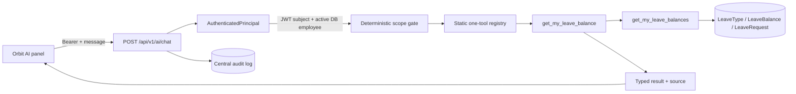

# Leave Balance AI Implementation Report

## Summary

Orbit AI now has one secure, read-only capability: checking the signed-in
employee's own leave balance. The result is calculated by the existing leave
policy service, returned through a hard-coded one-tool gateway, and rendered in
the existing persistent Orbit AI interface.

## Architecture implemented

Only the JWT subject can select the employee. The chat schema and tool schema
forbid identity, role, permission, tool-name, SQL, and API-path fields.

## Files created

- `backend/app/core/authentication.py`
- `backend/app/schemas/ai.py`
- `backend/app/ai/__init__.py`
- `backend/app/ai/prompts.py`
- `backend/app/ai/tool_registry.py`
- `backend/app/ai/leave_balance_tool.py`
- `backend/app/ai/orchestrator.py`
- `backend/app/api/ai.py`
- `backend/tests/test_ai_leave_balance.py`
- `src/services/aiApi.ts`
- `src/services/aiApi.test.ts`
- `src/components/ai/LeaveBalanceResultCard.tsx`
- `src/components/ai/AIChatResponseContent.tsx`
- `src/components/ai/AIChatResponseContent.test.tsx`
- `src/test/setup.ts`

## Files modified

- `.env.example`
- `backend/requirements.txt`
- `backend/app/core/config.py`
- `backend/app/services/auth_service.py`
- `backend/app/services/leave_service.py`
- `backend/app/schemas/leave.py`
- `backend/app/main.py`
- `src/hooks/useAuth.tsx`
- `src/pages/LoginPage.tsx`
- `src/pages/AskOrbitAIPage.tsx`
- `src/components/ai/OrbitAIBriefing.tsx`
- `package.json`
- `package-lock.json`
- `vite.config.ts`
- `docs/ai/LEAVE_BALANCE_AI_VERTICAL_SLICE.md`

Other dirty workspace files were pre-existing and were not part of this slice.

## Authentication approach

Successful password/MFA login now issues an HS256 JWT containing a subject,
issuer, audience, issued time, expiry, and token ID. The AI endpoint accepts
only `Authorization: Bearer`; it never falls back to legacy identity headers.
The dependency validates the signature and claims, loads the employee from the
database, and rejects missing, expired, disabled, locked, or unknown subjects.

Every environment requires `AUTH_JWT_SECRET`. Backend startup validates it
before database initialization and fails with the exact expected
`backend/.env` path when it is missing or too short. Login token signing and AI
token verification both resolve this same server-only setting.

## Tool flow

1. Validate the strict chat request.
2. Resolve `AuthenticatedPrincipal`.
3. Enforce per-user minute/day limits and bounded request size.
4. Reject another-person and unsupported intents.
5. Validate optional leave type.
6. Execute only `get_my_leave_balance`.
7. Load the employee by `principal.employee_id`.
8. Call canonical `get_my_leave_balances`.
9. Validate that any completed numeric answer has a successful tool result.
10. Return structured text and a balance card.

## Security controls

- Self-only server identity; body/header/prompt impersonation cannot override it.
- Strict Pydantic request and tool schemas (`extra="forbid"`).
- Immutable one-tool registry; no dynamic dispatch, URLs, API proxy, or SQL.
- Read-only policy fallback; no balance provisioning.
- Explicit permission check.
- Structured unsupported and failure responses without stack traces.
- Mandatory tool grounding for completed numerical responses.
- Timeouts, response-size limits, and database-backed rate limits.
- Audit events containing IDs/status/latency/source but not prompt contents.
- Source labels distinguish stored, policy-default, and on-request values.

## Test results

- Backend baseline: **47 passed**.
- Backend final verification: see the latest `pytest -q` output; all tests pass.
- Frontend: **7 passed** across loading, success, error, unsupported, request
  shape, bearer handling, and correlation ID behavior.
- `npm run build`: passed (TypeScript and production Vite build).
- No migration exists for this feature.

## Known limitations and remaining risks

- Non-AI APIs still have legacy compatibility authentication.
- The admin development fallback has no secure AI token.
- JWT refresh/revocation and signing-key rotation are not yet implemented.
- Fixed-window limits are process-local, not a distributed limiter. This keeps
  the read-only slice from writing non-audit database rows.
- The intentionally deterministic orchestrator is not a broad chat model.
- Existing proactive briefing data remains a separate pre-existing feature;
  it is not an AI tool in this slice.
- `npm audit` reports two moderate production React Router advisories and nine
  total dependency advisories. They were not force-upgraded in this scoped
  change because the available Vite remediation is breaking; dependency
  upgrades require a separate compatibility pass.

## Recommended next step

Secure the application-wide session boundary by replacing legacy identity
headers with `AuthenticatedPrincipal`, adding refresh/revocation and signing-key
rotation. Do not add another AI tool until that migration and an LLM provider
security review are complete.
