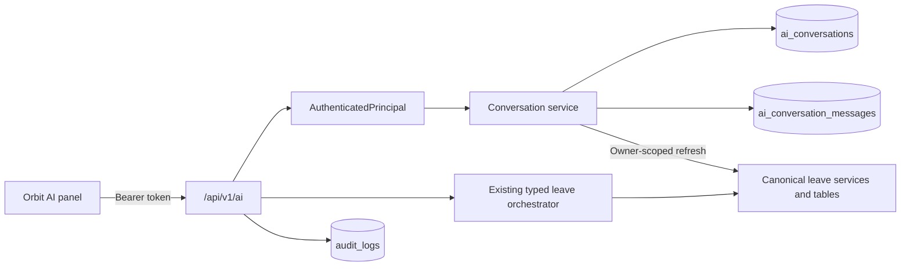

# Orbit AI Conversation History — Implementation Report

## Outcome

Orbit AI conversations are now stored in the backend and scoped to the
authenticated employee. Returning to the briefing closes the active
conversation without deleting it. A user can list, reopen, archive, restore,
or explicitly delete only their own conversations.

This work does not add leave submission or change leave policy, balance,
eligibility, approval, or request-status rules.

## Architecture

The conversation store contains the minimum data needed to restore a
transcript and a safe workflow reference. It does not store bearer tokens,
tool secrets, full employee records, raw tool output, or authoritative balance
and eligibility snapshots.

## Database

### `ai_conversations`

- UUIDv4 primary key.
- `owner_employee_id` foreign key to `employees`.
- Safe deterministic title, domain, capability, and lifecycle status.
- Optional workflow kind/reference/status.
- Message count and lifecycle timestamps.
- Retention expiry timestamp.
- Owner and owner/update indexes.

### `ai_conversation_messages`

- UUIDv4 primary key.
- Conversation and owner foreign keys.
- Bounded user/assistant text.
- Non-sensitive response metadata: status, result type, tool name, correlation
  ID, and timestamp.
- No bearer tokens, credentials, tool payloads, or full structured leave
  records.

Migration:

`backend/migrations/phase_ai_conversation_history_v1.sql`

The migration was applied to the configured development database and both
tables plus the owner/update index were verified.

## Backend API

All routes derive ownership exclusively from `AuthenticatedPrincipal`.
Conversation IDs are always queried together with the authenticated employee
ID, and an inaccessible or foreign ID returns the same not-found response.

| Method | Route | Purpose |
|---|---|---|
| POST | `/api/v1/ai/conversations` | Start a conversation |
| GET | `/api/v1/ai/conversations` | List current employee history |
| GET | `/api/v1/ai/conversations/{id}` | Read transcript and refresh workflow |
| POST | `/api/v1/ai/conversations/{id}/close` | Return to briefing without deleting |
| POST | `/api/v1/ai/conversations/{id}/archive` | Archive |
| POST | `/api/v1/ai/conversations/{id}/restore` | Restore/reopen and refresh |
| DELETE | `/api/v1/ai/conversations/{id}` | Explicitly delete transcript |

`POST /api/v1/ai/chat` now:

1. Resolves or creates an owner-scoped active conversation.
2. Persists the bounded user message.
3. Runs the existing allowlisted typed leave orchestrator.
4. Applies the existing grounding checks.
5. Persists the assistant text and safe response metadata.
6. Updates the deterministic title and safe workflow reference.

Closed or archived conversations cannot be continued until restored.

## Historical Facts and Workflow Refresh

Restored messages are marked historical. Stored structured tool output is not
returned as a current fact. The UI explains that current business facts will
be rechecked.

On open/restore:

- A referenced official leave request is re-read with both request ID and
  authenticated owner ID.
- A referenced leave draft is re-read with both draft ID and owner ID.
- Draft expiry is re-evaluated.
- Active draft references are rehydrated into the existing trusted
  short-term context only after the ownership check.
- Approver and current draft status are refreshed through the canonical draft
  service.
- Submitted/completed workflows are labelled completed.
- Expired and discarded workflows are labelled explicitly.
- Historical balance and eligibility text is not treated as authoritative;
  the next answer must execute the existing typed tool again.

Conversation history therefore cannot bypass fresh leave tools or canonical
workflow reads.

## Titles

Titles are deterministic and do not require an LLM. Examples include:

- `Casual Leave Balance`
- `Leave Balance Comparison`
- `Pending Leave Status`
- `Prepare Casual Leave — Jul 31`
- `Casual Leave Eligibility`

## Frontend

The existing persistent `OrbitAIBriefing` panel now includes:

- History control in the fixed header.
- New conversation control in the fixed header and history view.
- Owner-scoped conversation list with title, domain, lifecycle status,
  workflow status, created timestamp, and updated timestamp.
- Reopen/restore.
- Archive from the active conversation or history list.
- Explicit delete with confirmation.
- Separate Back to briefing behavior.
- Refreshed workflow banner for expired, discarded, completed, or active
  workflows.
- Historical transcript notice.

The fixed header, independently scrollable body, fixed composer, compact mode,
maximized mode, route persistence, and jump-to-latest behavior remain intact.

`sessionStorage` now stores only the opaque active conversation ID. The
transcript is restored from the authenticated backend endpoint.

## Security Controls

- Identity and owner scope come only from `AuthenticatedPrincipal`.
- Conversation create accepts an empty strict schema; owner fields are
  rejected.
- Foreign conversation IDs are indistinguishable from missing IDs.
- UUIDv4 conversation and message IDs.
- Closed/archived lifecycle enforcement before chat continuation.
- Bounded stored message size.
- No token, credentials, secrets, employee records, or raw tool payloads.
- Workflow references are always re-authorized against owner-scoped canonical
  records.
- Open, create, close, archive, restore, and delete actions are audited.
- Explicit deletion removes messages immediately and leaves a scrubbed,
  inaccessible tombstone for audit/lifecycle integrity.
- Default retention is 90 days and is configurable with
  `AI_CONVERSATION_RETENTION_DAYS`.
- History result count defaults to 50 and is configurable with
  `AI_CONVERSATION_HISTORY_LIMIT`.

## Files Created

- `backend/app/services/ai_conversation_service.py`
- `backend/migrations/phase_ai_conversation_history_v1.sql`
- `backend/tests/test_ai_conversation_history.py`
- `docs/ai/ORBIT_AI_CONVERSATION_HISTORY_IMPLEMENTATION_REPORT.md`

## Files Modified

- `.env.example`
- `backend/app/api/ai.py`
- `backend/app/core/config.py`
- `backend/app/main.py`
- `backend/app/models/__init__.py`
- `backend/app/models/ai_workflow.py`
- `backend/app/schemas/ai.py`
- Existing AI test fixtures for the new tables and stronger owner-isolation
  behavior.
- `src/components/ai/OrbitAIBriefing.tsx`
- `src/components/ai/OrbitAIBriefing.test.tsx`
- `src/services/aiApi.ts`

## Tests

Coverage includes:

- Back to briefing preserves server history.
- Correct transcript reopening.
- Unique new conversation IDs.
- Authenticated-principal isolation.
- Rejection of ownership input.
- Archived conversation retrieval and restoration.
- Deleted conversation denial.
- Fresh expired-draft state.
- Submitted/completed draft display.
- Header/history controls and composer layout.
- New conversation behavior.
- Delete confirmation.
- Maximize/restore without message loss.
- Existing Orbit AI leave-agent regressions.

Verification completed:

- Backend: `165 passed`.
- Frontend: `25 passed`.
- Production build: passed.
- In-app browser: fixed header controls, History view, Back to briefing,
  composer placement, and absence of console errors verified. The pre-existing
  browser session had an expired access token, so the history endpoint
  correctly displayed its authenticated error state until re-login.

## Rollback

1. Revert the application files listed above.
2. Stop the backend before schema rollback.
3. Export conversation/audit data if retention is required.
4. Drop `ai_conversation_messages` first, then `ai_conversations`.
5. Restart the backend and rebuild the frontend.

Dropping these tables deletes only Orbit AI history. It does not delete
official leave requests, balances, or Phase 3 leave drafts.
