# Orbit AI Current-State Audit

**Audit date:** 2026-07-26  
**Scope:** Current working tree and current local PostgreSQL/runtime configuration  
**Method:** Read-only source/configuration/database inspection, focused tests, one safe synthetic provider request, and no application-code, configuration, migration, dependency, environment, or database changes

> **Post-audit remediation (2026-07-26):** The transport ambiguity and
> admin false-zero findings in this snapshot have now been addressed. The
> original HTTP failure was a `400 invalid_request_error` because
> `gpt-5.6-luna` rejects the `temperature` parameter. The official adapter now
> omits that optional parameter and preserves safe SDK/HTTP diagnostics. A
> subsequent one-call synthetic check reached OpenAI successfully and returned
> `429 insufficient_quota`, now classified as non-retryable
> `provider_quota`. Admin diagnostics now aggregate employee-generated rows and
> report the four existing evaluations. Phase A remains observation-only;
> Phase B and Phase C remain unimplemented.

## 1. Executive summary

Orbit AI currently has a working, authenticated employee chat surface backed by a deterministic leave-domain orchestrator. The live request path persists conversations and messages, authorizes every request against the authenticated employee, executes a fixed registry of read and draft-management tools, and returns structured responses to the frontend. Leave balance, comparisons, request history/status/details, eligibility, durable intake, and AI-only leave-request drafts are active. Official leave submission and all other consequential actions remain explicitly unavailable.

Phase A contextual-LLM shadow mode is wired into the live chat path. It runs only after the deterministic answer has been computed and persisted, uses an in-process FastAPI background task, cannot select tools or alter the production response, and persists comparison telemetry. The database contains four live shadow evaluations, all produced by employee chat traffic and all recorded as `provider_failure` / `provider_transport`. This proves live invocation and failure persistence, but it does **not** prove a successful structured provider interpretation.

The reported admin status of `recent_evaluations: 0` is a diagnostics-query semantics defect, not missing invocation or missing persistence. Both admin-only diagnostics queries filter evaluations by the current principal's employee ID, so an administrator cannot see evaluations generated by other employees. The provider configuration itself loads successfully and the credential and model are configured, but a single synthetic request still failed as `provider_transport`. The adapter collapses API status and connection errors into the same category, so the underlying OpenAI failure cannot be determined safely from current telemetry.

The repository has substantial uncommitted and untracked work. This audit did not alter any of it. SQL migration state is not tracked by Alembic or another version table; runtime schema inspection shows all five AI tables exist, but the draft table is missing three indexes declared by its checked-in migration. The application also calls SQLAlchemy `create_all`, which can create tables without proving that migration scripts were applied.

**Recommended next task (exactly one): G — Fix the OpenAI Phase A provider adapter's live transport failure and preserve safe, actionable HTTP error classification.** Do not start Phase B or Phase C. After that single task passes one synthetic structured call, run a paced evaluation suitable for the account's 10 RPM limit. The admin diagnostics scope defect and migration drift should remain separately tracked follow-ups.

## 2. Exact live request flow

```mermaid
flowchart LR
    UI["OrbitAIBriefing.submitPrompt"] --> Client["sendAIChat"]
    Client --> Route["POST /api/v1/ai/chat"]
    Route --> Auth["get_authenticated_principal"]
    Auth --> Conversation["Ensure owner-scoped conversation"]
    Conversation --> UserWrite["Persist user message"]
    UserWrite --> Orchestrator["run_leave_balance_chat"]
    Orchestrator --> Workflow["Reload durable intake/draft/request context"]
    Workflow --> Tools["Fixed deterministic tool registry and services"]
    Tools --> Validate["Grounding validation"]
    Validate --> AssistantWrite["Persist assistant response and workflow metadata"]
    AssistantWrite --> Response["Return deterministic response"]
    AssistantWrite -. "when both flags are true" .-> Background["In-process background shadow evaluation"]
    Background --> Provider["OpenAI structured interpretation, no tools"]
    Provider --> Compare["Compare with deterministic observation"]
    Compare --> Telemetry["Persist shadow evaluation metadata"]
```



### 2.1 Browser to API

1. `AppLayout` mounts the Orbit panel and owns its open/focus keyboard behavior in `src/layouts/AppLayout.tsx:23-74` and renders `OrbitAIBriefing` at `src/layouts/AppLayout.tsx:102-123`.
2. `OrbitAIBriefing.submitPrompt` in `src/components/ai/OrbitAIBriefing.tsx:489-543` creates a conversation when needed (`:503-509`), calls `sendAIChat` (`:510`), and appends the returned assistant response to local UI state (`:512-530`). History loading and conversation switching are in `:351-487`.
3. `sendAIChat` in `src/services/aiApi.ts:366-396` sends `POST /api/v1/ai/chat` with the bearer token (`:375-384`). Shared conversation requests are in `conversationRequest`, `:269-295`; start/list/get/close/archive/restore/delete are in `:297-363`.
4. Authentication state is restored from and persisted to browser `localStorage` in `src/hooks/useAuth.tsx:34-59`; login stores the token at `:73-85`.

### 2.2 API authentication, authorization, and deterministic execution

1. `backend/app/main.py:375-376` registers both the legacy Orbit route and the secured AI router.
2. `POST /api/v1/ai/chat` is implemented by `chat` in `backend/app/api/ai.py:387-573`. It requires `AuthenticatedPrincipal` and a database session at `:392-393`.
3. `get_authenticated_principal` in `backend/app/core/authentication.py:109-146` validates the bearer JWT, resolves the employee, and rejects inactive or locked accounts. JWT creation/decoding is in `:49-70`. The resulting principal receives employee-self permissions at `:137-143`.
4. The endpoint enforces request bounds, rate limiting, and concurrency limits at `backend/app/api/ai.py:395-427`.
5. It creates or verifies an active owner-scoped conversation at `:433-450`, then commits the user message at `:451-456`.
6. It awaits `run_leave_balance_chat` at `:457-466`. Despite the historical name, this is the current deterministic leave orchestrator in `backend/app/ai/orchestrator.py:439` onward.
7. The orchestrator rejects unsafe scope at `backend/app/ai/orchestrator.py:447-458`, reloads trusted request/draft/intake/eligibility references at `:460-486`, and parses the goal deterministically at `:487-494`.
8. Official submission is explicitly blocked at `:508-523`. Durable intake and continuation are handled at `:525-567`; unsupported requests return a bounded response at `:569-581`.
9. Eligibility uses `check_my_leave_eligibility` at `:817-843`; balance, comparison, history, status, details, and decision branches are at `:873-1018`. Draft branches start at `:583`.
10. The immutable tool registry is `backend/app/ai/tool_registry.py:22-35`. It exposes only balance, comparison, recent requests, status, details, decision explanation, eligibility, and prepare/get/update/discard draft operations.
11. The API validates grounding and referenced records at `backend/app/api/ai.py:471-527`, commits the assistant message at `:531-537`, updates durable workflow/title metadata at `:538`, and returns the deterministic response at `:551`.

### 2.3 Persistence

- Owner scoping is enforced by `_owned_conversation_query` in `backend/app/services/ai_conversation_service.py:53-58`.
- Conversation create/get/list are at `:82-140`.
- `append_conversation_message` commits bounded message content at `:143-173`.
- Workflow metadata updates are at `:220-240`; lifecycle operations are at `:243-279`; durable reference refresh is at `:314-410`.
- Durable intake reads/writes/clears through `backend/app/services/leave_intake_service.py:104-176`.
- AI-only leave drafts are prepared/updated at `backend/app/services/leave_draft_service.py:239-336`, retrieved at `:339-361`, and discarded at `:364-392`. This service does not create an official leave request.
- Process-local convenience references are explicitly non-authoritative in `backend/app/ai/conversation_context.py:1`; its three in-memory dictionaries are at `:34-36`. Canonical records are re-authorized when reloaded, but these references disappear on restart and are not shared across workers.

### 2.4 Contextual shadow path

1. After deterministic execution and persistence, `backend/app/api/ai.py:539-550` schedules `run_shadow_evaluation_background` only when both contextual flags are enabled.
2. `shadow_enabled` requires `CONTEXTUAL_LLM_ENABLED` and `CONTEXTUAL_LLM_SHADOW_MODE` in `backend/app/services/contextual_shadow_service.py:49-53`.
3. `run_shadow_evaluation` builds bounded conversation context and a deterministic observation at `:141-153`, creates the provider/prompt/redacted request at `:154-176`, and invokes `interpret_with_policy` at `:177-182`.
4. The model output is compared to deterministic behavior at `:183-192`; success telemetry is persisted at `:193-210`, and categorized failure telemetry at `:211-242`.
5. The background wrapper creates its own database session and suppresses employee-visible failures at `:245-272`. This isolation is intentional, but the work is in-process and is not durable across process termination.
6. The production response is already determined before this task starts. The provider receives no tools and cannot change routing, workflow state, writes, or response text.

## 3. Capability matrix

| Capability | Classification | Evidence / current boundary |
|---|---|---|
| Authenticated Orbit chat | **Implemented and active** | Secured `/api/v1/ai/chat`; bearer principal and employee checks |
| Conversation history/lifecycle | **Implemented and active** | Durable owner-scoped conversations/messages; close/archive/restore/delete |
| Leave balance | **Implemented and active** | Deterministic registered tool |
| Leave balance comparison | **Implemented and active** | Deterministic registered tool |
| Leave request history | **Implemented and active** | Recent-request tool |
| Leave request status/details | **Implemented and active** | Owner-scoped status/details tools |
| Leave decision explanation | **Implemented and active** | Deterministic explanation tool |
| Sick/other leave eligibility | **Implemented and active** | Policy/balance/working-day evaluation |
| Conversational leave intake | **Implemented and active** | Durable 15-minute intake state |
| Prepare/get/update/discard AI draft | **Implemented and active** | Durable owner-scoped AI draft table |
| Official leave submission | **Not implemented** | Explicitly blocked by the orchestrator; no submission tool |
| Reminder suggestion | **Not implemented** | Architecture documentation only |
| Reminder sending | **Not implemented** | No reminder tool or delivery integration |
| Manager approval action | **Not implemented** | Normal application workflows may exist, but no Orbit AI tool/action |
| Policy RAG / document retrieval | **Not implemented** | Architecture documentation only |
| Contextual LLM interpretation | **Implemented in shadow mode only** | Enabled; four persisted `provider_transport` failures and no successful live interpretation |
| Few-shot contextual prompt | **Implemented in shadow mode only** | Versioned `contextual_leave_interpreter_v2`; eight examples |
| Shadow comparison telemetry | **Implemented in shadow mode only** | Evaluation rows persist without affecting production |
| LLM-selected tools/routing | **Not implemented** | Deterministic parser remains authoritative |
| LLM workflow continuation/planning | **Not implemented** | Phase B/C design only |
| Confirmed write execution | **Not implemented** | Draft writes only; official request writes blocked |

## 4. Shadow invocation, configuration, and provider findings

### 4.1 Current loaded configuration

The settings loader explicitly reads `backend/.env` with `override=False` in `backend/app/core/config.py:12-18`, so process environment values take precedence. Contextual settings and validation are at `:60-94` and `:151-201`.

Safe loaded values observed:

| Setting | Loaded value |
|---|---|
| `APP_ENV` | `development` |
| Contextual enabled | `true` |
| Shadow mode | `true` |
| Provider | `openai` |
| Model | `gpt-5.6-luna` |
| Base URL | `https://api.openai.com/v1` |
| Timeout | `15.0` seconds |
| Retry count | `1` |
| Max input tokens | `6000` |
| Max output tokens | `700` |
| Temperature | `0` |
| Prompt version | `contextual_leave_interpreter_v2` |
| Credential | Configured; value not displayed |
| Config validation | No errors |

The current backend process started after the observed `backend/.env` modification time, so the active process should include the current values. Settings are loaded at process import/start; editing `.env` alone does not mutate an already-running process and requires a backend restart.

### 4.2 Provider path and test

`backend/app/ai/providers/factory.py:10-30` selects the provider. The OpenAI implementation in `backend/app/ai/providers/openai_provider.py:25-89` uses the official async SDK and `responses.parse` with a Pydantic output schema, `store=False`, no tools, and the configured timeout. Policy enforcement in `backend/app/ai/providers/base.py:71-106` permits at most two attempts with current settings.

One authorized synthetic provider request was made using the first checked-in evaluation case, the versioned few-shot prompt, no tools, no database write, and retry count forced to zero. Result:

```text
success=false
provider=openai
model=gpt-5.6-luna
schema_valid=false
error_category=provider_transport
observed_end_to_end_latency≈6.2 seconds
```

A prior model-access lookup successfully resolved `gpt-5.6-luna`, so model naming/access is not disproven. However, no structured response has succeeded. `openai_provider.py:86-89` maps both SDK connection errors and all API status errors to `provider_transport`, discarding the distinction needed to identify authentication, permission, model/request compatibility, rate, or server errors without exposing sensitive payloads. The exact root cause therefore remains unresolved.

The evaluation script is also unsafe to run wholesale against a 10 RPM account without pacing: `backend/scripts/evaluate_contextual_shadow.py:185-270` iterates the dataset directly, and `both` mode would make 76 calls for the 38-case dataset.

## 5. Database integrity and migration reconciliation

The configured PostgreSQL database was inspected read-only. Current row counts:

| Table | Rows | Latest observed UTC |
|---|---:|---|
| `ai_leave_request_drafts` | 5 | 2026-07-25 17:28:38 |
| `ai_leave_intake_states` | 2 | 2026-07-26 04:12:38 |
| `ai_conversations` | 4 | 2026-07-26 04:12:34 |
| `ai_conversation_messages` | 10 | 2026-07-26 04:12:54 |
| `ai_contextual_shadow_evaluations` | 4 | 2026-07-26 04:12:56 |

All four shadow rows are employee-generated and contain `outcome=provider_failure`, `comparison_result=not_run`, `error_category=provider_transport`, and no token counts. Their recorded latencies range from approximately 2.1 to 4.9 seconds. No raw provider content or credential was inspected.

The ORM declarations are in `backend/app/models/ai_workflow.py`: drafts at `:22-60`, intake at `:61-103`, conversations at `:104-153`, messages at `:154-181`, and shadow evaluations at `:182` onward.

| Table | Live writer | Live reader | Do live requests produce rows? | Expected effect of the latest complete eligibility question |
|---|---|---|---|---|
| `ai_leave_request_drafts` | `leave_draft_service` prepare/update | Draft service and conversation refresh | Yes, only for draft workflows | **No new row expected**; asking eligibility is not preparing a draft |
| `ai_leave_intake_states` | `leave_intake_service.save_intake_state` | Intake service/orchestrator | Yes, for incomplete or continued intake | **No new row required** when leave type and date resolve completely; an existing active intake may still be consulted/cleared |
| `ai_conversations` | `ai_conversation_service.create_conversation` | Conversation API/service | Yes | **Yes only if a new conversation was opened**; otherwise the existing row is updated |
| `ai_conversation_messages` | `append_conversation_message` | Conversation detail/history | Yes, user and assistant messages | **Two rows expected** for a successful turn |
| `ai_contextual_shadow_evaluations` | `contextual_shadow_service._store` | Diagnostics/status service | Yes when both flags are enabled, including provider failure | **One row expected** after the background attempt; the latest timestamps are consistent with the manual request |

No Alembic/version tracking table exists. `backend/app/core/database.py:26-28` calls `Base.metadata.create_all`, and the AI models are imported through `backend/app/models/__init__.py:88-92`. Consequently, table existence does not prove execution of:

- `backend/migrations/phase_ai_leave_request_draft_v1.sql`
- `backend/migrations/phase_ai_leave_intake_v1.sql`
- `backend/migrations/phase_ai_conversation_history_v1.sql`
- `backend/migrations/phase_contextual_llm_shadow_v1.sql`

Runtime schema broadly matches the ORM and migrations, with one confirmed drift: `ai_leave_request_drafts` has only its owner index, while its migration declares owner/status, expiry, and conversation indexes that are absent. The intake table has both ORM-generated and migration-declared indexes, including some overlapping indexes. Migration application status is therefore **not authoritatively provable**, and the draft migration appears not to have been fully applied.

## 6. Why provider status reports zero evaluations

`shadow_diagnostics` is admin-only at `backend/app/api/ai.py:576-591`, and `contextual_provider_status` is admin-only at `:594-608`. Despite that, both service queries filter `AIContextualShadowEvaluation.actor_employee_id == principal.employee_id`:

- `backend/app/services/contextual_shadow_service.py:376-422`, especially `:382-387`
- `backend/app/services/contextual_shadow_service.py:425-452`, especially `:431-434`

Re-running the status service with an admin principal reproduced:

```text
recent_evaluations=0
last_outcome=None
last_error=None
```

while the same database contained four employee-generated rows. Therefore:

- Live invocation is working.
- Failure persistence is working.
- Configuration loading is working.
- The admin status result is misleading because of principal-scoped query semantics.
- The provider itself is still failing independently.

This is a real diagnostics defect, but it is not the first blocker to obtaining a successful Phase A interpretation.

## 7. Documentation reconciliation

### Accurate current implementation reports

- `docs/ai/ORBIT_AI_CONVERSATION_HISTORY_IMPLEMENTATION_REPORT.md`
- `docs/ai/LEAVE_BALANCE_AI_IMPLEMENTATION_REPORT.md`
- `docs/ai/LEAVE_AGENT_PHASE_1_IMPLEMENTATION_REPORT.md`
- `docs/ai/LEAVE_AGENT_PHASE_2_IMPLEMENTATION_REPORT.md`
- `docs/ai/LEAVE_AGENT_PHASE_3_IMPLEMENTATION_REPORT.md`
- `docs/ai/LEAVE_AGENT_PHASE_3_5_IMPLEMENTATION_REPORT.md`

These align with the deterministic, owner-scoped read/intake/draft implementation and its explicit no-submission boundary.

### Design documentation, not implemented capability

- `docs/ai/COMPLETE_LEAVE_AGENT_ARCHITECTURE.md`
- `docs/ai/CONTEXTUAL_LLM_ORCHESTRATOR_ARCHITECTURE.md`
- `docs/implementation/LEAVE_AGENT_VERTICAL_SLICE.md`

Items such as reminders, policy RAG, LLM planning/routing, official submission, confirmation gates, and approval operations in these documents are future architecture, not current production behavior.

### Stale or superseded statements

- `docs/ai/CONTEXTUAL_LLM_PHASE_A_PROVIDER_VALIDATION_REPORT.md:4,15-16,156-157,198,282-284` describes credential/configuration/live provider evidence as unavailable. A credential and valid configuration are now loaded, model access has been checked, and live shadow failures are persisted. Successful provider output remains unproven.
- `docs/ai/CONTEXTUAL_LLM_PHASE_A_SHADOW_MODE_IMPLEMENTATION_REPORT.md:242` describes the OpenAI-compatible adapter as the only network provider path. The repository now contains an official OpenAI SDK adapter.
- Historical focused-test counts in the shadow reports no longer describe the expanded current test file.

### Current facts not covered clearly by existing reports

- All current live shadow calls fail as `provider_transport`.
- Admin-only status/diagnostics incorrectly hide employee-generated evaluations.
- The runtime draft table is missing migration-declared indexes.
- The full evaluator lacks rate-limit pacing.
- Shadow work uses non-durable in-process background tasks.

## 8. Security, reliability, and observability risks

| Priority | Risk | Consequence |
|---|---|---|
| High | Provider status/diagnostics are admin-only but principal-scoped | Administrators receive false-zero operational telemetry |
| High | API status and connection failures collapse to `provider_transport` | Root cause cannot be diagnosed safely; authentication, permission, rate, schema, and server failures are indistinguishable |
| High | No successful structured provider call yet | Phase A quality and schema compatibility are not validated |
| High | Full evaluator has no RPM pacing | A 76-call `both` run exceeds the stated 10 RPM allowance |
| Medium | In-process background task has no durable queue | Shadow evaluations can be lost during restart/crash/deployment |
| Medium | `create_all` plus no migration ledger | Schema drift can go unnoticed; current missing draft indexes confirm the risk |
| Medium | User message commits before deterministic execution finishes | An exception after that commit can leave an unmatched user message |
| Medium | Retry loop yields but has no real backoff | Repeated transient/rate failures may be retried immediately |
| Medium | Browser bearer token is stored in `localStorage` | Any successful same-origin script injection can access the token |
| Low/Medium | Process-local conversation references | Restart/multi-worker behavior loses convenience context, although durable canonical data is re-authorized |

Positive controls already present include owner-scoped queries, active/locked-account checks, immutable tool registration, grounding validation, bounded payloads/context, redacted shadow inputs, `store=False`, absence of provider tools, no production-response influence, and explicit blocking of official submissions.

## 9. Test coverage and remaining gaps

Focused backend tests cover authentication configuration, leave balance, Phases 1/2/3/3.5, approver resolution, conversation history, and contextual shadow behavior. Focused frontend tests cover the API client and the main Orbit chat/draft response components. Package integrity was also checked.

Verification result:

- Backend: **129 passed** in 245.69 seconds. The run emitted 3,819 warnings, overwhelmingly existing `datetime.utcnow()` deprecations plus one Starlette multipart pending deprecation; there were no failures.
- Frontend: **4 test files / 26 tests passed** in 9.85 seconds. The run emitted two React Router v7 future-flag warnings; there were no failures.
- Python environment: `pip check` reported no broken requirements.

Important remaining gaps:

- No real-network automated test proves one successful OpenAI structured interpretation.
- No test asserts that an admin status view aggregates employee shadow evaluations.
- No migration-ledger or runtime-schema test catches missing indexes.
- No evaluator pacing test protects low-RPM accounts.
- No crash/restart test covers loss of in-process background shadow jobs.
- No complete browser-to-real-backend end-to-end test covers authentication, history, deterministic response, and shadow telemetry together.

The declared OpenAI dependency is installed (`openai 2.48.0` satisfies `openai>=2,<3`), and `pip check` found no dependency conflicts.

## 10. Exact next implementation task

**G — Fix the OpenAI Phase A provider adapter's live transport failure and preserve safe, actionable HTTP error classification.**

Acceptance boundary for this one task:

1. Preserve non-sensitive distinctions among authentication/permission, rate limit, invalid request/schema/model, timeout, connection, and server failures.
2. Keep credentials, raw prompts, employee data, and raw provider bodies out of logs and persisted error details.
3. Make one checked-in synthetic case succeed through the same structured adapter used by shadow mode.
4. Add focused mocked tests for the error mapping and one opt-in single-call validation path.
5. Do not allow the provider to select tools, mutate state, alter deterministic responses, or enable Phase B/C.

Only after this succeeds should the existing evaluator be given explicit 10-RPM pacing and run. Fixing the admin aggregation query and formalizing migrations are necessary follow-ups, but combining them into the next provider task would obscure its completion criteria.

## 11. Files inspected

Key inspected paths:

- `src/layouts/AppLayout.tsx`
- `src/components/ai/OrbitAIBriefing.tsx`
- `src/components/ai/AIChatResponseContent.tsx`
- `src/components/ai/LeaveRequestDraftCard.tsx`
- `src/services/aiApi.ts`
- `src/hooks/useAuth.tsx`
- `backend/app/main.py`
- `backend/app/api/ai.py`
- `backend/app/api/orbit_ai.py`
- `backend/app/core/authentication.py`
- `backend/app/core/config.py`
- `backend/app/core/database.py`
- `backend/app/ai/orchestrator.py`
- `backend/app/ai/tool_registry.py`
- `backend/app/ai/conversation_context.py`
- `backend/app/ai/providers/base.py`
- `backend/app/ai/providers/factory.py`
- `backend/app/ai/providers/openai_provider.py`
- `backend/app/ai/prompt_templates.py`
- `backend/app/ai/shadow_evaluator.py`
- `backend/app/ai/prompts/contextual_leave_interpreter_v2.json`
- `backend/app/models/ai_workflow.py`
- `backend/app/services/ai_conversation_service.py`
- `backend/app/services/contextual_shadow_service.py`
- `backend/app/services/leave_draft_service.py`
- `backend/app/services/leave_eligibility_service.py`
- `backend/app/services/leave_intake_service.py`
- `backend/app/services/leave_approver_service.py`
- `backend/app/ai/leave_request_tools.py`
- `backend/migrations/phase_ai_leave_request_draft_v1.sql`
- `backend/migrations/phase_ai_leave_intake_v1.sql`
- `backend/migrations/phase_ai_conversation_history_v1.sql`
- `backend/migrations/phase_contextual_llm_shadow_v1.sql`
- `backend/scripts/evaluate_contextual_shadow.py`
- `backend/tests/test_ai_*.py`
- `backend/tests/test_auth_configuration.py`
- `backend/tests/test_contextual_llm_shadow.py`
- `backend/tests/test_leave_approver_resolution.py`
- `backend/tests/evals/contextual_leave_phase_a.json`
- all current `docs/ai/*.md` reports and relevant `docs/implementation/*.md` design material

## 12. Commands and probes run

Read-only commands/probes used:

- `rg`, `rg --files`, and PowerShell file inspection for source, tests, configuration declarations, documentation, and line references
- `git status --short` to establish the dirty working-tree boundary
- Safe settings introspection through the application settings object; credential value was never printed
- Process/listener and file timestamp inspection to correlate the current backend process with `.env`
- Read-only SQLAlchemy/PostgreSQL queries for table existence, row counts, timestamps, outcomes, roles, indexes, and migration-ledger presence
- Direct read-only calls to provider-status service logic with an admin principal to reproduce the false-zero result
- OpenAI model-access lookup without printing credentials
- One synthetic structured provider invocation with no retry, no tools, no database write, and no employee data
- `python -m pip check`
- Focused backend `pytest` suite for the AI/auth slices
- Focused frontend `vitest` suite for Orbit AI components and API client

No application code, configuration, environment file, migration, dependency, or database data was changed. The only created file is this audit report.

## 13. Unresolved questions

1. **Resolved after the audit:** the collapsed error was HTTP 400,
   `invalid_request_error`, parameter `temperature`; after correcting the
   request shape, the current external blocker is HTTP 429
   `insufficient_quota`.
2. **Resolved for the current single-organization application:** admin and
   super-admin diagnostics aggregate all employee shadow rows; non-admin
   service use remains owner-scoped.
3. Which SQL migration scripts, if any, were manually applied to this database? There is no authoritative ledger.
4. Is a single backend process guaranteed in deployment, or must process-local context and background shadow work support multiple workers/restarts?
5. What retention/deletion policy is required for shadow evaluation metadata?
