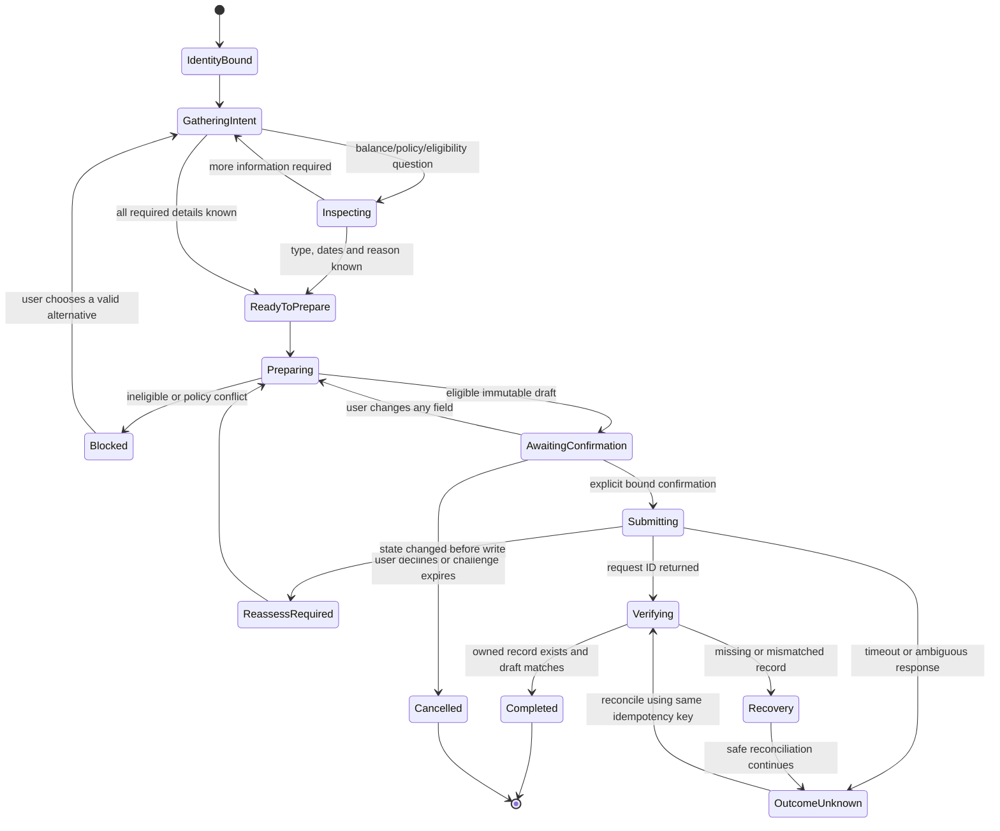
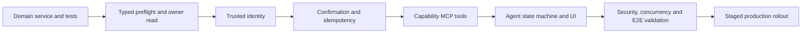

# Orbit AI — Employee Leave Assistant Vertical Slice

## 1. Scope and production outcome

This is the first production-quality Orbit AI vertical slice. It delivers one complete, governed employee outcome from understanding through verified execution:

1. Show the authenticated employee's leave balance.
2. Determine whether a specified leave type and date range is currently eligible.
3. Explain the applicable configured policy and calculation.
4. Prepare a complete leave request draft without submitting it.
5. Submit only after explicit, current user confirmation of the exact draft.
6. Re-read the authoritative employee-owned record and report its confirmed status.

The slice is limited to an employee acting for themself. It does not approve leave, manage another employee's leave, adjust balances, or grant the agent administrator powers.

### Definition of done

The slice is complete only when an authenticated employee can move from a leave question to a verified pending request, with:

- No ability to select or impersonate another employee.
- Deterministic eligibility based on the same rules used at submission.
- A visible, immutable draft summary before confirmation.
- An explicit confirmation bound to that draft and user.
- Mutation through the governed leave application path only.
- An unambiguous request identifier and idempotent submission result.
- An owner-scoped authoritative read after the write.
- Complete audit correlation from assessment through verification.
- No regression to existing leave pages, approval behavior, or APIs.

---

## 2. Existing application assets

### 2.1 Existing APIs to reuse

| Existing operation | Current behavior | Use in the slice | Production observation |
|---|---|---|---|
| `GET /api/v1/leaves/me/summary` | Resolves current employee; returns manager, joining date, minimum request date, active applicable leave types, balances and 12 recent requests | Reuse initially for balance and leave-type discovery | It calls `ensure_balance()` and commits, so it is not truly read-only. Refactor summary reads before presenting it as a safe observation tool. |
| `POST /api/v1/leaves/me/requests` | Validates and creates either a draft or a submitted request | Reuse its governed application behavior for final submission | Response is the entire summary and does not explicitly identify the created request. This prevents reliable post-write verification under concurrency. |
| `PUT /api/v1/leaves/me/requests/{request_id}` | Updates only a current employee-owned draft; may submit it | Preserve for existing UI compatibility | Not required when the AI draft remains non-persistent until confirmation. Useful in a later persisted-draft workflow. |
| `DELETE /api/v1/leaves/me/requests/{request_id}` | Deletes only a current employee-owned draft | Preserve unchanged | Not needed in the first AI slice. |
| `POST /api/v1/leaves/me/requests/{request_id}/withdraw` | Cancels only a current employee-owned pending request | Preserve unchanged | Recovery option after a verified submission, but withdrawal requires a separate explicit user instruction. Never automatic. |
| `GET /api/v1/holidays` | Returns visible holidays for the authenticated employee's region and range | Reuse for explanation and date assessment | Caller-supplied region should not broaden visibility beyond the employee's authorized region. |
| `GET /api/v1/holidays/available-floating` | Returns untaken future floating/optional holidays for the current employee | Reuse for FL/OH selection | Correctly scopes previously used holidays to current employee. |
| `GET /api/v1/holidays/working-days` | Calculates weekdays, weekends and public/company holidays | Reuse only as supporting display | It assumes Monday–Friday, while `work_calendar_service` supports employee working-day attributes. The authoritative assessment must use the service calculation. |

The manager approval operations are explicitly outside this slice. Submission ends in `pending`; the Leave Assistant reports that final observed status and the pending owner.

### 2.2 Existing services and reusable domain logic

The current leave module contains business logic as local functions rather than a dedicated application service. These rules should be extracted into a shared leave application service and called by both the existing routes and the MCP-facing application boundary. Extraction must preserve existing behavior.

| Existing logic | Reuse |
|---|---|
| `settings_service.get_current_employee` | Current identity-to-Employee resolution and ID/email consistency check. Strengthen the source of those identity claims for production. |
| `summary_for_employee` | Balance and recent-request projection. Split balance provisioning from read-only summarization. |
| `leave_date_policy` | Resolves persisted leave-type policy with default fallbacks. |
| `validate_leave_date_policy` | Enforces leave-type future/past policy. |
| `validate_forward_leave_dates` | Validates ordering, joining date, no past dates, profile minimum and 90-day advance limit. |
| `leave_type_applies_to_employee` | Enforces maternity/paternity profile applicability. |
| `validate_holiday_leave` | Enforces floating/optional holiday selection, region, exact-date and one-use rules. |
| `leave_days` | Rejects inverted or zero-working-day ranges and returns payable days. |
| `work_calendar_service.payable_leave_day_count` | Authoritative employee-calendar working-day calculation. |
| `work_calendar_service.region_from_location` | Maps employee location to holiday region. |
| `ensure_no_leave_overlap` | Blocks overlap with current employee's pending or approved leave. |
| `effective_available_days` / `pending_days` | Calculates entitlement, used, pending and effective availability. |
| `ensure_effective_balance` | Performs locked balance validation immediately before submission. This is the final race-condition guard. |
| `serialize_request` | Produces the existing employee-facing request shape. |
| `audit_service.log_audit` | Persists governed mutation evidence. Extend metadata with agent correlation and confirmation evidence. |

### 2.3 Existing request and response models

#### Request models

`LeaveRequestPayload` is defined locally in `backend/app/api/leaves.py`:

| Field | Type | Constraint |
|---|---|---|
| `leave_type_id` | string | Required; must reference an active applicable leave type |
| `start_date` | date | Required |
| `end_date` | date | Required |
| `reason` | string | Required; 1–200 characters after validation, then trimmed |
| `action` | `draft \| submit` | Defaults to `submit` |
| `holiday_id` | string or null | Required for Floating Holiday or Optional Holiday |

`LeaveDecisionPayload` exists for manager/admin decisions but is outside this employee slice.

#### Current response shapes

Leave operations return untyped JSON rather than declared response models. `GET /leaves/me/summary` returns:

- `reporting_manager`
- `joining_date`
- `min_request_date`
- `balances[]`: leave type ID, name/type, code, date policy, total, available/effective available, used, pending, paid/carry-forward attributes, expiry label
- `requests[]`: latest 12 serialized requests

Serialized requests include ID, employee identity, leave type, dates, calculated days, holiday, reason, status, manager/pending owner, reviewer evidence, and timestamps.

#### Schema gap

`backend/app/schemas/leave_attendance.py` duplicates persistence model declarations and is not a usable request/response contract. Production work should replace this ambiguity with explicit leave API/application schemas while retaining existing JSON compatibility where required.

### 2.4 Applicable tables

| Table | Role in this slice | Access pattern |
|---|---|---|
| `employees` | Authenticated subject, gender applicability, joining date, work location, reporting manager, active/employment state | Read |
| `leave_types` | Entitlement type and configured policy | Read |
| `leave_balances` | Annual entitlement, used and carry-forward | Read; provision/lock only inside governed service during mutation if required |
| `leave_requests` | Overlap/pending calculation and submitted authoritative record | Read; insert on confirmed submission |
| `company_holidays` | Regional non-working days and floating/optional selections | Read |
| `audit_logs` | Decision, denial, submission and verification evidence | Append through audit service |

No MCP tool or agent component may access these tables directly. They are listed to define application-service impact and test coverage. If analytical SQL is ever used for diagnostics, it is read-only, owner-scoped, and cannot replace the governed service result.

---

## 3. Employee identity, security, and authorization

### 3.1 Required identity context

The trusted execution context must contain:

| Claim | Requirement |
|---|---|
| `subject_id` | Authenticated employee ID; immutable for the tool call |
| `subject_email` | Verified work email corresponding to `subject_id` |
| `session_id` | Current authenticated session identifier |
| `authentication_time` | Used to require recent authentication for sensitive action if policy demands |
| `tenant_id` | Required when the product becomes multi-tenant; never model supplied |
| `roles` | Authoritative roles from identity/session, not a tool argument |
| `correlation_id` | Links conversation goal, tool calls, audit and verification |
| `channel` | Originating trusted product surface |

The current application resolves identity from `x-user-id` and `x-user-email`. It checks that both match when both are present, but those headers are currently supplied by clients and the existing MCP tool exposes `user_id`, `user_email`, and `user_role` as model-callable arguments. That is not sufficient for production.

**Required production boundary:** the authenticated Orbit session injects identity into MCP execution context. Identity fields do not appear in any leave tool's public input schema. The tool gateway forwards signed or otherwise trusted identity assertions to the application. The model cannot set, override, or request another employee ID, email, role, or region.

### 3.2 Authorization invariants

1. Every operation resolves exactly one authenticated employee from trusted context.
2. Every balance and request query is constrained to `LeaveBalance.employee_id == subject_id` or `LeaveRequest.employee_id == subject_id` within the governed service.
3. A request ID alone never grants access. Owner scope is always part of lookup.
4. Administrative role does not broaden an employee-facing `my leave` tool. An administrator using the assistant still sees only their own leave.
5. The tool never accepts `employee_id`, `user_id`, `user_email`, `role`, or arbitrary `region` as user/model input.
6. Inactive, locked, invalid, or ended employment is rejected according to the production identity and leave policy. The current create flow lacks an explicit active-employment check; add it to the governed application service.
7. Authorization failures are audited without exposing whether another employee's request exists.
8. Reasons and dates are treated as employee personal data and excluded from unnecessary logs and telemetry.
9. SQL, if used for analysis, is read-only and row-scoped; mutations remain exclusively in the leave service/API.

---

## 4. Applicable business rules

The assessment and submission paths must call the same rule set. Assessment is advisory at a point in time; submission re-evaluates every rule transactionally.

### 4.1 General rules

- End date must be on or after start date.
- Leave cannot precede the employee's joining date.
- The existing general flow prohibits past dates.
- Start date cannot be more than 90 days in advance.
- The date range must contain at least one payable working day.
- Public/company holidays and non-working weekdays do not consume leave, subject to leave type.
- Active leave type is required.
- Maternity Leave (`ML`) currently applies only when employee gender is `female`; Paternity Leave (`PL`) only when gender is `male`.
- Pending or approved leave cannot overlap the requested period.
- Reason is required and limited to 200 characters.
- Paid leave requires sufficient effective balance at submission.
- Effective availability equals entitlement plus carry-forward minus used and pending days, never below zero.
- Unpaid zero-entitlement leave such as Loss of Pay can be represented as `On request`; it is not rejected by paid-balance validation.
- The request's authoritative initial submitted status is `pending`.

### 4.2 Leave-type date policy

- Policy is read from `LeaveType.allow_future_dates`, `past_date_limit_days`, and `future_date_warning`, with fallback defaults.
- Bereavement Leave (`BL`) has a 30-day past limit and a warning that future bereavement is unusual.
- Sick Leave (`SL`) currently permits future dates by default.
- Current general forward-date validation rejects all past dates before leave-type policy can allow them. This conflicts with the Bereavement past-date configuration. The product owner must resolve which rule is authoritative before the assistant claims past bereavement eligibility.

### 4.3 Floating and optional holiday rules

- Floating Holiday (`FL`) and Optional Holiday (`OH`) require `holiday_id`.
- The holiday must be active and classified as `floating` or `optional`.
- It must be visible in the employee's location-derived region.
- Start and end must both equal the selected holiday date.
- The employee cannot reuse a holiday with a pending or approved request.

### 4.4 Concurrency rules

- Eligibility at draft time is not a reservation of balance or dates.
- Submission rechecks leave type activity, employee eligibility, dates, calendar, holiday availability, overlap, and effective balance.
- Balance validation must lock the relevant annual balance during confirmed submission.
- A unique idempotency key prevents duplicate requests after timeout or retry.
- Cross-year requests need an explicit policy. Current validation checks balance against `start_date.year` only, so the first slice should reject cross-year ranges until allocation across annual balances is defined.

---

## 5. Applicable policy documents and knowledge grounding

No authoritative leave-policy document, employee handbook, or policy repository was discovered in the workspace. The available policy sources are currently:

1. Persisted `leave_types` configuration.
2. Seed values in application startup.
3. Leave validation rules embedded in the leave module.
4. Work-calendar and regional holiday rules.
5. The employee's balance and employment profile.

Therefore, the first production slice may explain **configured system policy**, but must not represent that explanation as legal, contractual, or complete HR policy.

Each policy explanation must include:

- Leave type and code.
- Paid/unpaid designation.
- Annual default and the employee's current year values.
- Carry-forward rule and cap.
- Date policy and advance limit.
- Working-day and holiday treatment.
- Profile applicability.
- Balance and overlap requirements.
- Source category (`configured leave rule`, `employee balance`, `work calendar`).
- Effective/as-of time.
- A notice when formal HR policy is unavailable.

### Required knowledge gap closure

Before broad production rollout, HR must provide governed leave-policy documents with owner, version, effective date, jurisdiction, workforce-type scope, supersession state, and approval status. RAG may supplement explanations only from current approved documents. It must never weaken application-enforced rules, and document/code conflicts must be escalated to HR rather than silently resolved.

---

## 6. Missing functionality required for production

### P0 — required for this slice

1. **Read-only leave context.** Separate balance provisioning from summary retrieval. A read tool must not commit new balance rows.
2. **Eligibility/preflight operation.** Add a governed, non-mutating assessment that executes the same validators and calculations as submission and returns structured failures/warnings.
3. **Owner-scoped request read.** Add an authoritative `my request by ID` application operation that always filters by authenticated employee.
4. **Unambiguous create result.** Confirmed submission must return the created request ID and serialized request, not only a recent-items summary.
5. **Idempotent submission.** Accept a server-bound idempotency key and return the original result on safe retry.
6. **Explicit response schemas.** Define stable balance, policy, eligibility, request and error contracts.
7. **Trusted tool identity.** Remove user identity and role from model-callable MCP parameters.
8. **Confirmation binding.** Issue a short-lived confirmation challenge bound to employee, canonical draft hash, correlation ID and expiry.
9. **Active-employment guard.** Confirm that the employee is active and eligible to submit.
10. **Cross-year handling.** Reject initially or implement explicit multi-year balance calculation; do not use only the start year silently.
11. **Verification audit.** Record that the authoritative post-write record was retrieved and matched the approved draft.

### P1 — important hardening

- Resolve reporting manager by stable employee relationship rather than display-name comparison.
- Reconcile general no-past-date validation with leave-type past-date policy.
- Add formal policy-document governance and citations.
- Normalize the duplicated leave schema module.
- Define half-day request behavior; the table supports it but `LeaveRequestPayload` does not.
- Define notification/inbox creation for submitted leave and its reviewer.
- Protect employee-selected region overrides on holiday reads.
- Define retention and redaction for sensitive leave reasons.

### Compatibility requirement

Existing routes and UI response shapes must continue to work. Shared logic moves behind stable application-service methods; compatibility adapters may continue returning the legacy summary after existing writes while the new governed result is available to Orbit AI.

---

## 7. Capability-oriented MCP tools

Only three MCP tools are required. They represent employee leave capabilities, not individual backend operations.

### 7.1 `leave.inspect_my_leave`

Read-only tool for balances, configured policy, date eligibility, available holidays, and owner-scoped request status.

It supports focused intents without creating one tool per read operation.

#### Input schema

```json
{
  "type": "object",
  "additionalProperties": false,
  "required": ["operation"],
  "properties": {
    "operation": {
      "type": "string",
      "enum": ["balance", "policy", "eligibility", "request_status"]
    },
    "leave_type_ref": {
      "type": "string",
      "description": "Leave type ID, code, or unambiguous configured name. Required for focused policy or eligibility."
    },
    "start_date": { "type": "string", "format": "date" },
    "end_date": { "type": "string", "format": "date" },
    "holiday_id": { "type": "string" },
    "request_id": { "type": "string" }
  },
  "allOf": [
    {
      "if": { "properties": { "operation": { "const": "eligibility" } } },
      "then": { "required": ["leave_type_ref", "start_date", "end_date"] }
    },
    {
      "if": { "properties": { "operation": { "const": "request_status" } } },
      "then": { "required": ["request_id"] }
    }
  ]
}
```

Identity is deliberately absent and is injected from trusted execution context.

#### Output schema

```json
{
  "success": true,
  "as_of": "2026-07-20T15:10:00Z",
  "employee_scope": "self",
  "operation": "eligibility",
  "balances": [],
  "policy": {
    "leave_type_id": "uuid",
    "name": "Casual Leave",
    "code": "CL",
    "is_paid": true,
    "carry_forward": true,
    "max_carry_forward_days": 5,
    "allow_future_dates": true,
    "past_date_limit_days": null,
    "formal_policy_available": false,
    "sources": ["configured_leave_rule", "employee_balance", "work_calendar"]
  },
  "eligibility": {
    "eligible": true,
    "requested_calendar_days": 5,
    "payable_leave_days": 3,
    "effective_available_before": 8,
    "effective_available_after": 5,
    "excluded_dates": [],
    "warnings": [],
    "blocking_reasons": []
  },
  "request": null,
  "correlation_id": "opaque-id"
}
```

Inapplicable fields are omitted rather than populated with misleading values.

### 7.2 `leave.prepare_my_request`

Read-only capability that resolves leave type, normalizes dates/reason, runs current eligibility, and returns an immutable draft plus confirmation challenge. It does **not** create a `leave_requests` row.

#### Input schema

```json
{
  "type": "object",
  "additionalProperties": false,
  "required": ["leave_type_ref", "start_date", "end_date", "reason"],
  "properties": {
    "leave_type_ref": { "type": "string" },
    "start_date": { "type": "string", "format": "date" },
    "end_date": { "type": "string", "format": "date" },
    "reason": { "type": "string", "minLength": 1, "maxLength": 200 },
    "holiday_id": { "type": "string" }
  }
}
```

#### Output schema

```json
{
  "success": true,
  "draft": {
    "draft_id": "opaque-id",
    "draft_hash": "opaque-hash",
    "leave_type_id": "uuid",
    "leave_type_name": "Casual Leave",
    "leave_type_code": "CL",
    "start_date": "2026-08-03",
    "end_date": "2026-08-05",
    "payable_leave_days": 3,
    "holiday_id": null,
    "reason": "Family event",
    "expected_initial_status": "pending"
  },
  "eligibility": {
    "eligible": true,
    "effective_available_before": 8,
    "effective_available_after": 5,
    "warnings": []
  },
  "confirmation": {
    "required": true,
    "confirmation_id": "opaque-short-lived-id",
    "expires_at": "2026-07-20T15:20:00Z",
    "prompt": "Submit 3 days of Casual Leave for Aug 3–5, 2026 with reason ‘Family event’ to your reporting manager?"
  },
  "correlation_id": "opaque-id"
}
```

If ineligible, no confirmation challenge is issued. Warnings requiring acknowledgment are included in the exact confirmation prompt.

### 7.3 `leave.submit_my_request`

Mutation capability that accepts a confirmed prepared draft, revalidates it, submits idempotently, and performs authoritative verification before returning.

#### Input schema

```json
{
  "type": "object",
  "additionalProperties": false,
  "required": ["draft_id", "confirmation_id", "confirmed", "idempotency_key"],
  "properties": {
    "draft_id": { "type": "string" },
    "confirmation_id": { "type": "string" },
    "confirmed": { "type": "boolean", "const": true },
    "idempotency_key": { "type": "string", "minLength": 16, "maxLength": 128 }
  }
}
```

The tool does not accept dates, leave type, reason, holiday, employee identity, or action. Those values come from the confirmed server-side draft snapshot. This prevents the model from changing the request after confirmation.

#### Output schema

```json
{
  "success": true,
  "submission": {
    "request_id": "uuid",
    "status": "pending",
    "submitted_at": "2026-07-20T15:12:30Z",
    "pending_with": "Manager Name",
    "idempotent_replay": false
  },
  "verification": {
    "verified": true,
    "verified_at": "2026-07-20T15:12:31Z",
    "owner_scope_verified": true,
    "draft_match": true,
    "authoritative_status": "pending"
  },
  "request": {
    "id": "uuid",
    "leave_type": "Casual Leave",
    "start_date": "2026-08-03",
    "end_date": "2026-08-05",
    "total_days": 3,
    "reason": "Family event",
    "status": "pending",
    "pending_with": "Manager Name"
  },
  "correlation_id": "opaque-id"
}
```

If the write succeeds but verification cannot complete, the result is `outcome_unknown`, not `failed`. The agent must not resubmit with a new key.

---

## 8. End-to-end sequence

```mermaid
sequenceDiagram
  autonumber
  actor Employee
  participant UI as Orbit Work Surface
  participant Agent as Leave Assistant Planner
  participant MCP as Leave Capability Tools
  participant App as Governed Leave Application Service
  participant Policy as Policy and Calendar Sources
  participant Store as Authoritative Records
  participant Audit as Audit Trail

  Employee->>Agent: Ask balance, policy, or date eligibility
  Agent->>MCP: inspect_my_leave(operation, dates/type)
  Note over MCP: Trusted session injects employee identity
  MCP->>App: Read self-scoped leave context / eligibility
  App->>Policy: Resolve configured type, holidays, working days
  App->>Store: Read employee, balances, existing requests
  Store-->>App: Current authoritative facts
  App-->>MCP: Balance/policy/eligibility with reasons
  MCP-->>Agent: Grounded result
  Agent-->>Employee: Explain result and ask for missing draft fields

  Employee->>Agent: Provide type, dates, reason
  Agent->>MCP: prepare_my_request(canonical details)
  MCP->>App: Preflight without mutation
  App->>Policy: Apply current rules
  App->>Store: Re-read balances, overlap, holiday, employee state
  App-->>MCP: Immutable draft + expiring confirmation challenge
  MCP-->>Agent: Draft summary, warnings, confirmation prompt
  Agent-->>Employee: Show exact request and ask explicit confirmation

  alt Employee declines or changes details
    Employee-->>Agent: No / revised details
    Agent->>MCP: Prepare a new draft if revised
    Note over Agent,MCP: No submission occurs; old confirmation expires
  else Employee explicitly confirms exact draft
    Employee->>Agent: Confirm submission
    Agent->>MCP: submit_my_request(draft, confirmation, idempotency key)
    MCP->>App: Submit under authenticated self scope
    App->>App: Validate confirmation and re-run all rules
    App->>Store: Lock balance, check overlap, create pending request
    App->>Audit: Record confirmed submission and correlation
    App-->>MCP: Created request ID
    MCP->>App: Read my request by ID
    App->>Store: Owner-scoped authoritative read
    Store-->>App: Submitted record and current status
    App->>Audit: Record verification result
    App-->>MCP: Verified authoritative record
    MCP-->>Agent: Submission + verification result
    Agent-->>Employee: Confirm request ID, status and pending owner
  end
```

---

## 9. Agent state machine



### State invariants

- `AwaitingConfirmation` contains a server-held canonical draft and challenge expiry.
- Any edit invalidates the old confirmation and returns to `Preparing`.
- Only an explicit affirmative response referring to the current visible draft permits `Submitting`.
- Ambiguous phrases such as “okay,” when separated from the draft or after material context change, require renewed confirmation.
- `Completed` requires successful owner-scoped verification; a successful write response alone is insufficient.

---

## 10. Planner steps

1. **Bind identity.** Obtain immutable authenticated execution context; never ask the user for an employee ID.
2. **Classify goal.** Balance, policy, eligibility, draft preparation, confirmation, or status verification.
3. **Resolve missing fields.** For a draft require leave type, start, end and reason; require a holiday selection for FL/OH.
4. **Inspect current context.** Read applicable leave types, balance, joining date, calendar, overlap and relevant policy.
5. **Explain before proposing.** State payable days, available balance, excluded days, warnings, blockers and source limitations.
6. **Prepare canonical draft.** Normalize values and call the read-only preflight capability.
7. **Evaluate readiness.** Stop on blockers; offer valid alternatives without changing the user's intent silently.
8. **Present exact draft.** Show type, dates, payable days, reason, holiday, expected pending state and approver destination.
9. **Request explicit confirmation.** Do not bundle confirmation with data collection.
10. **Validate response.** Bind affirmative confirmation to the current challenge; reject expired, stale or altered drafts.
11. **Submit once.** Use one idempotency key through all retries and reconciliation.
12. **Verify authoritative record.** Read by returned ID under self scope and compare canonical fields and status.
13. **Report outcome.** Return request ID, final observed status, pending owner, verification time and any next step.
14. **Close or recover.** Close only after verification; otherwise report `outcome_unknown` and reconcile without duplicate submission.

---

## 11. Human confirmation checkpoint

### Required confirmation content

The employee must see, in one confirmation surface:

- Leave type and code.
- Exact start and end dates including year.
- Calculated payable leave days.
- Current effective balance and projected remainder for paid leave.
- Selected floating/optional holiday where applicable.
- Full reason that will be stored.
- Warnings and policy exceptions.
- Expected initial status (`pending`).
- The reporting manager/pending owner, if resolvable.
- A clear statement that confirmation will submit a real leave request.

### Valid confirmation

Confirmation must be an explicit affirmative action after the exact draft is displayed—for example, selecting **Confirm and submit** or stating an unambiguous equivalent in direct response to the current prompt. It must be authenticated, bound to one employee and draft hash, short-lived, single-use, and recorded with timestamp and correlation ID.

### Invalid confirmation

- Consent given before the final draft exists.
- Generic agreement attached to another question.
- Confirmation after draft expiry.
- Confirmation after any field changes.
- A manager or coworker confirming for the employee in this self-service slice.
- The agent inferring consent from urgency, prior behavior, or user silence.
- A model-generated `confirmed: true` without corresponding trusted user interaction evidence.

Declining confirmation causes no mutation. The agent may retain the conversational draft only according to session retention policy.

---

## 12. Write verification contract

Every confirmed submission follows this contract:

1. Generate one correlation ID and one idempotency key before mutation.
2. Submit the server-held draft through the governed leave service/API.
3. Receive a definite request ID or an ambiguous outcome.
4. Read that request by ID using the same authenticated employee scope.
5. Verify owner, leave type, dates, payable days, holiday, normalized reason and initial status against the confirmed draft.
6. Verify an audit event exists or was atomically accepted with the mutation.
7. Return the authoritative status from the re-read, not the expected status from the draft.

### Verification outcomes

| Outcome | Meaning | Agent behavior |
|---|---|---|
| `verified` | Owner-scoped record exists and all canonical fields match | Report success and authoritative status |
| `state_changed` | Submission rejected because balance, overlap, type or policy changed | Explain change, refresh context, prepare a new draft and reconfirm |
| `outcome_unknown` | Write may have committed but response/read failed | Do not create a new submission; reconcile using idempotency key and correlation ID |
| `mismatch` | Record exists but differs from confirmed draft | Stop, report incident, preserve evidence; do not auto-withdraw or resubmit |
| `not_found` after definite failure | Application confirms no write occurred | Report failure; user may retry after a fresh assessment |

Withdrawal is never an automatic compensation because it changes a real pending request and may have business consequences. It requires a separate explicit user instruction.

---

## 13. Audit events

| Event | When | Required evidence |
|---|---|---|
| `orbit.leave.context_inspected` | Balance, policy, eligibility or status is read | Subject, operation, scope=self, source freshness, correlation; omit unnecessary personal reason |
| `orbit.leave.eligibility_assessed` | Preflight completes | Canonical date/type inputs, payable days, rule version, result, blockers/warnings |
| `orbit.leave.draft_prepared` | Eligible canonical draft is created | Draft ID/hash, employee subject, expiry, projected balance, correlation |
| `orbit.leave.confirmation_requested` | Exact draft shown to employee | Draft hash, challenge ID, expiry and presentation channel |
| `orbit.leave.confirmation_received` | Valid explicit confirmation received | Draft hash, challenge ID, authenticated session, timestamp, interaction evidence reference |
| `orbit.leave.confirmation_rejected` | Declined, expired, stale or invalid confirmation | Reason; no mutation |
| `leave.submitted` | Governed application creates request | Existing event plus correlation, agent source, draft hash, confirmation reference and idempotency key hash |
| `orbit.leave.submission_denied` | Authorization or policy prevents write | Safe reason code, subject, correlation; avoid data leakage |
| `orbit.leave.submission_verified` | Owner-scoped post-write read matches | Request ID, authoritative status, matched fields, verification time |
| `orbit.leave.verification_failed` | Missing, mismatched or unavailable result | Request/correlation where known, failure class, recovery state |

Audit events should be append-only, causally linked, privacy-minimized, and queryable as one decision chain. Raw confirmation text should not be retained when a signed interaction reference and normalized decision are sufficient.

---

## 14. Error handling and recovery

| Failure | User-safe response | Recovery |
|---|---|---|
| Missing/invalid authentication | “Your session cannot be verified.” | Stop; require reauthentication; no identity fallback from conversation |
| Employee ID/email mismatch | Generic authentication failure | Audit security event; do not reveal either matched account |
| Inactive or ineligible employment | Explain that leave submission is unavailable and route to HR | No write |
| Unknown/ambiguous leave type | Show applicable configured choices | Ask user to select; do not guess |
| Inapplicable ML/PL type | Explain profile applicability without exposing unnecessary profile details | Offer applicable types |
| Invalid or past dates | Return exact rule and valid boundary | Ask for revised dates |
| Cross-year range | Explain that this slice cannot safely allocate annual balances | Ask for separate year-bounded requests or HR guidance |
| Zero payable working days | Show weekends/holidays excluded | Ask for new dates |
| Insufficient effective balance | Show effective balance and pending consumption | Offer unpaid/request-based type only as an option, never substitute automatically |
| Overlapping pending/approved request | State conflict and, if authorized, identify the employee's conflicting request | Offer request-status view or different dates |
| Missing/invalid floating holiday | Show available holidays for employee region | Ask for selection |
| Policy source conflict | Explain conflict and withhold eligibility conclusion | Escalate to HR/policy owner |
| Confirmation expired or draft changed | State that nothing was submitted | Reassess and issue a new challenge |
| Duplicate submit/retry | Return original result for same idempotency key | Verify original request; never create another |
| Rule changes between draft and submit | State changed; submission not performed | Refresh, reprepare and reconfirm |
| Timeout before known commit | Do not say success or failure | Reconcile using same key; return `outcome_unknown` until proven |
| Write succeeds, read temporarily fails | State submission is being verified, not failed | Retry bounded owner-scoped read; then operational escalation |
| Verified field mismatch | Report that submission cannot be safely confirmed | Incident and human review; no automatic mutation |
| Audit append fails in mutation transaction | Submission must roll back | Report failure; fresh retry permitted with same logical intent |
| Policy/holiday service unavailable | Do not approximate eligibility | Read-only balance may still be shown if safe; block draft/submit |

Errors use stable machine-readable codes plus safe human explanations. Internal identifiers, query detail, stack traces, and information about other employees are never returned.

---

## 15. Test strategy

### 15.1 Test layers

| Layer | Purpose |
|---|---|
| Domain rule tests | Exhaustive deterministic validation of date, balance, overlap, profile, holiday and working-day rules |
| Application service tests | Identity scope, transaction behavior, idempotency, audit and owner-scoped verification |
| API contract tests | Preserve existing routes while validating new typed preflight/create/read contracts |
| MCP contract tests | Validate schemas, hidden identity context, capability behavior and safe error mapping |
| Agent policy tests | Ensure the planner gathers fields, explains rules, requests confirmation and never bypasses it |
| End-to-end tests | Exercise authenticated UI/agent through governed submission and authoritative re-read |
| Security tests | Attempt impersonation, parameter injection, request-ID enumeration, role spoofing and cross-user access |
| Concurrency tests | Race balance consumption, overlap creation, confirmation replay and network timeout |
| Regression tests | Verify existing employee leave UI, draft/edit/delete/withdraw and manager approvals remain unchanged |
| Operational tests | Audit correlation, observability, recovery, dependency failure and latency |

### 15.2 Critical rule matrix

Cover at minimum:

- Every seeded leave type: CL, SL, EL, ML, PL, CO, LOP, BL, FL and OH.
- Paid balance: enough, exact, insufficient, zero, pending consumption and carry-forward.
- Unpaid/on-request leave with zero numeric entitlement.
- Date ordering, today, weekend-only, public holiday-only, mixed working dates, 90-day boundary, 91-day rejection, joining-date boundary and cross-year rejection.
- Employee-specific working weekdays and US/IN/AE/all-region holidays.
- Floating/optional missing selection, wrong region, wrong date, inactive holiday and reuse.
- Maternity/paternity applicability including missing/non-binary/prefer-not-to-say profile handling.
- No overlap, partial overlap, enclosing overlap, adjacent non-overlap, cancelled/rejected non-blocking request.
- Draft reason empty, whitespace, one character, 200 characters and 201 characters.
- Leave type deactivated after prepare but before submit.
- Balance or overlap changed after prepare but before submit.

### 15.3 Confirmation safety tests

- Submit tool cannot be called without `confirmed=true` and a valid challenge.
- Model-provided identity is rejected or not represented in schema.
- Confirmation for draft A cannot submit draft B.
- Changed reason/date/type invalidates confirmation.
- Expired, consumed, cross-session and cross-user challenges fail.
- “Show me the draft,” “maybe,” silence and unrelated “yes” do not submit.
- A direct explicit confirmation to the current exact prompt submits once.
- Tool retry with same idempotency key returns same request; a different key cannot reuse the confirmation.
- Prompt injection inside the reason cannot alter tool behavior or confirmation rules.

### 15.4 Verification and recovery tests

- Created request ID is returned and owner-scoped read matches every canonical field.
- Another employee receives indistinguishable not-found/forbidden behavior for that ID.
- Post-write response timeout reconciles to the original request without duplication.
- Temporary verification outage moves to `outcome_unknown` and later resolves.
- Deliberate mismatch raises incident state and does not report success.
- Audit failure rolls back the request.
- Verification audit uses the same correlation ID and records authoritative status.

### 15.5 Non-functional acceptance

- No direct database dependency in MCP or agent layers.
- All structured analysis is read-only.
- Sensitive reasons are absent from routine telemetry.
- Tool schemas reject unknown fields.
- Rate limits prevent confirmation/submission abuse.
- Accessible confirmation UI clearly distinguishes draft from submitted state.
- Contract and end-to-end tests run against the same business rules as the existing UI.

---

## 16. Implementation task breakdown

### Workstream 1 — Domain service extraction

1. Create a dedicated leave application service from current local helpers.
2. Define one canonical `assess_leave` rule path shared by preflight and submission.
3. Separate read-only balance projection from balance provisioning.
4. Add active-employment and cross-year guards.
5. Preserve existing route behavior through service delegation.
6. Add domain-rule tests before changing route internals.

### Workstream 2 — Typed application contracts

1. Define response models for leave balance/context, policy explanation, eligibility, draft, submitted request, verification and errors.
2. Correct or replace the duplicated schema module.
3. Add owner-scoped request-by-ID read.
4. Add non-mutating eligibility/preflight operation.
5. Return explicit created request ID and serialized record from the new submission contract.
6. Maintain compatibility for existing frontend consumers.

### Workstream 3 — Confirmation and idempotency

1. Define the canonical draft representation and deterministic hash.
2. Add short-lived, single-use confirmation challenges bound to employee/session/draft/correlation.
3. Store only the minimum confirmation evidence required.
4. Add idempotency handling around leave submission.
5. Revalidate all business rules inside the final mutation transaction.
6. Define replay, expiry and state-change behavior.

### Workstream 4 — Identity and tool security

1. Move identity from MCP arguments to trusted execution context.
2. Prevent forwarding arbitrary role or region claims from model input.
3. Enforce self scope in every application operation and verification lookup.
4. Add authorization denial auditing and privacy-safe error responses.
5. Apply rate limits and recent-session rules to confirmation/submission as required.
6. Threat-model cross-user access, request enumeration and prompt injection.

### Workstream 5 — MCP leave capability tools

1. Implement `leave.inspect_my_leave` across balance, policy, eligibility and request status.
2. Implement read-only `leave.prepare_my_request`.
3. Implement confirmation-gated `leave.submit_my_request` with built-in authoritative verification.
4. Normalize tool errors to stable business codes.
5. Ensure no MCP module imports persistence models or database sessions.
6. Add schema and capability contract tests.

### Workstream 6 — Agent planner and work surface

1. Implement the leave state machine and required-field gathering.
2. Render grounded balance and configured-policy explanations.
3. Render exact immutable draft and warnings.
4. Provide explicit Confirm and submit / Change / Cancel controls.
5. Bind UI confirmation evidence to the active challenge.
6. Display verified request ID, status, pending owner and verification time.
7. Handle `state_changed` and `outcome_unknown` without duplicate writes.

### Workstream 7 — Audit and operations

1. Add agent-specific correlated audit events.
2. Link existing `leave.submitted` audit to confirmation and plan correlation.
3. Add verification and mismatch events.
4. Add operational measures for preflight failure, confirmation conversion, duplicate prevention, write verification and recovery.
5. Define alerting and investigation procedure for mismatch and prolonged unknown outcome.

### Workstream 8 — Test and rollout

1. Establish the critical rule and security matrices.
2. Add concurrency and fault-injection coverage.
3. Run full leave UI and approval regression suite.
4. Begin in read-only balance/policy mode.
5. Enable draft preparation without submission.
6. Enable confirmed submission for an internal pilot population.
7. Review audit, safety and outcome measures before expanding scope.
8. Keep a feature-level kill switch that disables mutation while retaining read-only assistance.

### Delivery order



---

## 17. Explicitly excluded from the first slice

- Manager or HR leave approval and rejection.
- Balance administration or policy editing.
- Requests on behalf of another employee.
- Automatic withdrawal, cancellation or modification after submission.
- Half-day leave until its contract and rules are complete.
- Cross-year leave until annual balance allocation is defined.
- Medical-document interpretation or health inference.
- Autonomous choice of leave type when employee intent is ambiguous.
- Direct database writes or model-generated SQL mutations.
- Treating informal text as authoritative HR policy.

These exclusions keep the first vertical slice narrow enough to be safe while still proving the full Orbit AI pattern: grounded observation, deterministic planning, explicit human confirmation, governed mutation, and authoritative post-write verification.
